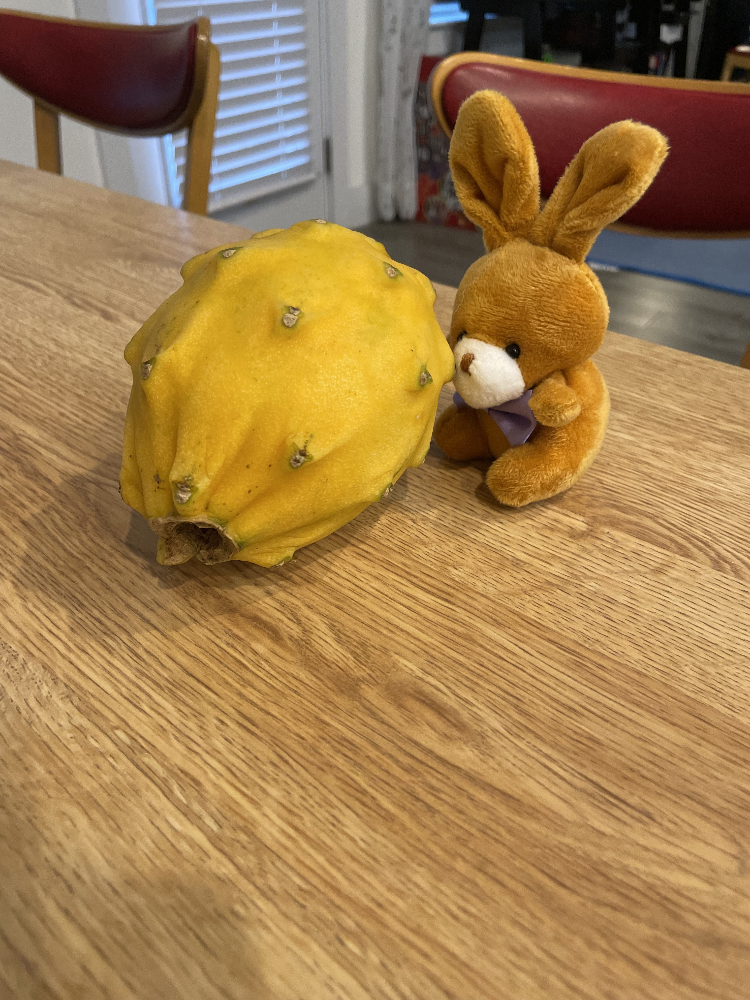

# Chapter 1: The Dragon Fruit

The bunnies have recently decided that dragon fruit is quite delicious!
However, it is also quite expensive.
As such, they have decided to study the dragon fruit, and attempt to grown their own.
Acorn got started by studying a dragon fruit.

After extensive studying, Acorn and Grapefruit soaked and are now watching the dragon fruit seeds.

