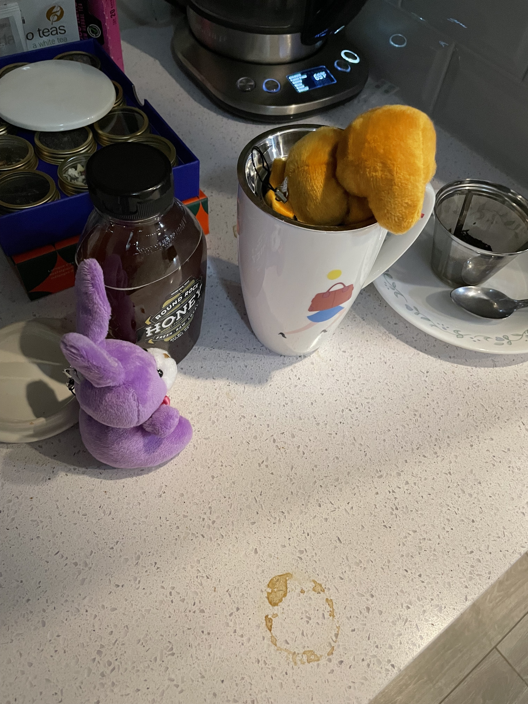

# Attempting Tea

Shanny was up pretty late last night, Eggplant and Peanut wanted to help her wake up. As such, they decided to make some “go juice”. Eggplant suggested coffee as Jacob likes coffee, but was convinced by Peanut that Shanny was more of a green tea sorta person.

Now, Peanut and Eggplant don’t really know how to make tea, so they make this up as they went. Peanut decided this tea must be the best as it looks like it has little chocolate chips in it.

First the bunnies got the tea in the cup.

Then they got the water going.

Then they carefully put the water in.

But for what ever reason, the tea didn’t look right. The water was not turning green.

Panicking a bit, Peanut decided stirring might help.

But not much changed.

Looking around, Eggplant found some honey and thought that might help the situation. 

Sadly, it did not. The tea, was still not green.

Afraid of ruining the beverage, Eggplant and Peanut decided to consult the espresso bunnies, who suggested milk, as milk goes in lattes. 



So in went the milk....

But now, some how, the tea looked even less right.

Sad, and feeling a little defeated, the bunnies took the drink to the table. 

BUUUUT on the way they found a bottle!!

Now, neither bunny reads human. But they figured if you break “Tigre” apart, “Ti” sounds like tea and “gre” kinda sounds like green. 

“Could this be bottled green tea” the bunnies asked? “Can we save her drink?”

The bunnies, no longer full of despair decided this must be how you make tea.

...so in it went.

The excited bunnies decided they should take a sip to test their work.

It did not go well.

Peanut had to call Dr. Hops over.

Dr. Hops determined that the “Go Juice” though harmless to bunnies, was not fit for human or bunny consumption.

It was thrown away.

Eggplant and Peanut decided it would be best to wait until Shanny got up to get a proper tea making lesson.

For those concerned, Radish and Turnip have made a full recovery from the bunny flue. I found them this morning waiting to be released for quarantine enjoying a sunshine spot.

