# Fresh Tea Is Best Tea

I was greeted by some rather optimistic bunnies this morning. They talked to Shanny about tea, and Shanny exclaimed
"how do you mess up tea? its just leafs and water?!". 
The bunnies, now having an understanding of tea, wanted to try again. They asked if I could take them out of get some fresh leafs.
I said of course, but first we must take the trash out.
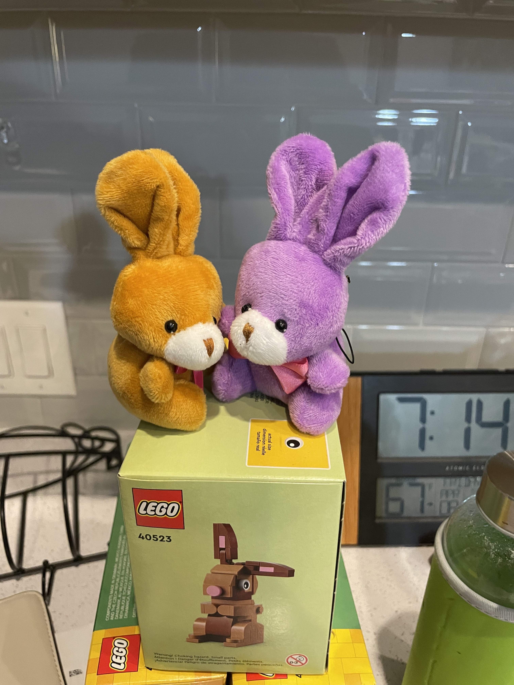

The bunnies were a little nervous.
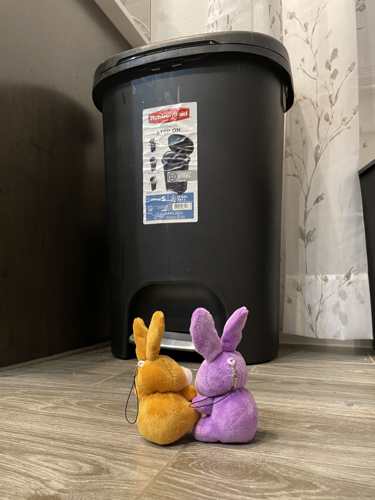

But they make a great tag team.
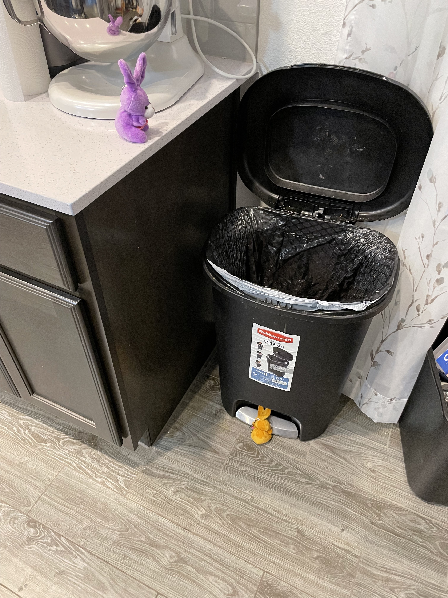

We opened the garage.
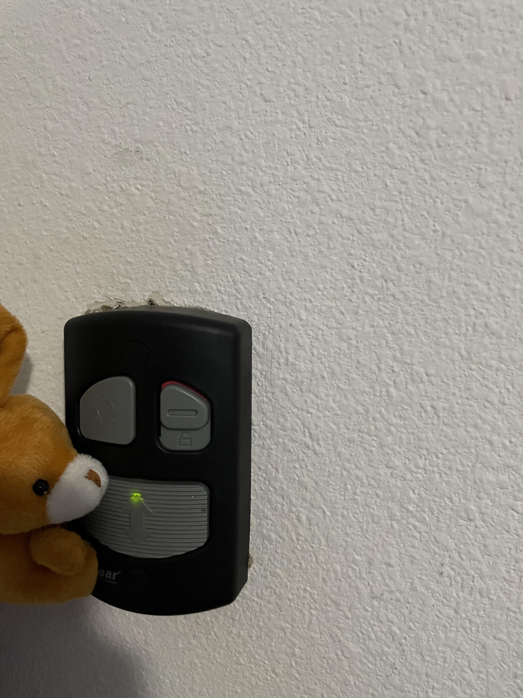

Put the trash in.
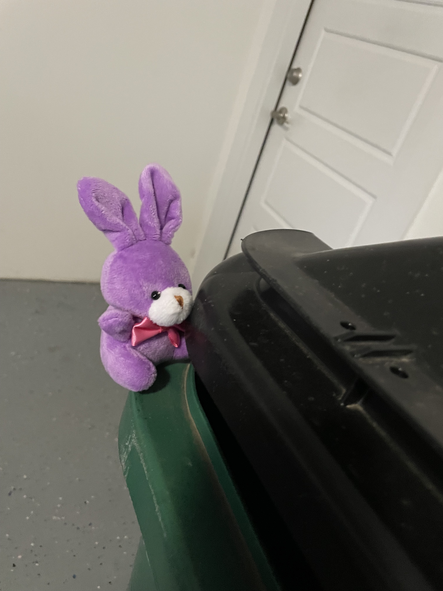

And took the trash out.
Now, while we were out Peanut say a plant with some very fresh looking leafs.
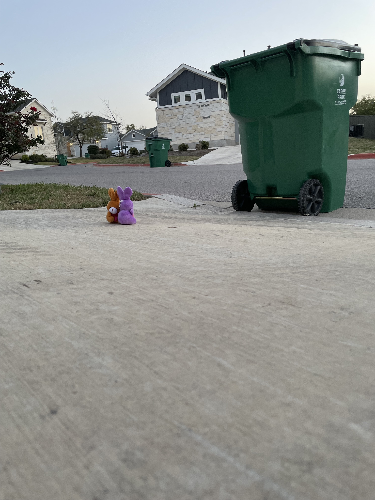

Upon further inspection, the bunnies decided the leafs were quite fresh.
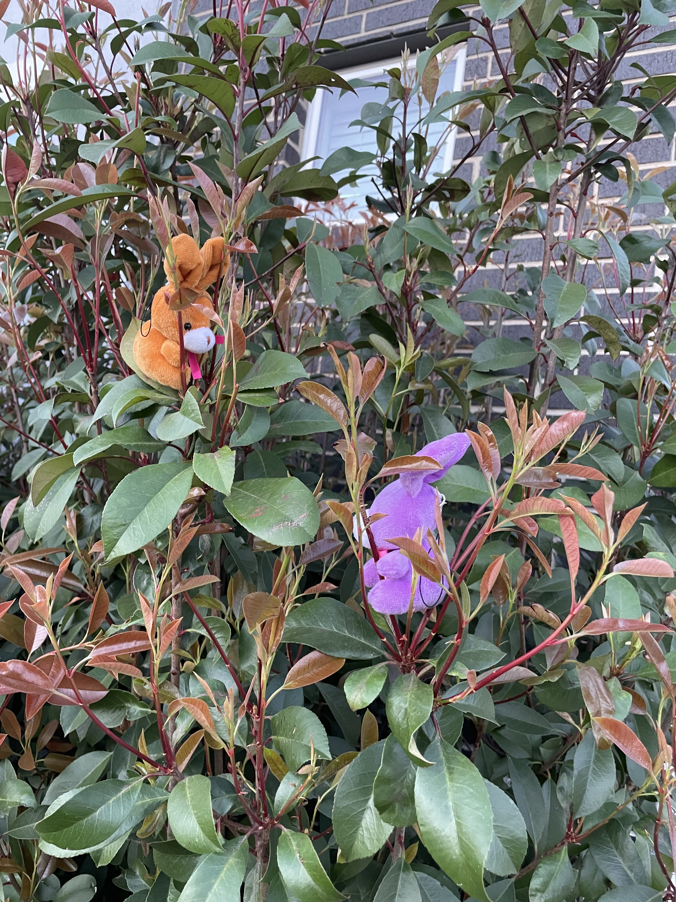

And grabbed a few.

Adhering to the recipe, the bunnies got some water going. 
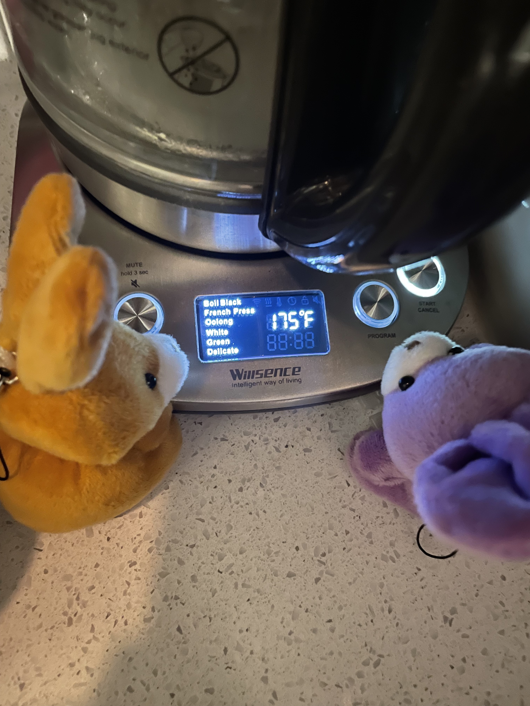

Eggplant put the leafs in the cup.
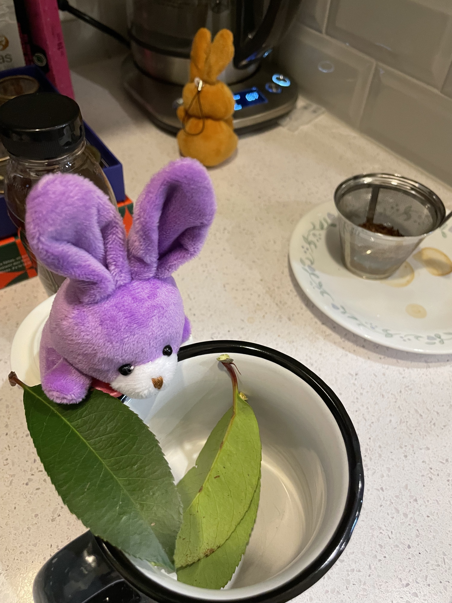

Then the water went in.
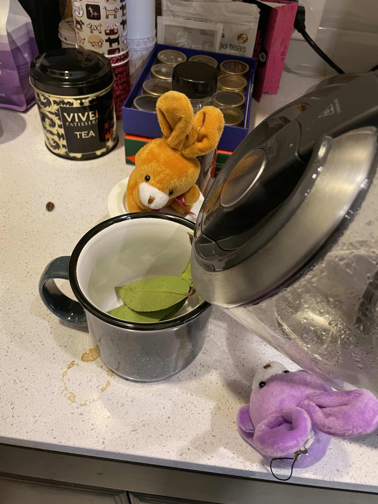

The bunnies waited for the leads to steep.
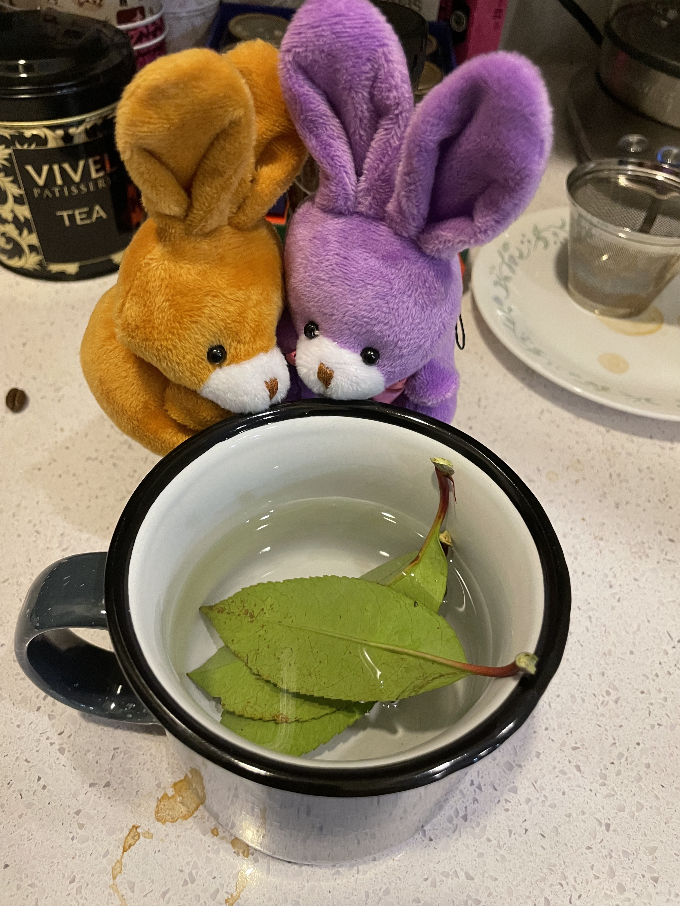

And then took the tea to the couch to wait for Shanny.
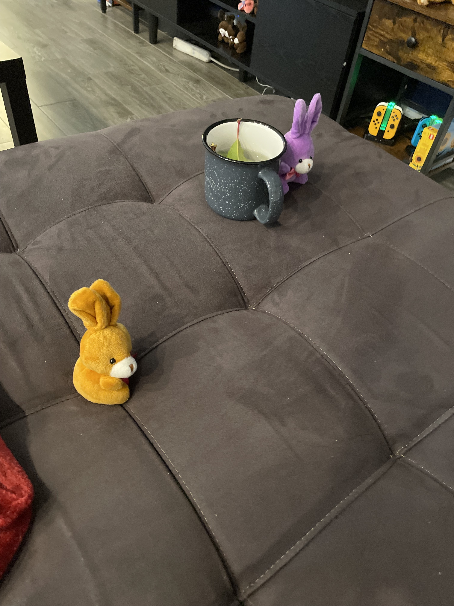

Shanny was not moving very fast, and worried that the tea may go cold, the bunnies went to go get Shanny.

