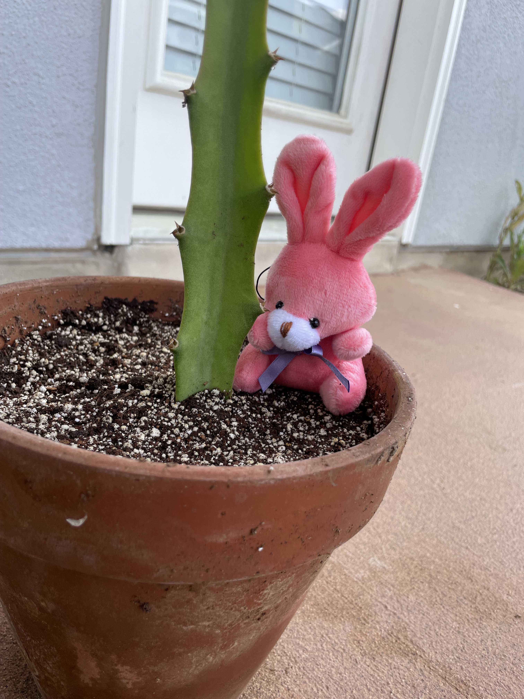

# Cactus

Acron and Squash are pretty upset, they did everything right, but the seeds didn't sprout.

Pretty stressed about the whole thing, the bunnies reached for the boos.

Until Shanny told them she ordered some dirt and cuttings.
The now excited bunnies, waited by the door for the Amazon man.

Amazon man came!

Now that we have dirt and cuttings, we have to get our pot ready.

Squash planted one cutting.

Acron planted the other.

