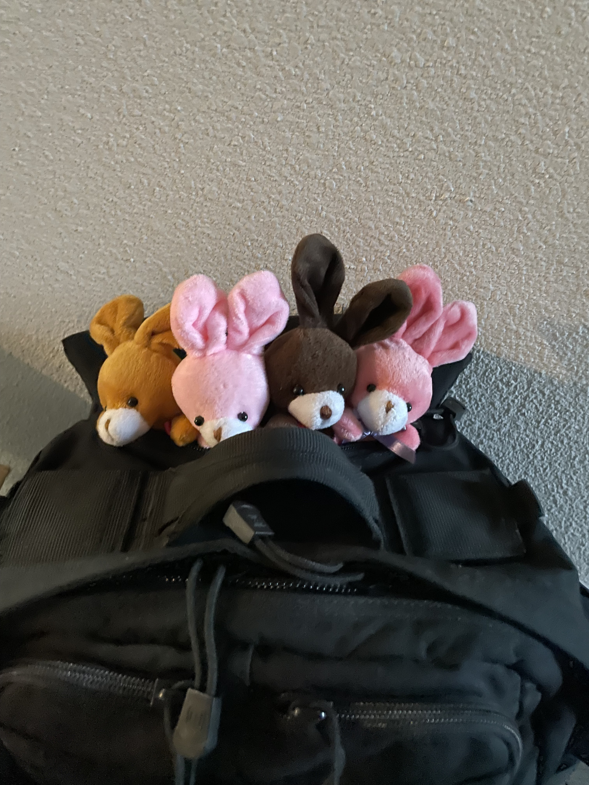
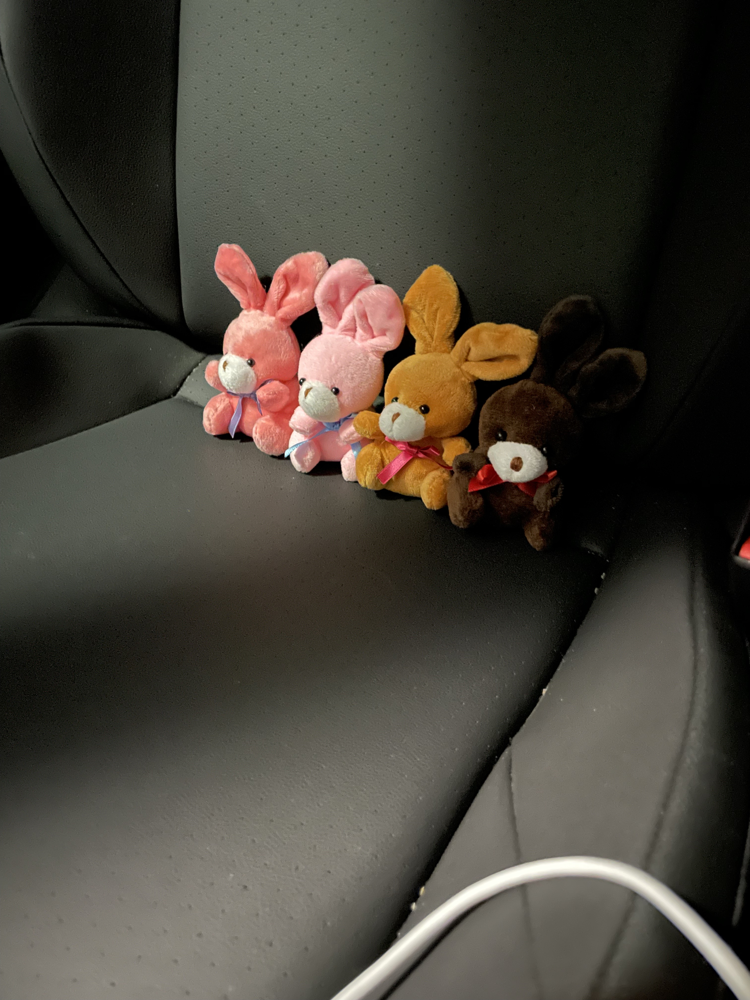
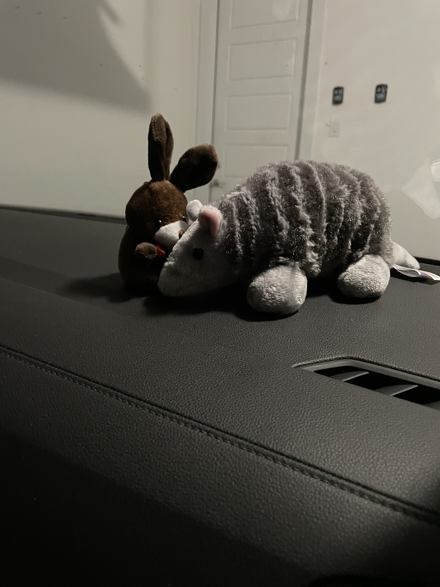
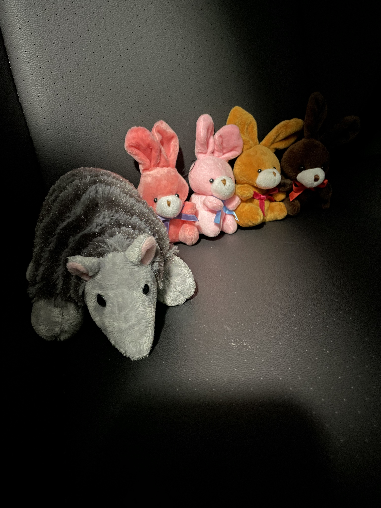
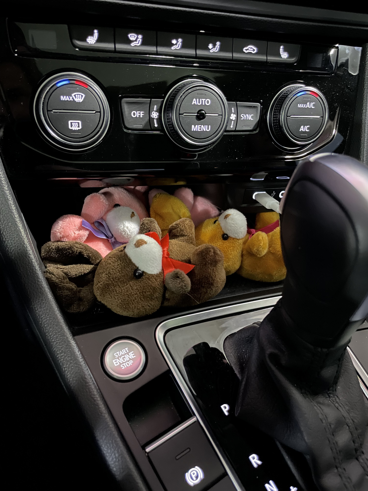
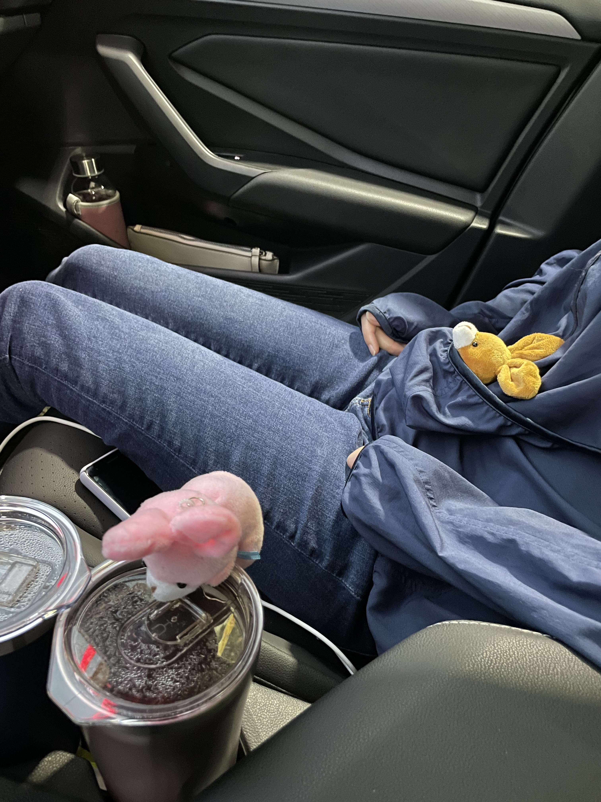
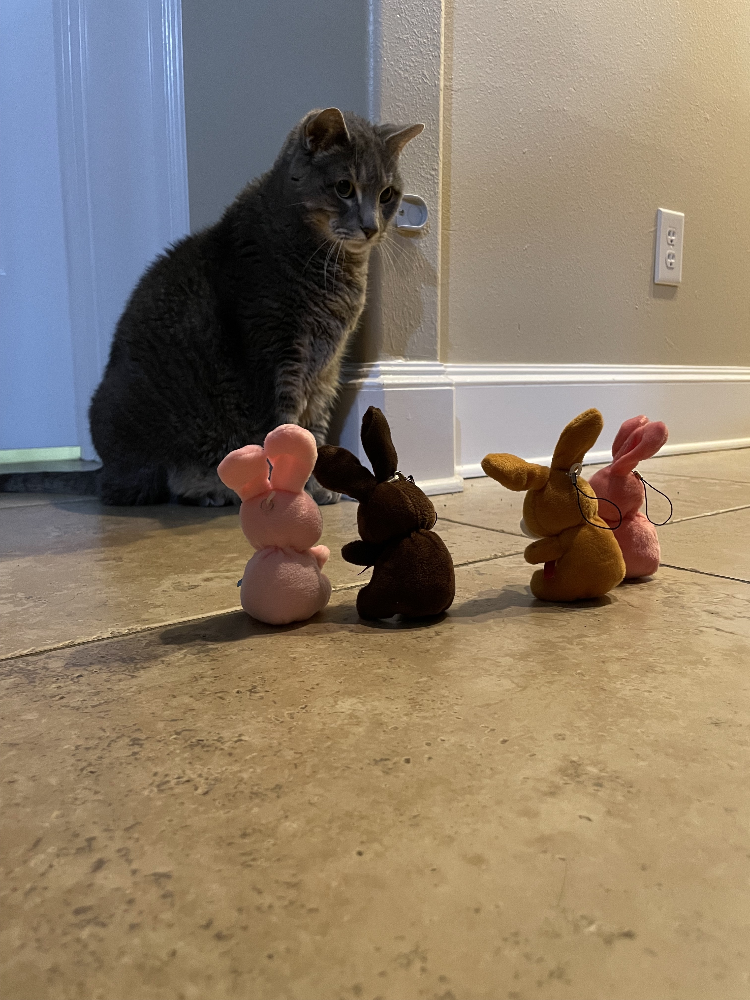

# The Great Magnolia Adventure: The Ride

The bunnies are traveling! We are spending the weekend in Magnolia! Carmel and Smartie want to check out the magnolia office, and Melon and Coco have been asked to make drinks!
The bunnies decided the felt lined backback pocket was a good way to travel.

I  however suggested a car seat. 
While seated, the bunnies saw Philip the car armadillo!

Coco was the only one brave enough to say hi.

Turns out Philip is pretty cool and wanted to sit with the bunnies.

Only problem was it is still pretty early, and the bunnies got tired.
The all had to pile into the bunny den for a quick snooze.

Eventually we had to stop for gas.

A far more awake Carmel decided to sit in Shanny's lap.

Melon and Coco decided they wanted to help drive.

While Carmel was living his best life, and Smartie was getting some tea.

We made it! Even found a kitty!

