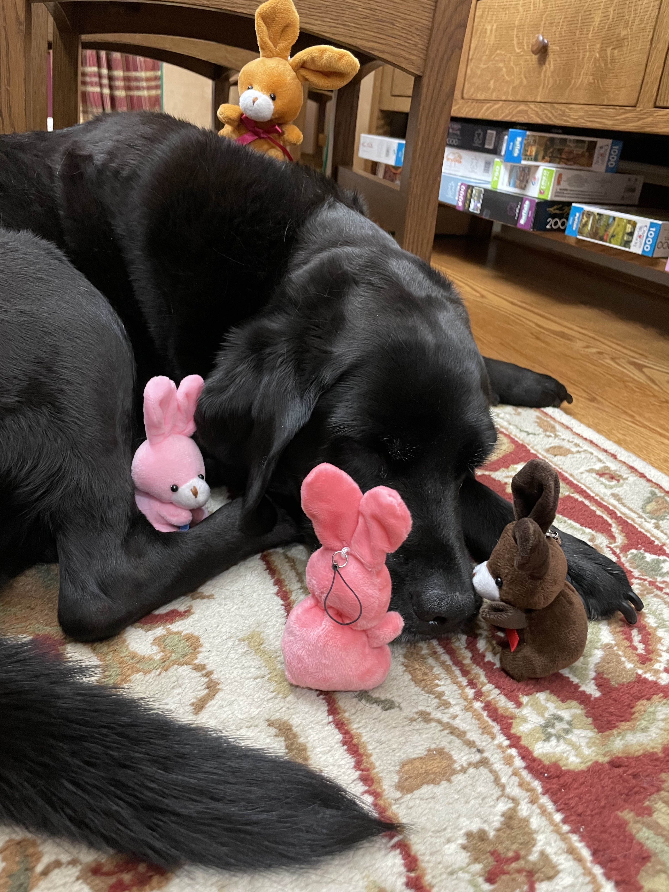
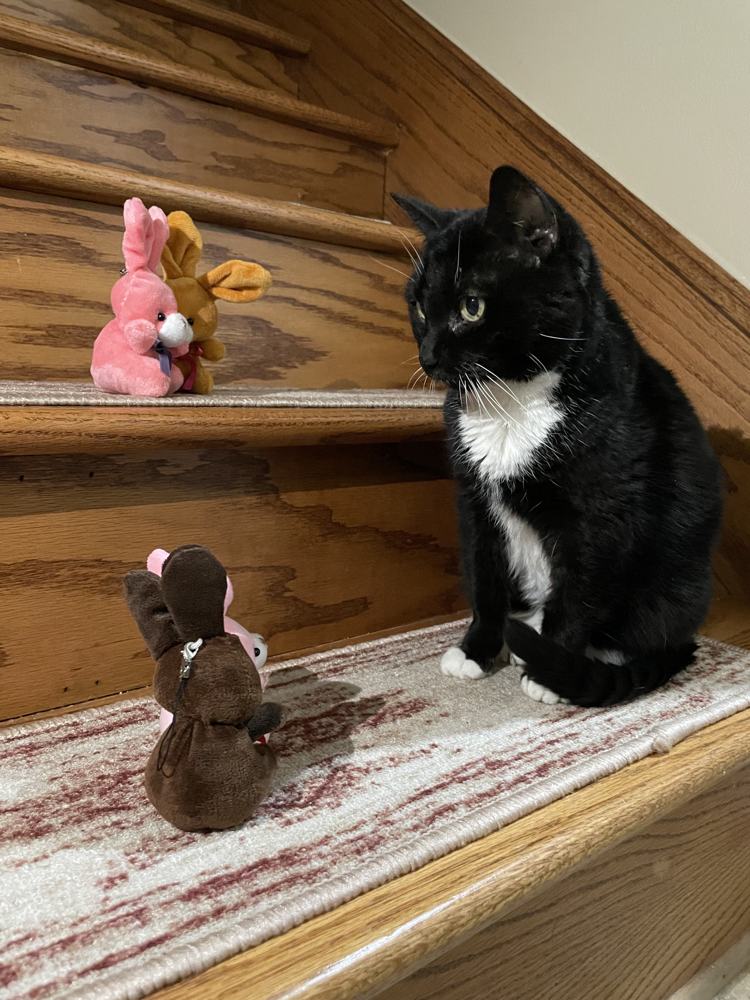
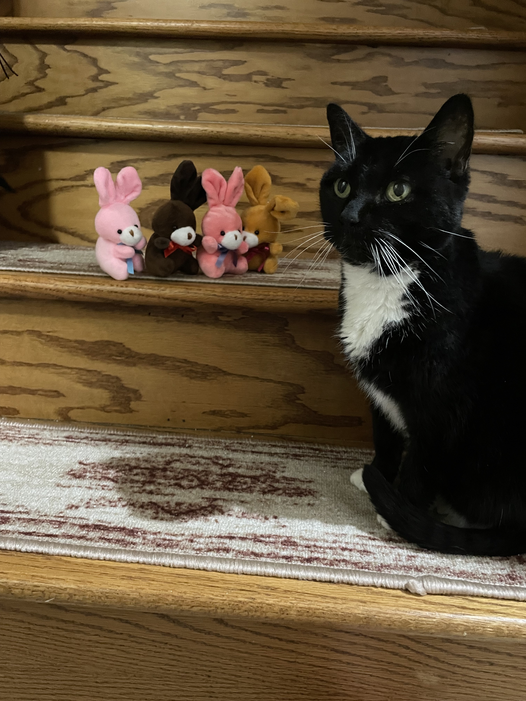
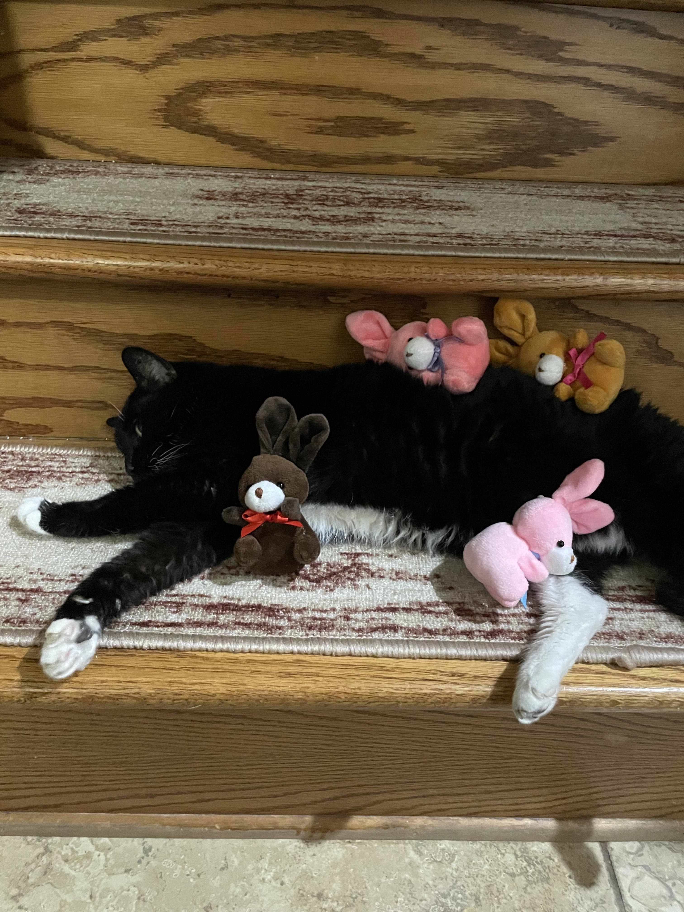

# The Great Magnolia Adventure: Mouser and T

The bunnies have been going on quite a few adventures around the house. This morning they found a sleepying doggie. 

They tried to get the doggie to play, and even though the doggie woke up, the doggie didn't budge. After a while, the bunnies gave up and went exploring for more animals.

Eventually the bunnies found Mousie! The black kitty.

Mousie was a little concerned about the bunnies and asked Shanny if they were safe. Shanny said yes, and that the bunnies probably just wanted a hug.

Mousie streched out, and snuggled with the bunnies for a bit.

