# The Great Magnolia Adventure: Melon's Nature Walk

Most of the bunnies wanted to sleep in this morning, but Melon was wide awake.
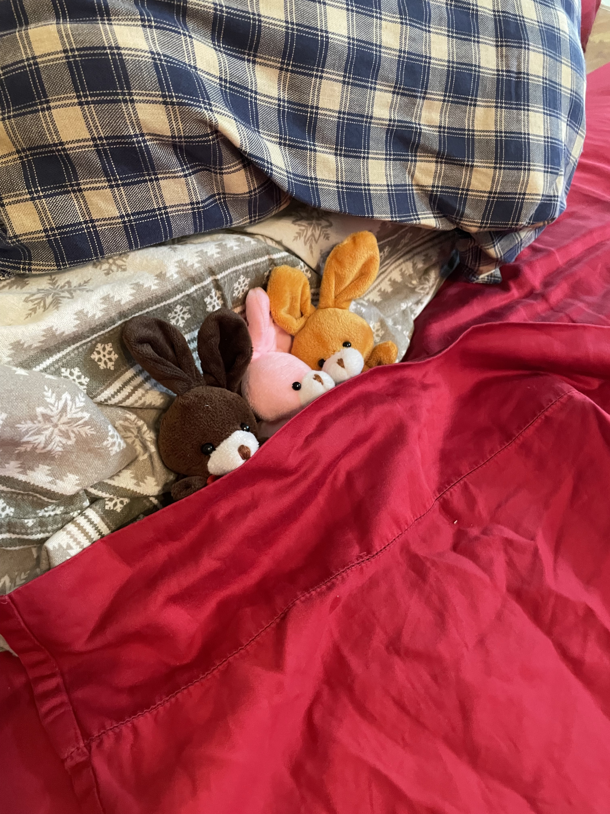

First, she helped feed the kitties.
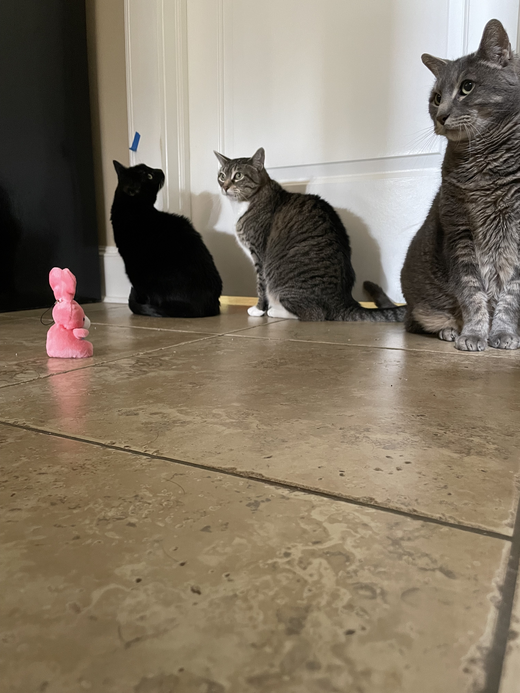

The she heard that Jill, Mama and Jacob were going for a walk. 

Curious about nature, she asked to tag along. She helped tie a shoe.
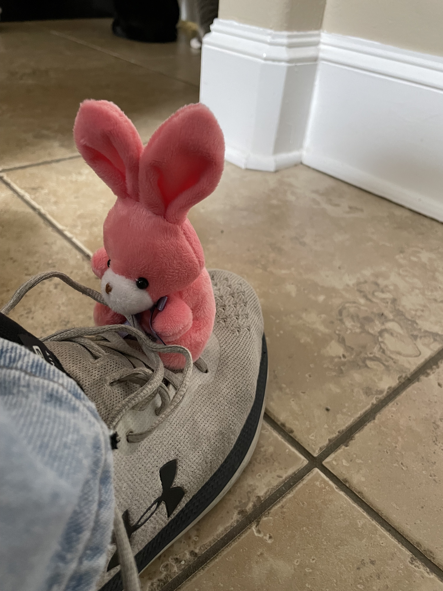

Then got a shoe of her own.
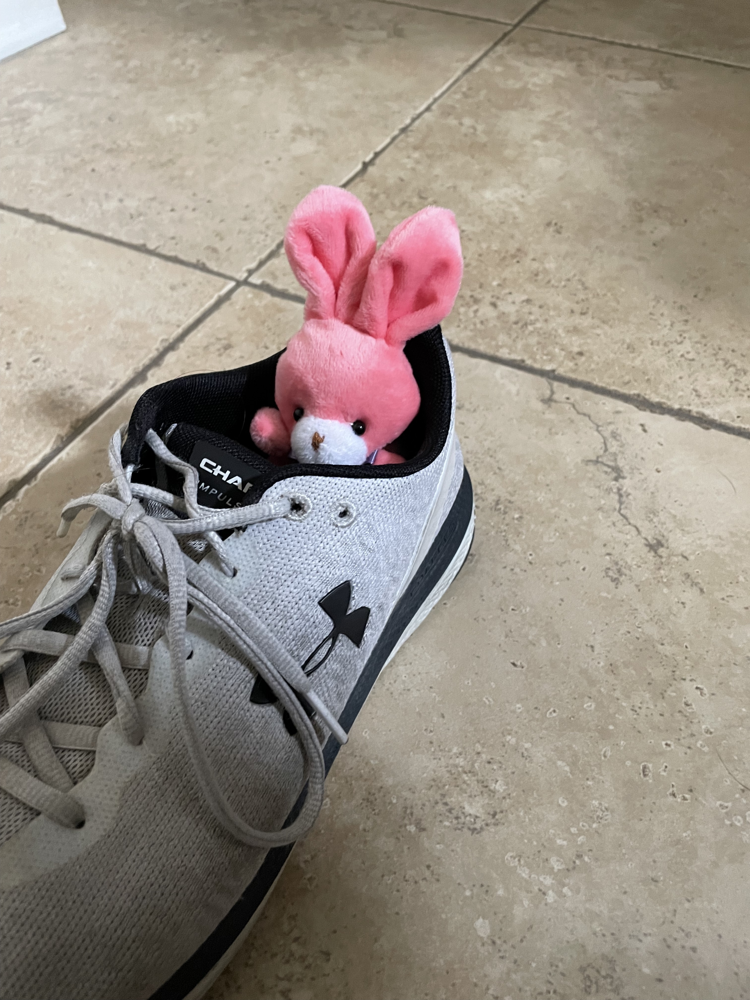

We checked out the porch before venturing out.
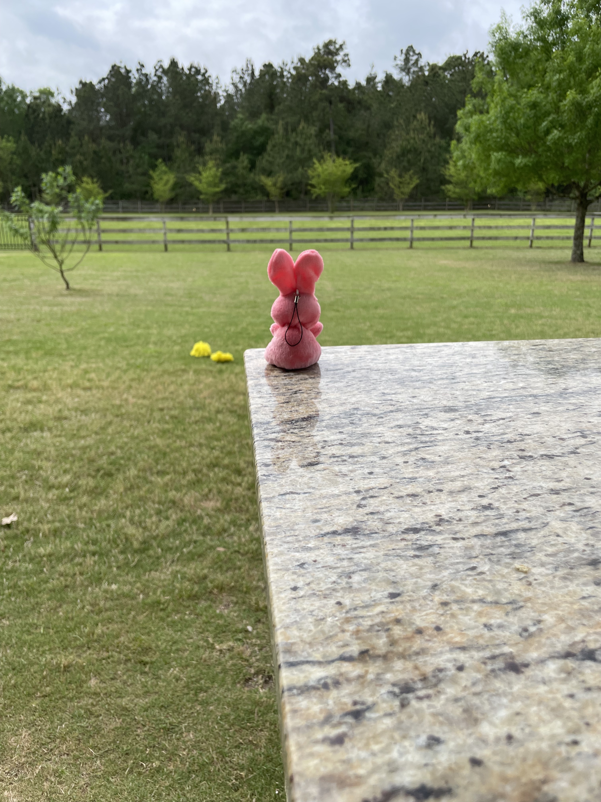

We found a fence with a gate.

Mama had to open it.
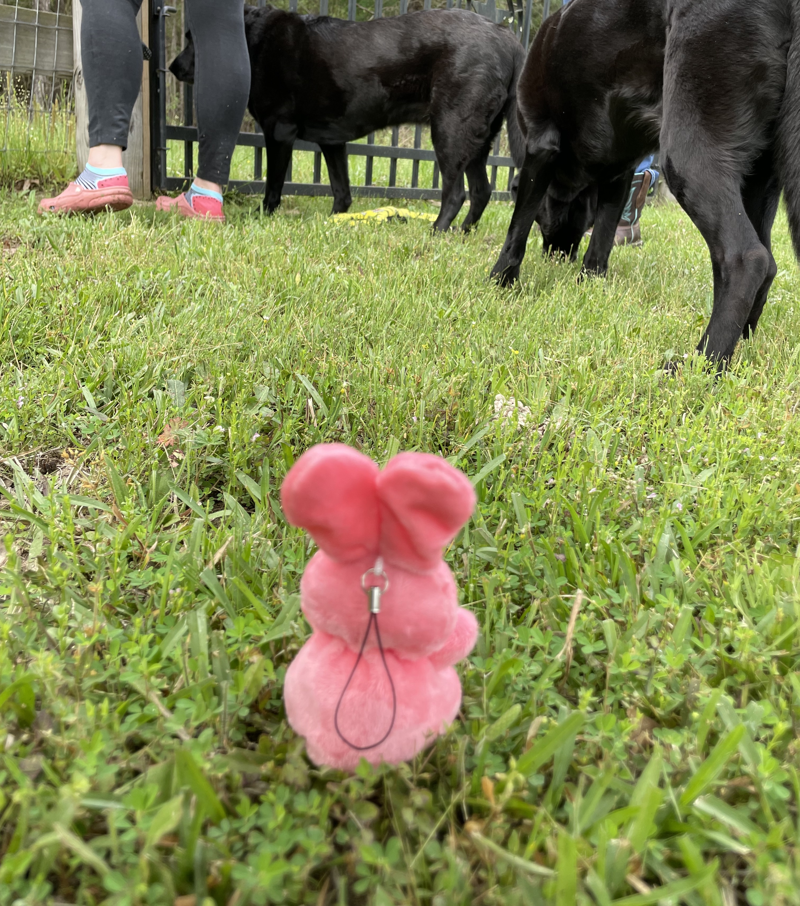

We started along the nature trail.
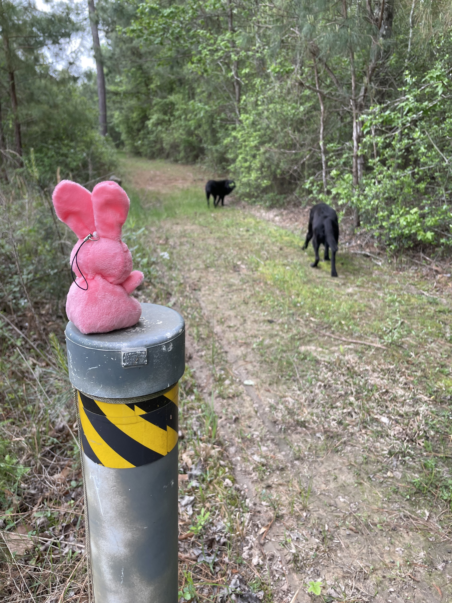

Found some wild blueberry plants.

Found the end of the property.

Found what we believe is a pine cone, though Shanny said these were acrons?

We found a horse? Seemed like a friendly horse, but we could not reach him.
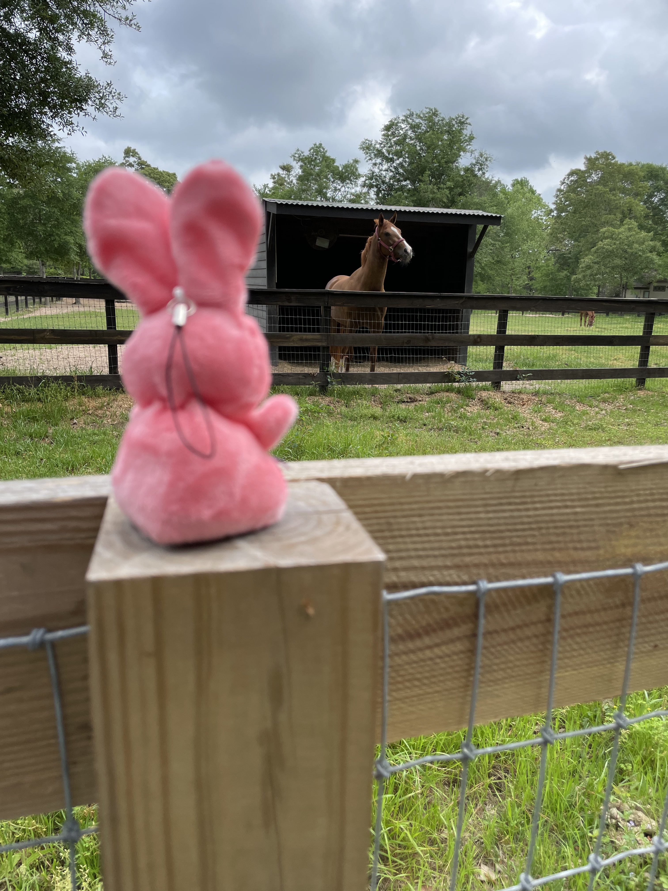

Climbed a skinny tree.

Climbed a fatter tree.

Found some flowers on the ground.

Found a flower tree!
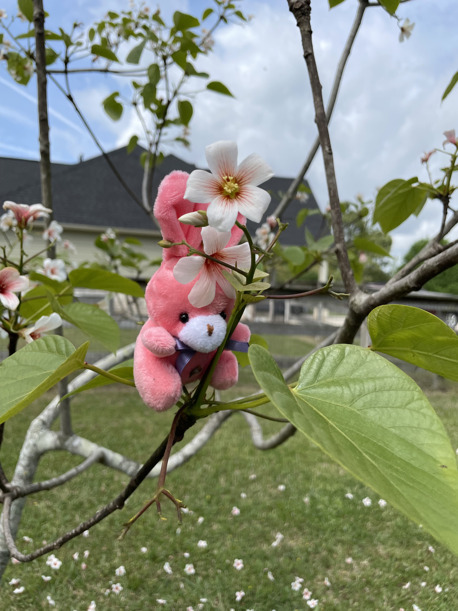

Found an acorn, though SHanny said these were pinecones? Nature is very confusing.

We even found a mushroom!! Shanny likes to eat these! Mama said, this one was not an eating on though.
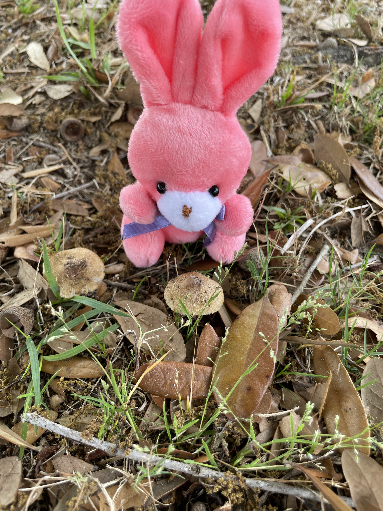

After the end of the nature walk, Mama helped Melon pick a few flowers.
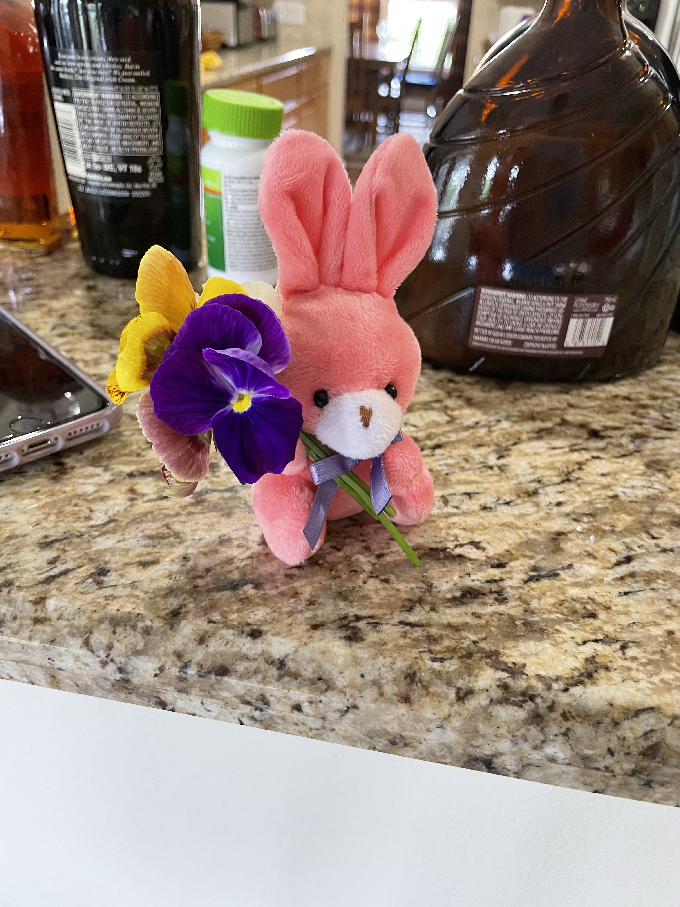

Melon then decided as Shanny missed the nature walk, to go give the flowers to her.

