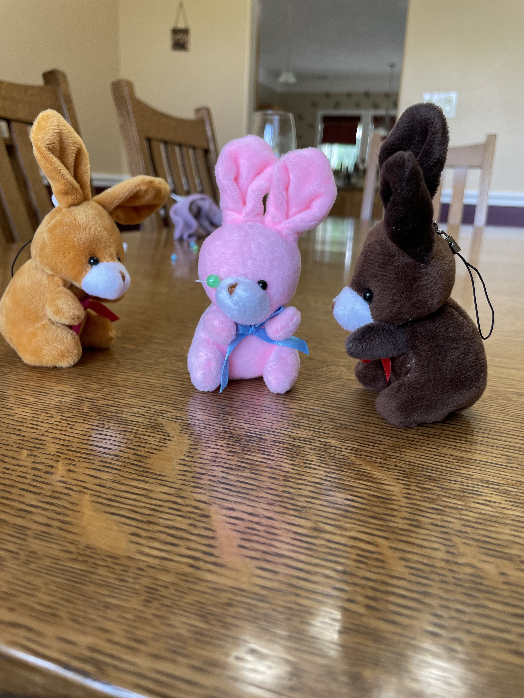

# The Dangers Of Pie

The bunnies wanted to help mama make a cherry pie. Mama said "sure", so the bunnies jumped right in.
After consulting the cookbook, they decided to drain the cherries.

Carmel went and found the fruit.

Smartie opened them up.

Carmel checking out the cherries, they smelled delicious.

Cocoa laid out some paper towels.

And they all worked to dry off the cherries.

Next comes pie dough, but for some reason Smartie started running into things... She assured the other bunnies she was ok though...

Melon and Carmel rolled out the dough.

While rolling dough, Smartie almost fell of the counter. Upon further inspection the other bunnies found out she lost an eye!!!

After failing to locate her eye, the bunnies took Smartie to the bunny surgeon.

The surgeon said we could replace the eye with a new bionic one, and pulled a few off the shelf for Smartie to try on. 

Melon was not ready to see a bunch of eyes and passed out.

First we tried on a hyper realistic eye, Smartie felt this one was too human.

Then a googly eye, she felt this one was too big.

Smarttie was concerned we would not find a match, but we kept going.

Maybe an S eye for Smartie? nah...

A blue eye?

Maybe a green eye?

We finally settled on a black eye.

Smarttie then was sent to pre op.

We are happy to report surgery went well. Minimal bruising and swelling.

Smartie was told to take it easy and follow up with her primary care in a few days when she was back home.

Mama felt pretty bad for the eye accident and packaged up a slice of pie for the bunnies.

Smartie followed up with Dr. Hops

Dr. Hops struggled to get the sticky off, but said the nurse would help with that after the eye exam. 

We are happy to report the new eye is working quite well.

The nurse even came out with some fancy anti stick bunny soap to clean up Smartie.

