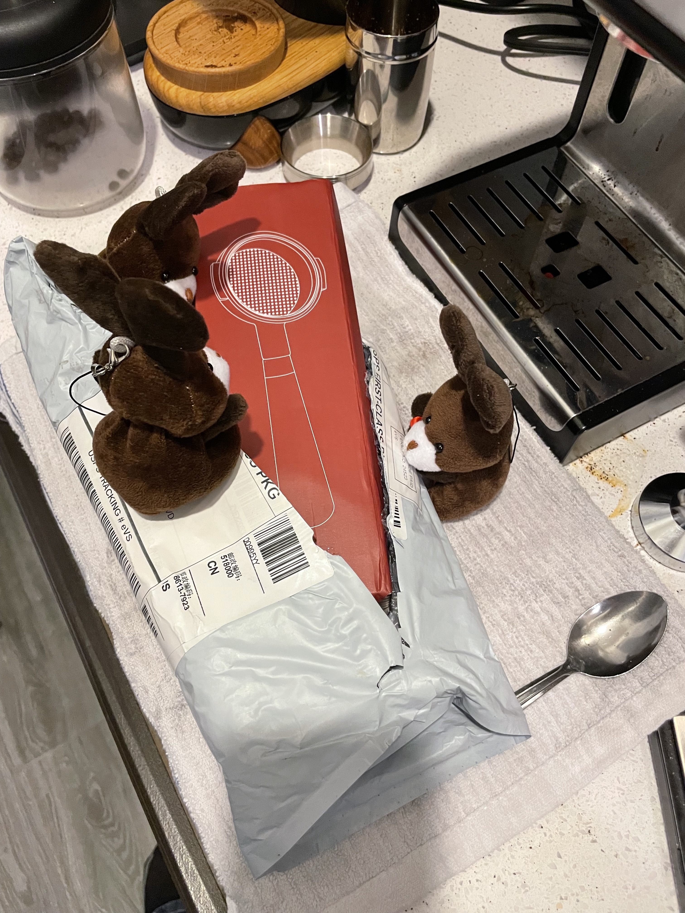

# A New Portafilter

The espresso bunnies are quite excited this morning. Normally they use a pressurized portafilter to pull espresso shots.

However, this morning they got a package!

A non pressurized portafilter!! The bunnies couldn't wait to give it a shot.

They pulled it out of the package.

And checked it out, they know the new portafilter would be a slight challenge, but were up for it!

They got the coffee ready!

And attempted a shot.... but disaster stuck and coffee went everywhere....

The bunnies when to go talk to bruce... they needed expert help.

