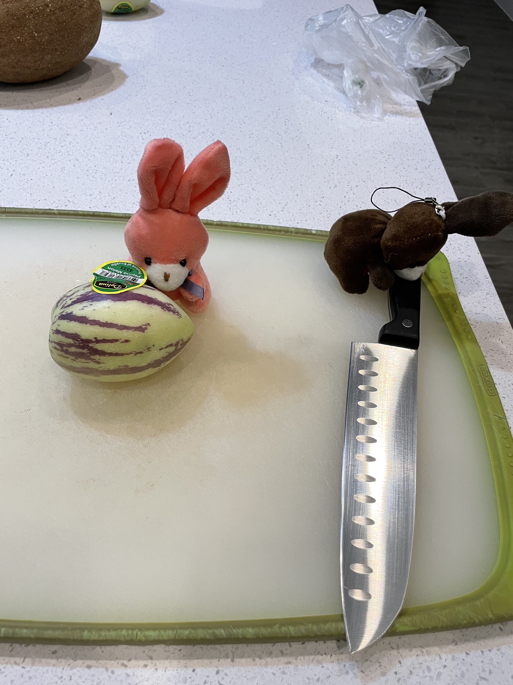
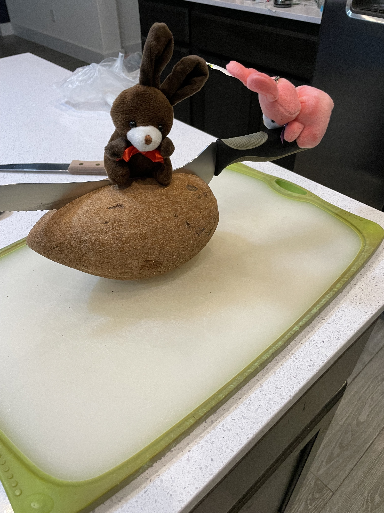

# Strange New Bunny Snacks

Today we went to the store, it was time again to get bunny snacks. Cocoa and melon, were quite interested to see what new yummies we brought back.

First they found a steak, and decided this was not a bunny snack.

But then they found a funny looking little fruit with stripes!

And one without stripes!

Even found something that looked like a giant almond.

The bunnies wasted no time in checking out these new non-steak bunny snacks.
Melon struggled with the sticker, which Cocoa got the knife.

Chop!

The bunnies tried the fruit.... it was.... not so good.
Kinda like a salty, grainy, cucumber.

So then they decided to try the almond. This was quite hard to cut.

The bunnies really wanted to like this one. Smelled yummy, but was very tough. We decided it was not quite ripe.

Afterword... Cocoa gave Melon a hand with her sticker.

