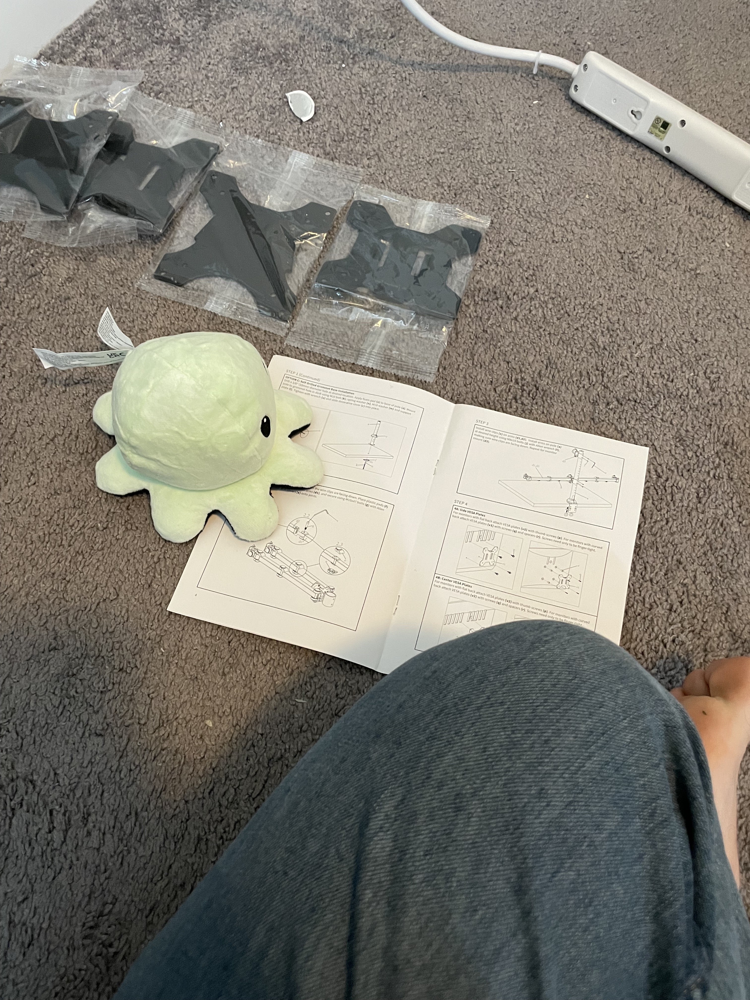
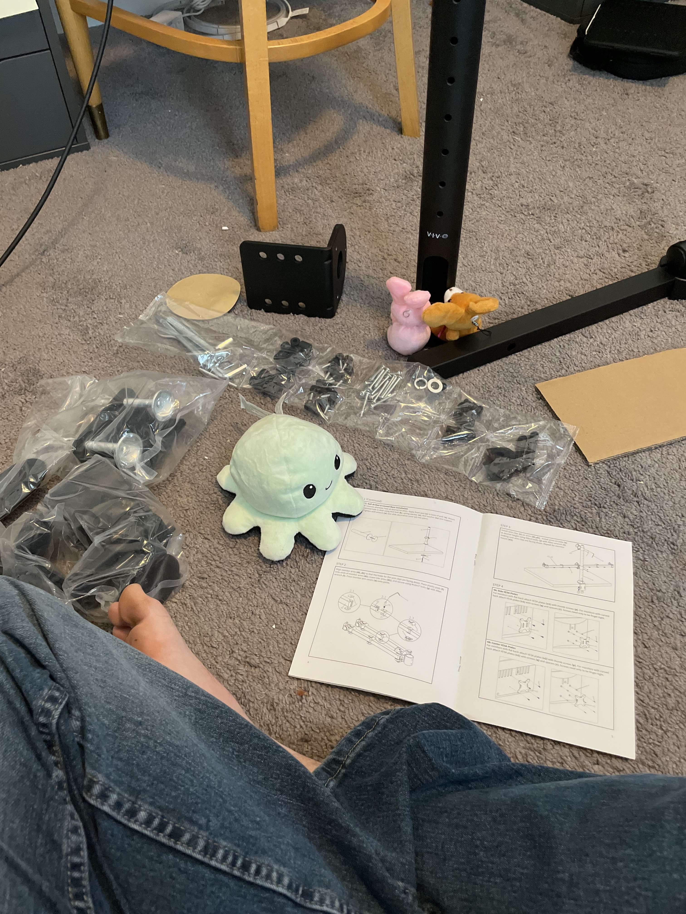
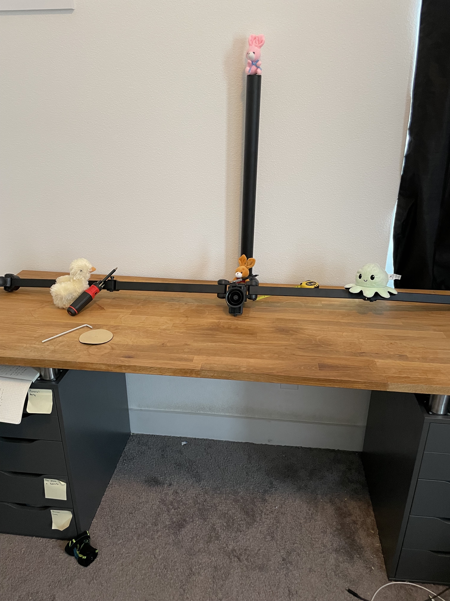

# Building Monitor Arms

Here recently Jacob has started reworking his office. The bunnies decided they would help. Today we start on monitor arms.

As it turns out, Carmel and Smartie can't read human, so they had to get some help from Compie the computer octopus.

Once the bunnies knew what to do, they got started.

The parts were pretty heavy, but we got it going.

Goose the duck even came by to help with the screw driver!

