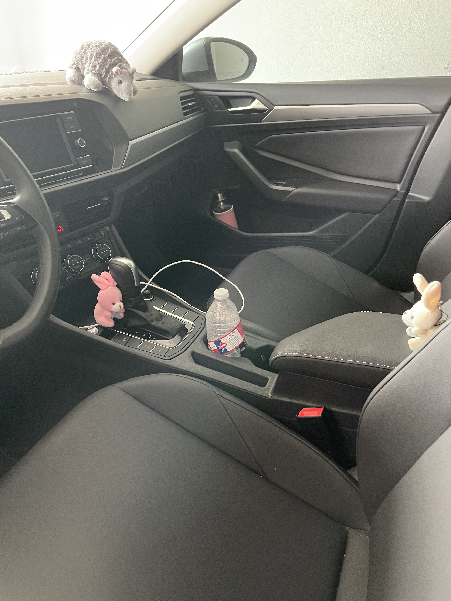

# A Car Wash!

Shanny decided she wanted her car washed up, peppermint and bubbles decided to help. First, we had to get the towels.

Then the soap.

First the bunnies tackled Jacob's car. Ben the buffalo was concerned about bunnies taking over his car...

First the bunnies took out the mats.

Then they vacuumed.

Then they wiped down the inside.

Then, the bunnies tackled the inside of Shanny's car.

Philip the armadillo was curious as to what the bunnies were doing.

Philip didn't understand why they bunnies were taking the mats away.

Then the bunnies pulled out the vacuum, and the curious Philip panicked. Vacuums are loud and scary.

However, Philip was very happy with how clean the floors were.

Then the bunnies wiped down the inside

Once again, philip being very happy with the quality of the bunny's work.

The bunnies were then going to start on the outside of the car... but quickly got rained out.

