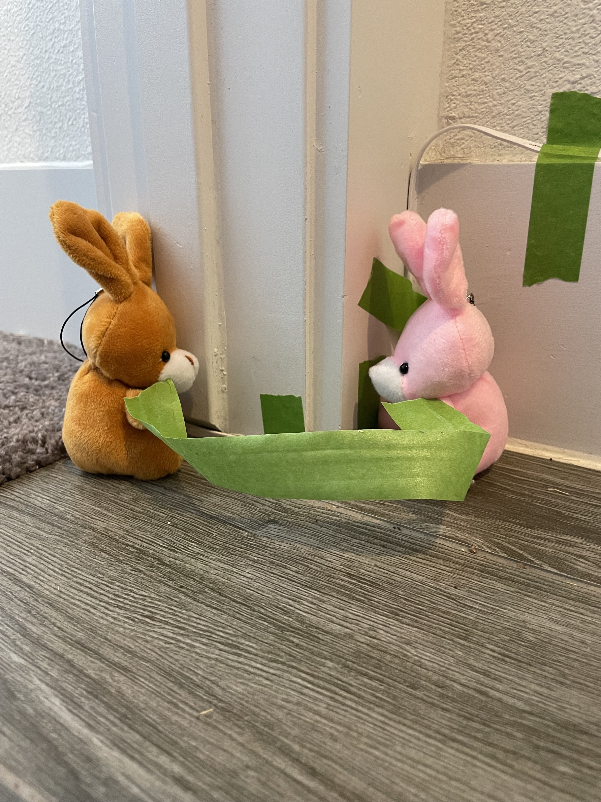
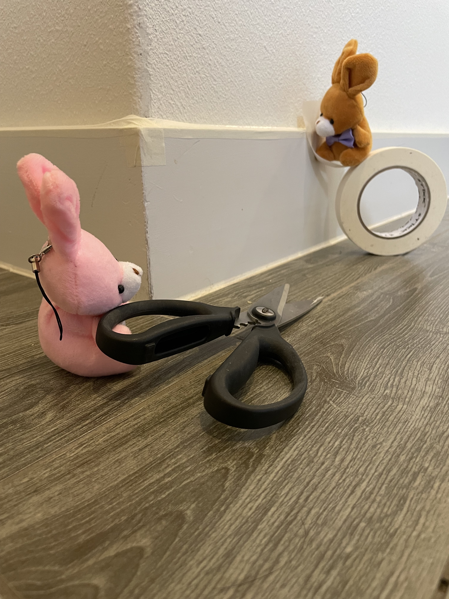
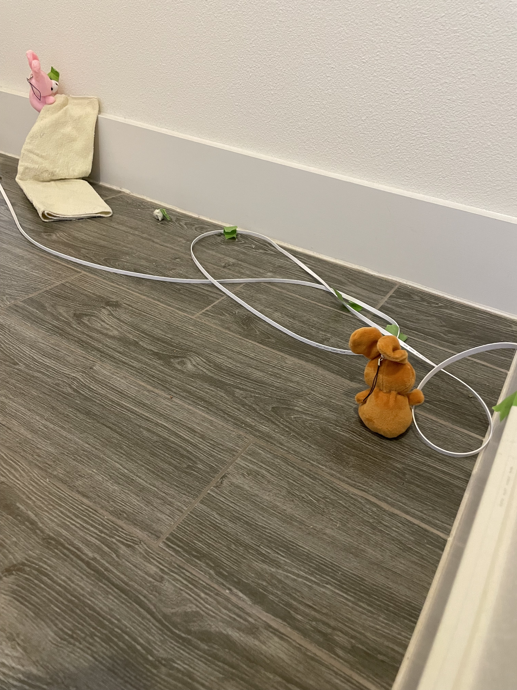

# Netflix and Internet

Turns out Turnip and Radish got quite hooked on netflix during the bunny flu. They have been watching movies quite frequently from the guest room, but find themselves frustrated with network speed. As such, they decided to move the router.

But, we needed a long ethernet cord for that. Are turns out cables get tangled. We had to take a bit to untangle it.

We had to run it from the dining room, so we went along the base boards and trim.

We taped it in place to make sure it stayed put

Work is progressing....

But green sticks out, so once we had the cable in place, we used white to make it blend it.

Radish even decided to clean the baseboards along the way.

