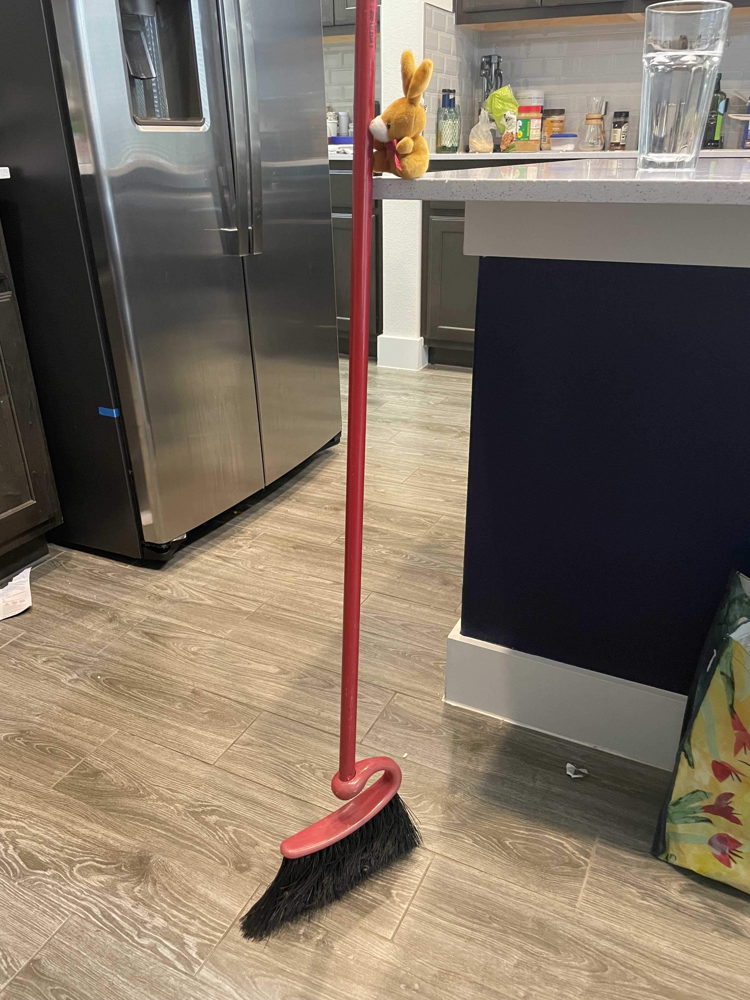

# Happy Hour

Today was the first happy hour in quite a while, the bunnies who wanted to make a good first impression, decided it was best to clean the house.
First, peanut got started with the guest bathroom.

Grape replaced to toilet paper.

After which they tackled the toilet. Grape was afraid to fall in, so they rigged up a saftey harness.

Scrumb scrumb.

Then the bunnies started sweeping. Or at least peanut attempted it.

It is a two bunny job.

Not sure how, but the bunnies did a good job.

Then Peanut started on the countertops.

They were very messy.

Then it was time to steam mop, first the bunnies had to get water.

Then they mopped!

After which, they noticed some crumbs on the couch, and decided it needed a vacuum. 

And you can't leave a blanket all over the couch, so they folded that up too.

Then they unloaded the dishwasher

But the bunnies panicked! "Oh no, we forgot the food" they cried looking at an empty plate! The bunnies went looking for Shanny, and called her when they could not find her in the house. Turns out, she already left to pick up food.

Relieved, the bunnies did the only next logical thing. Started making drinks!! First they measured!

THen the pour!

Shake shake!!

