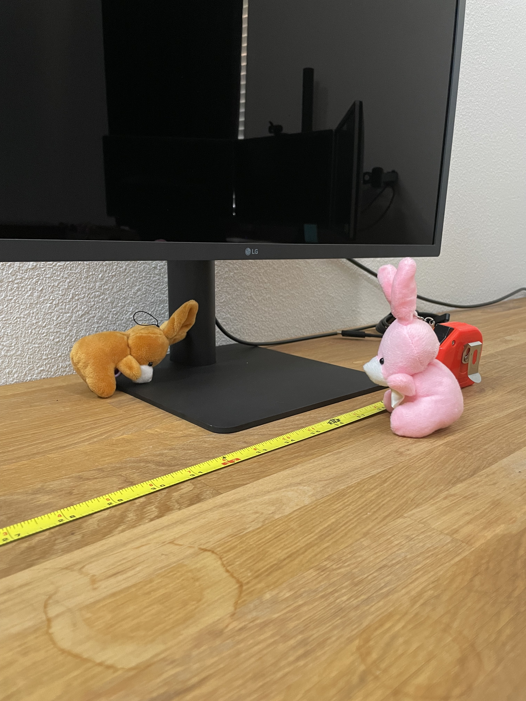
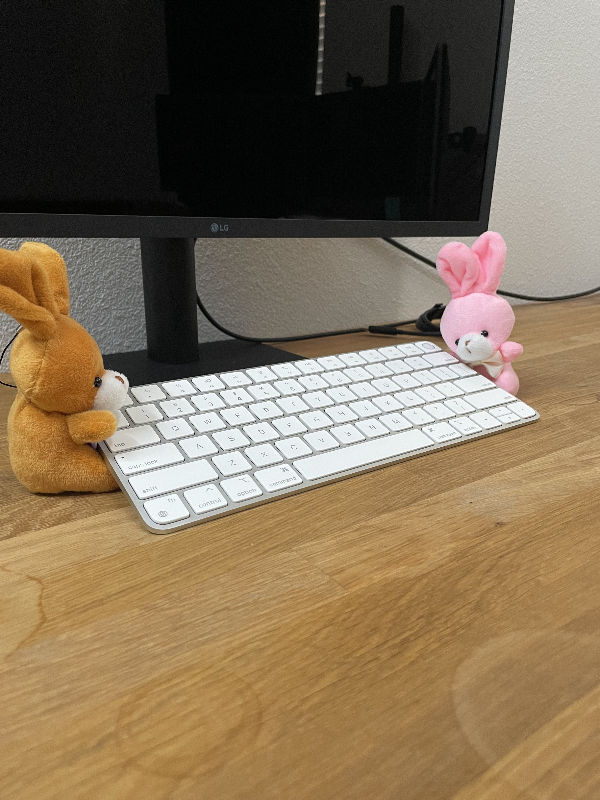
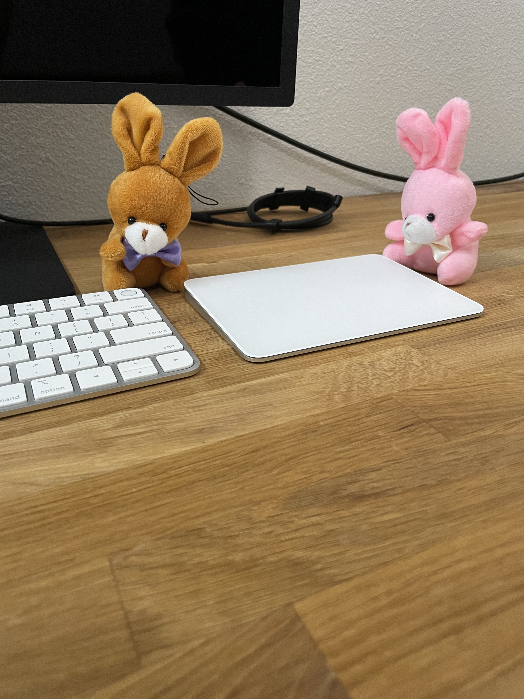
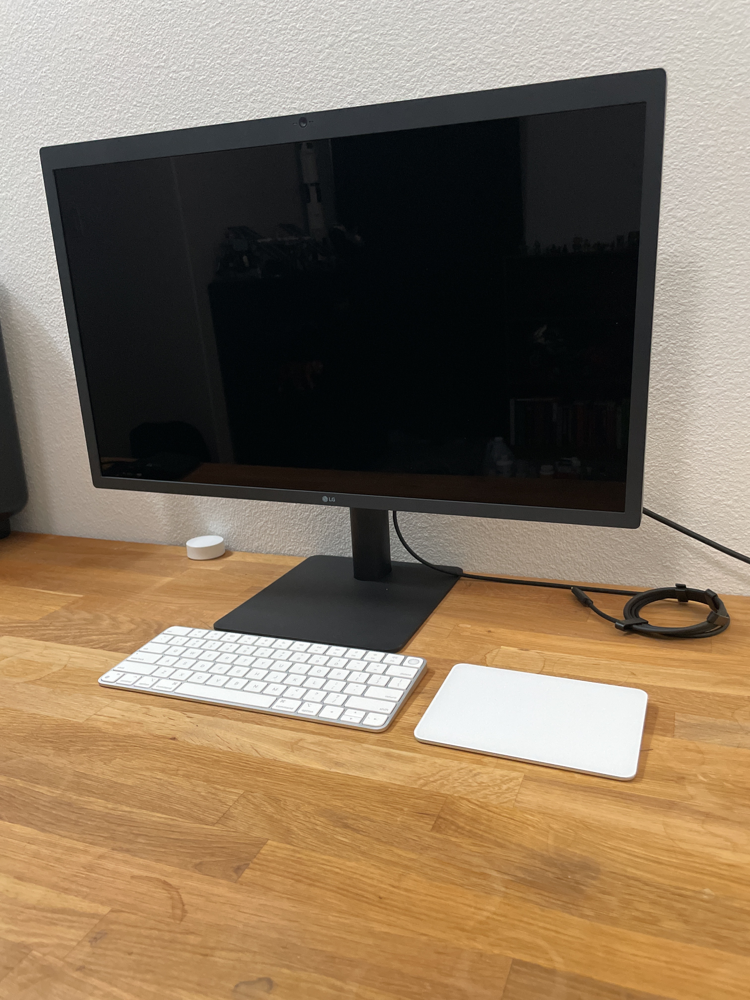
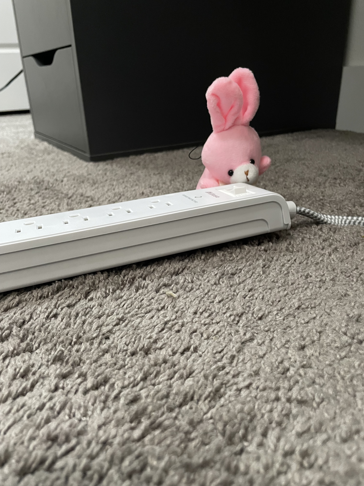
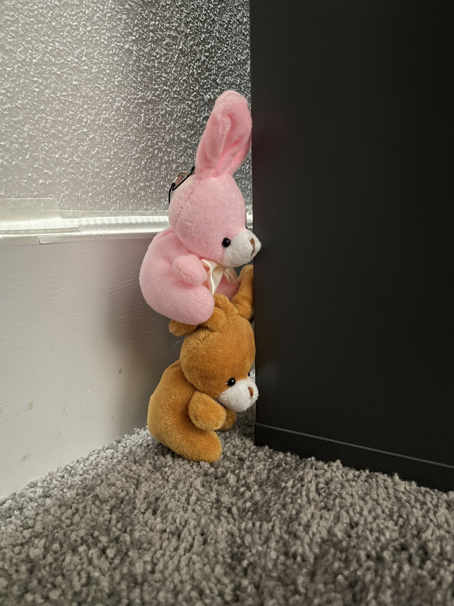
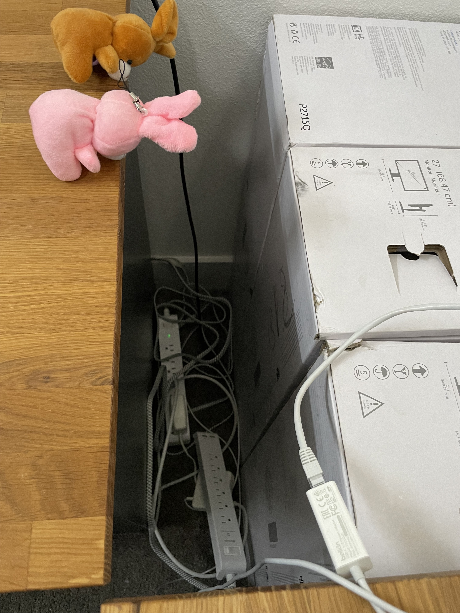
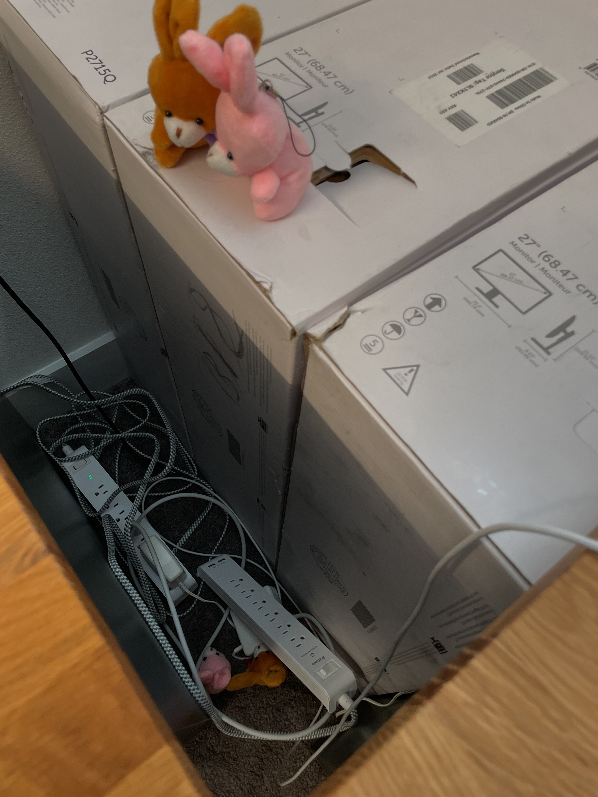

# Office Remodel

Office remodel continues!!
Today we are getting the second desk set up for the new computer. First we need to center the monitor.

Then the keyboard.

Then the track pad.

Jacob approves.

Then we need power management.

We plan to run power strips behind the desk.

Which means we have to move the desk.

Got the power set up, and the desk back. But now we have a mess. Time for cable management?

Radish and Turnip called Smartie and Carmel to help with the cables. They, after all, are the home office bunnies.

