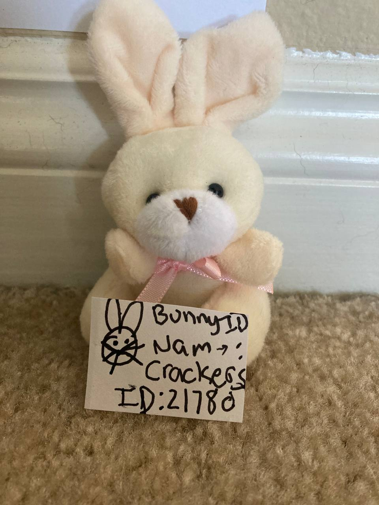
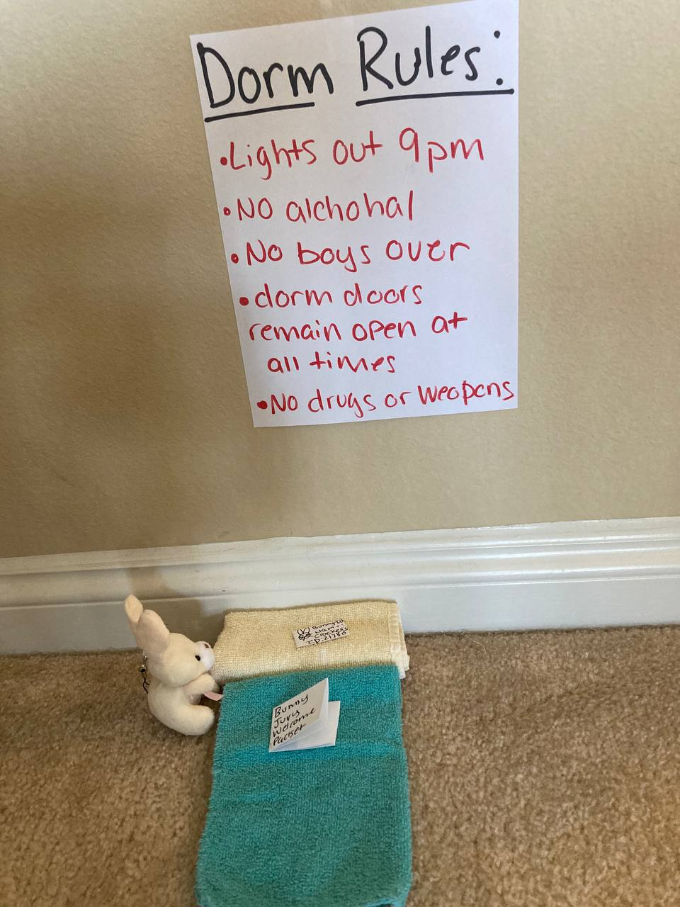
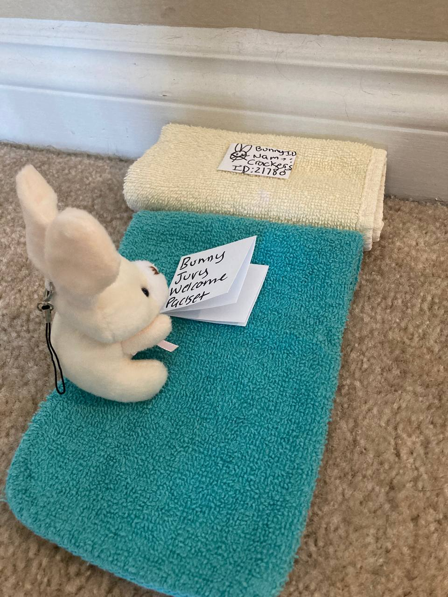
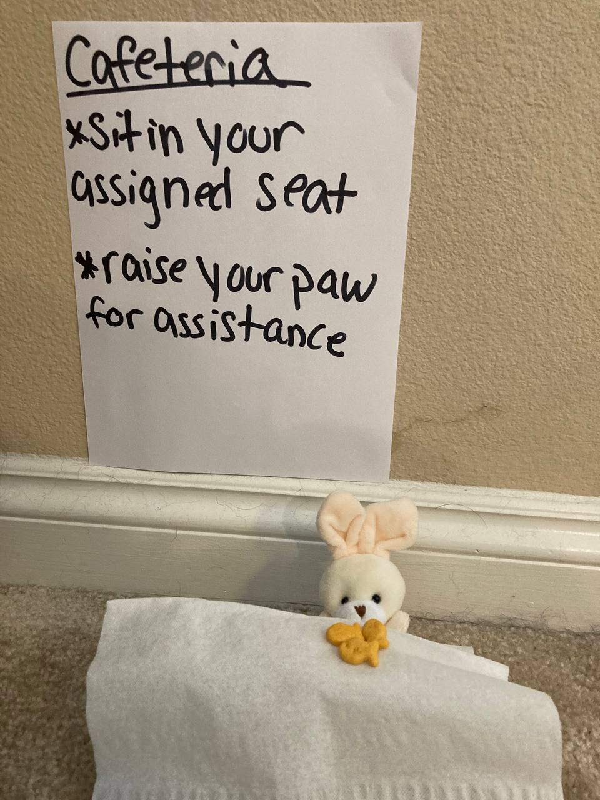
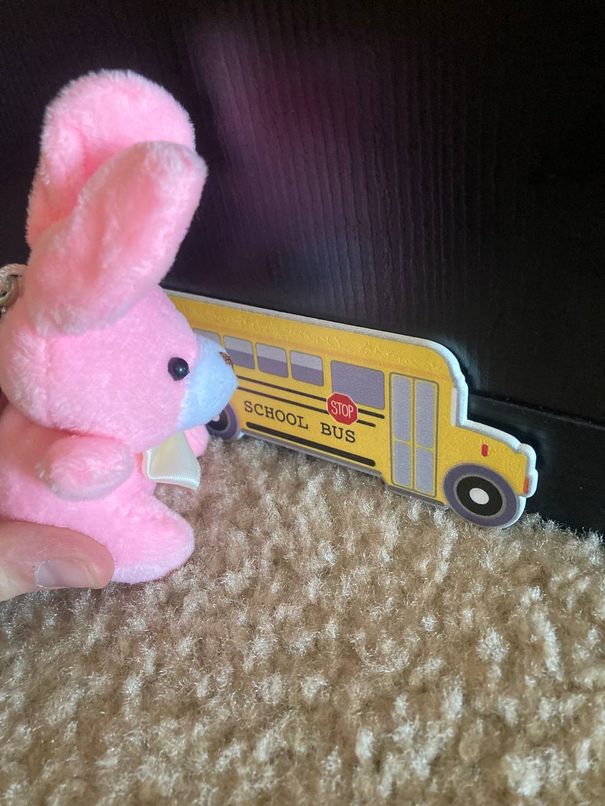

# The Bad Bunnies
## Story Credit: Jillian Daigle

Welcome to the bunny Juvy correction center! A chance for all dropout bunnies to be rehabilitated and re-acclimate to society to get their life back on track!

Today is move-in day for the Juvy bunnies! The first of two, Crackers, arrives today.  

First crackers must take an intake photo for her ID.

After her photos, she is escorted to her dorm. Dorm rules are posted on the wall.

A welcome orientation packet can be found sitting on the bed.

After she gets a chance to check out her dorm she is then taken to the bunny cafeteria where she is allowed to have a snack of goldfish crackers.

Lucy the other bunny, got her license revoked for reckless driving and is having to Bber to the correction center.
However, Lucy fired the driver for driving two slow, and is now trying to steal a school buss.

