# Are The Bunnies Going Home?

Yesterday I had to have a talk with the bunnies. Easter month has come and gone. Originally the bunnies planned to go back home, but they were pretty upset about getting stuffed back in the eggs. 
So we decided, If they picked up their eggs, and continued to help with chores they could stick around.
Yesterday, Shanny and I went to get some tubs. We did get dinner on the way back home, and forgot them in the car.
So bubbles and peppermint went out to garage this morning.
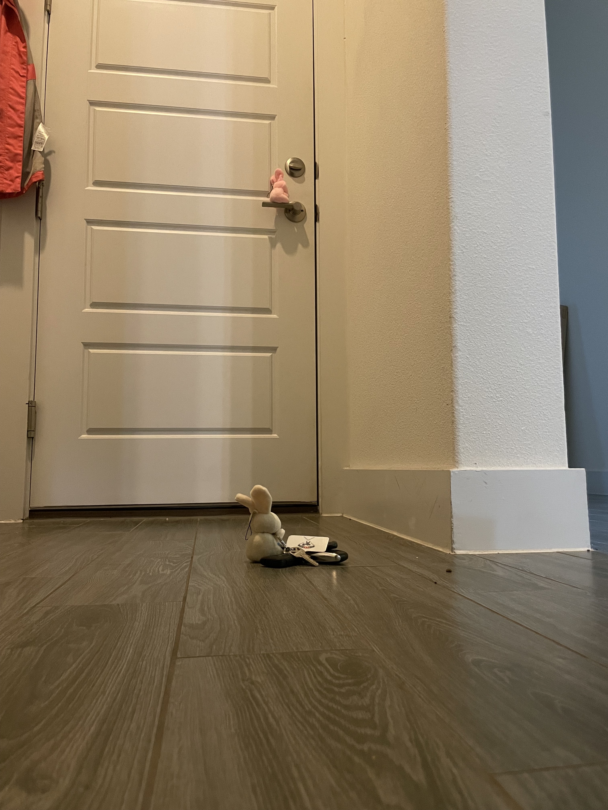

Opened the trunk.
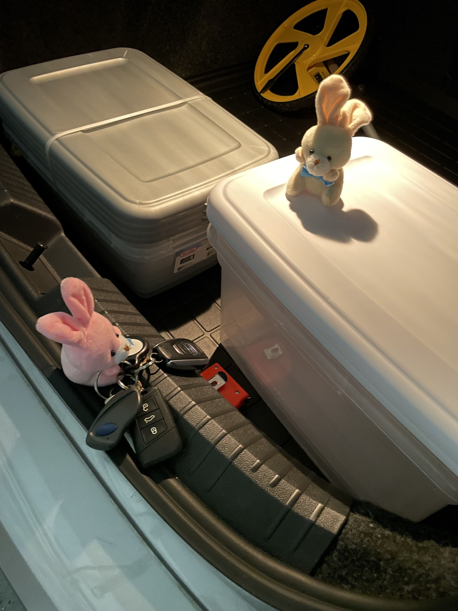

And brought in the tubs.
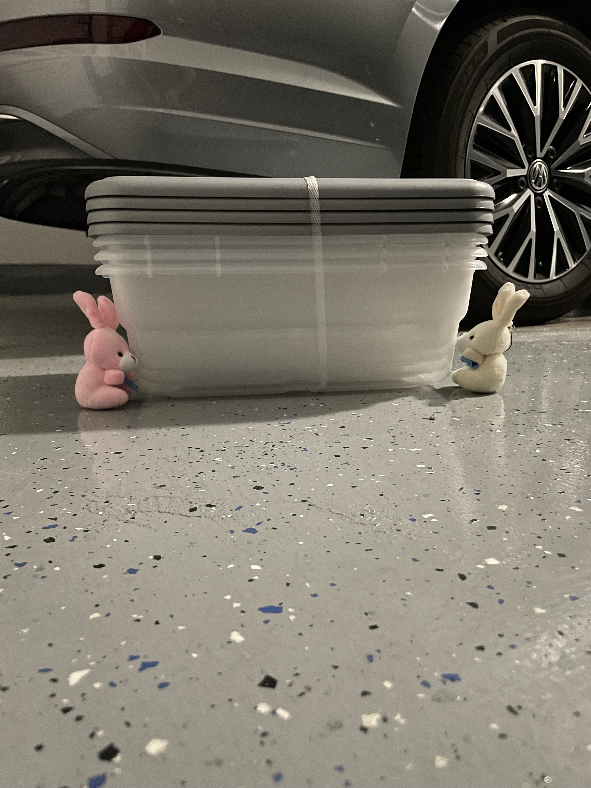

Had to cut them apart…..
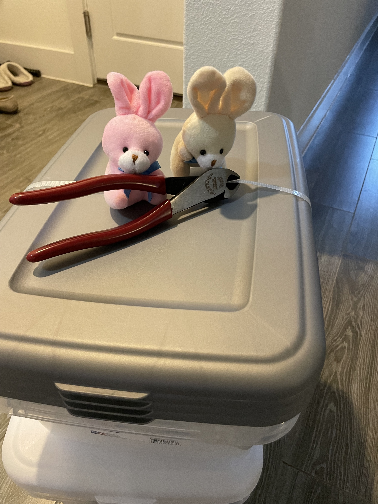

The cleaned the eggs.
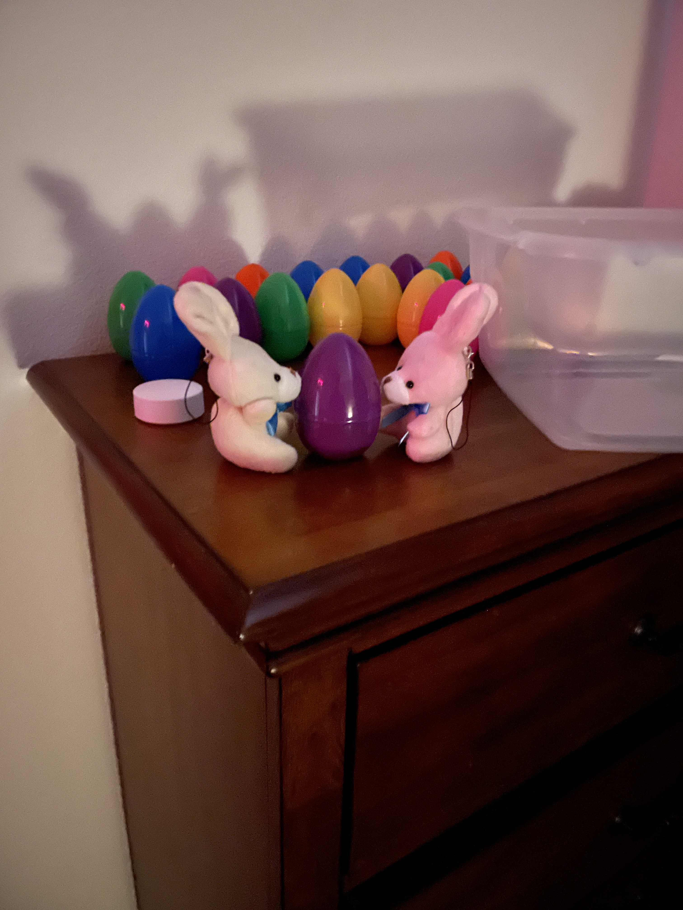

And packed them up.
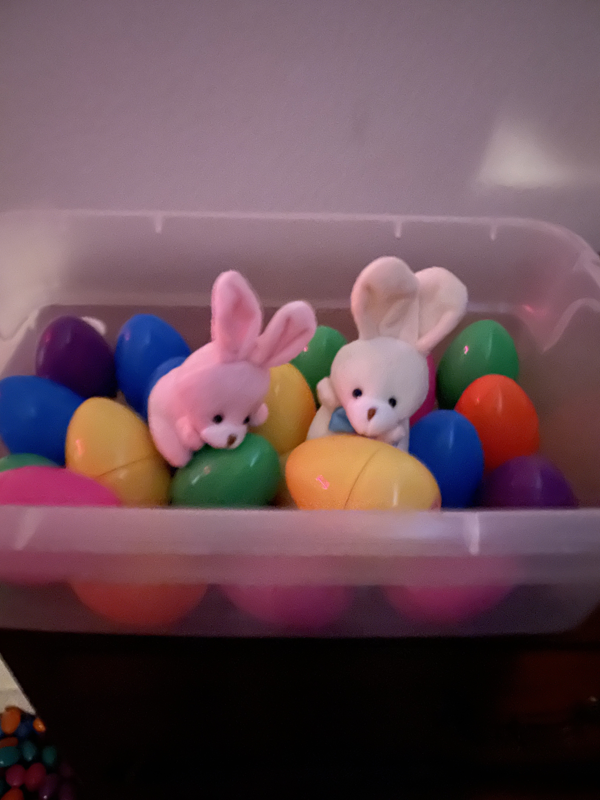

They took the tub to the storage room.
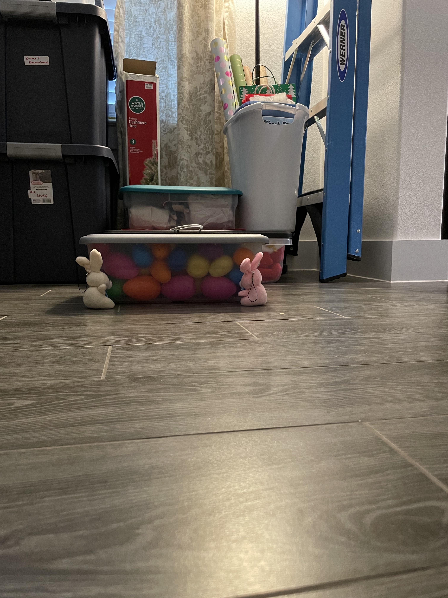

And put it with the rest of the decorations.
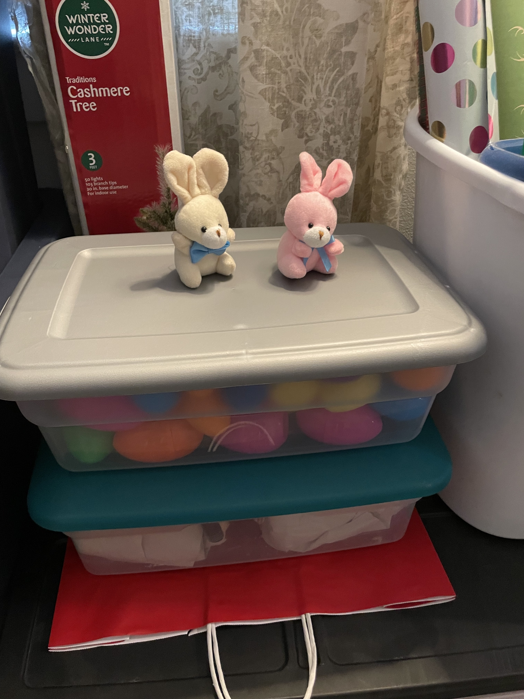

Then the bunnies, wanting to make good on their chore promos, helped pick up other decorations.
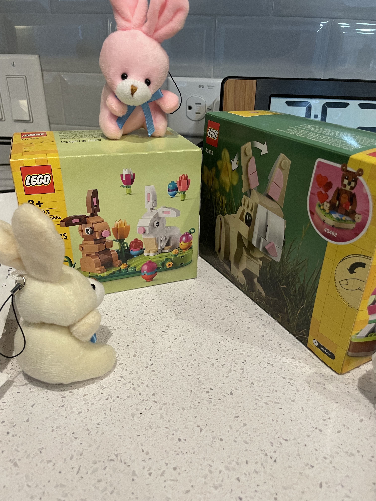

They put the Easter lego away.
Now, we have quite a few lego, some of which we want to store on bookshelves.
Turns out, one such book shel was delivered last night.
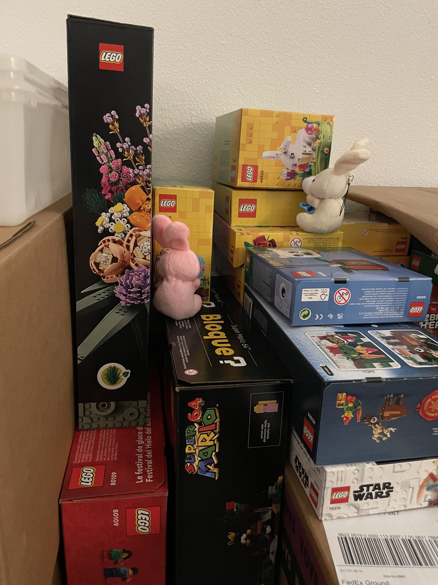

The bunnies decided they would help get it to the right room, and put it together.
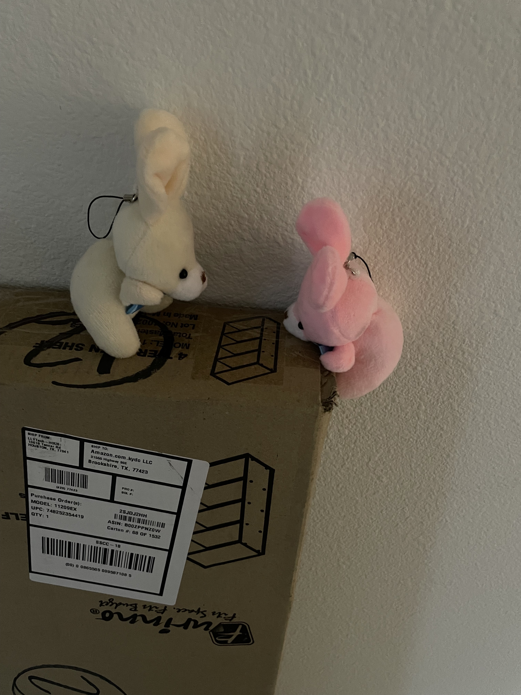

Looks like the bunnies are struggling to move the box though.... TBC
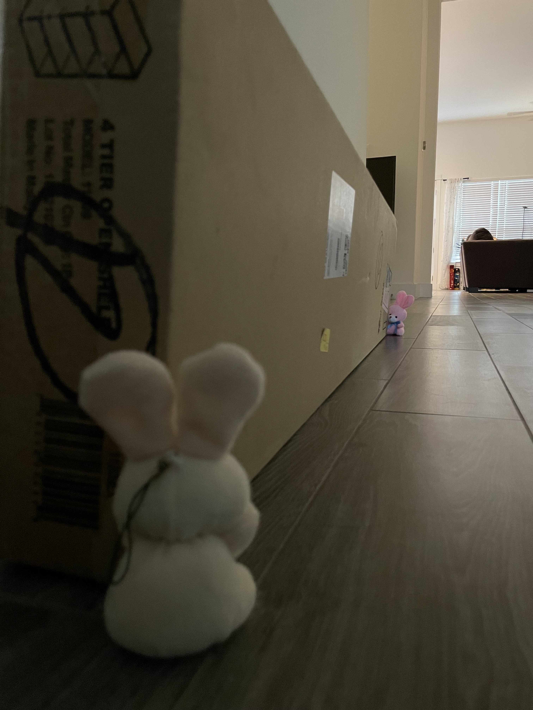

