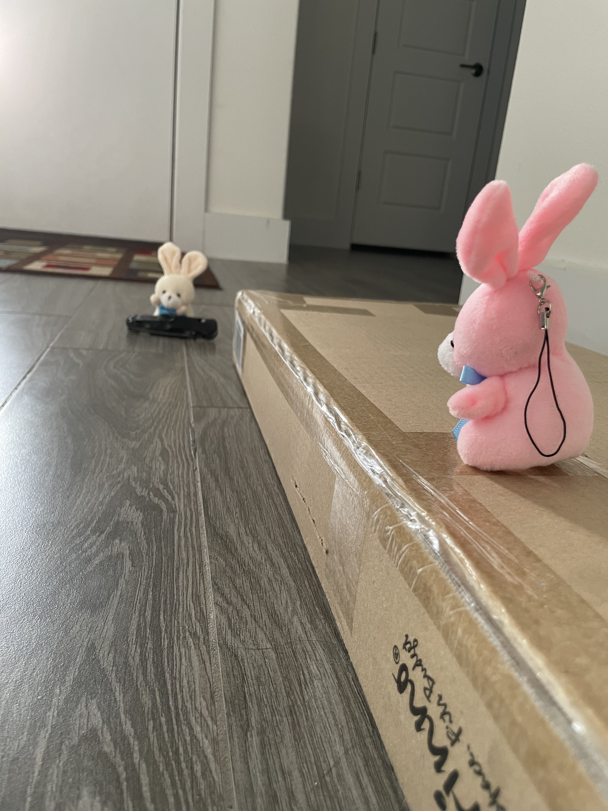
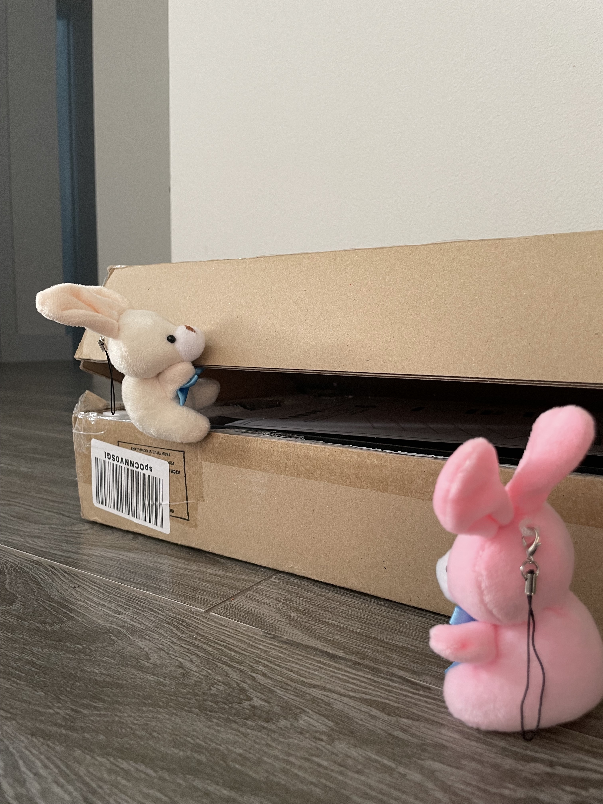
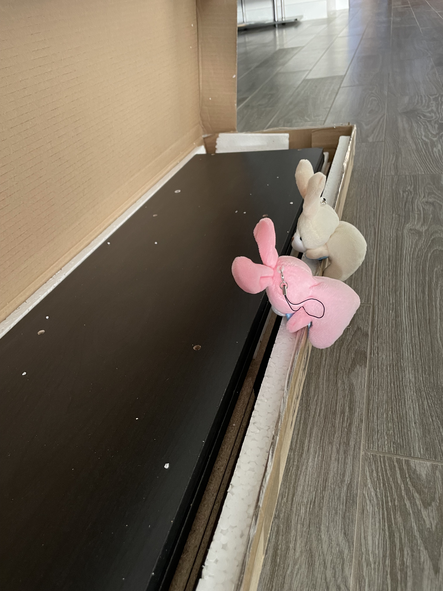
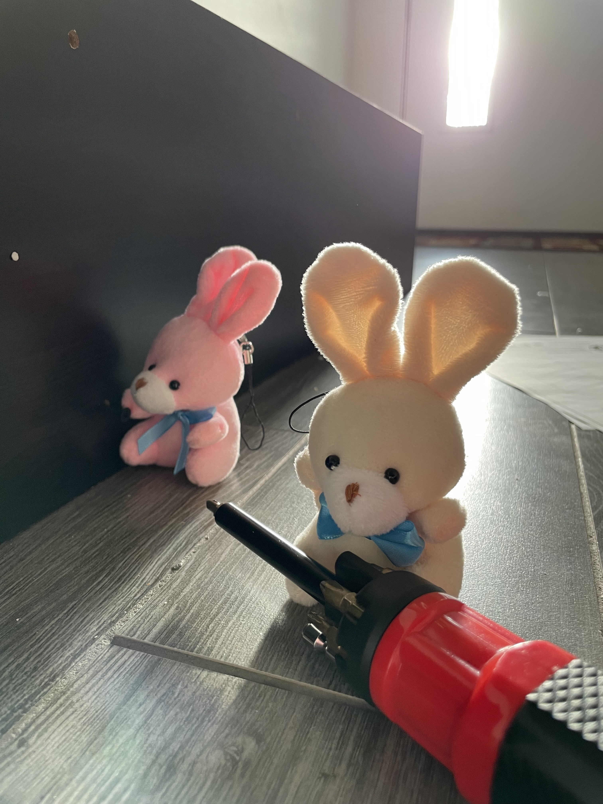
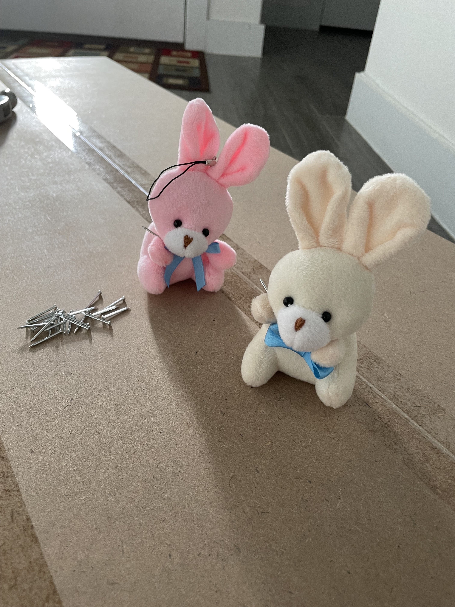
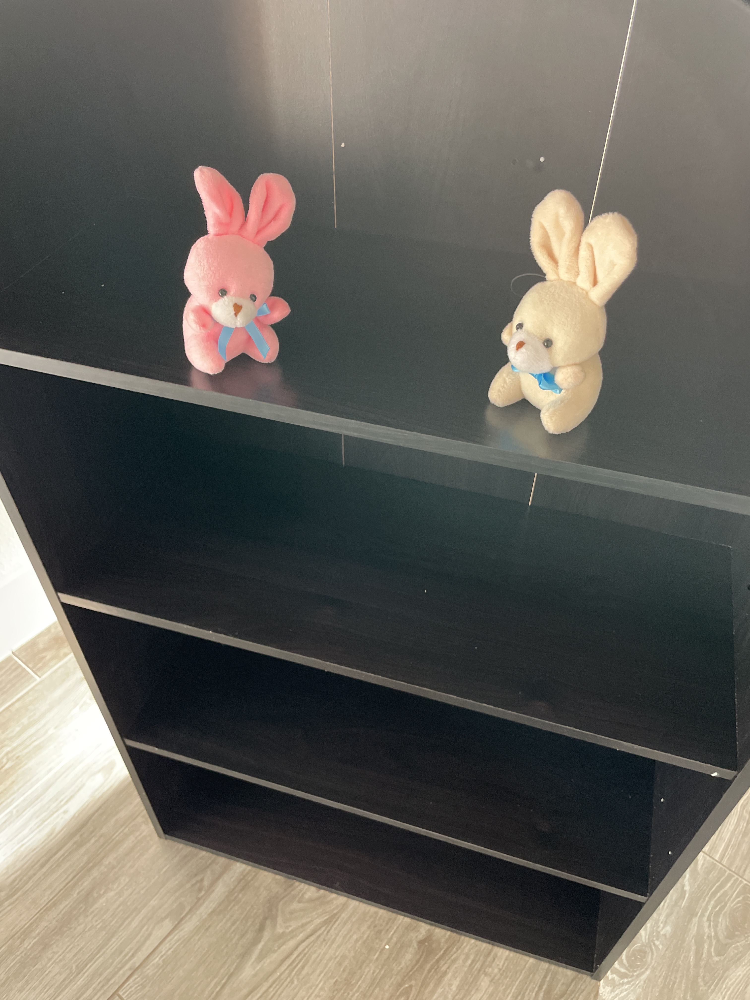
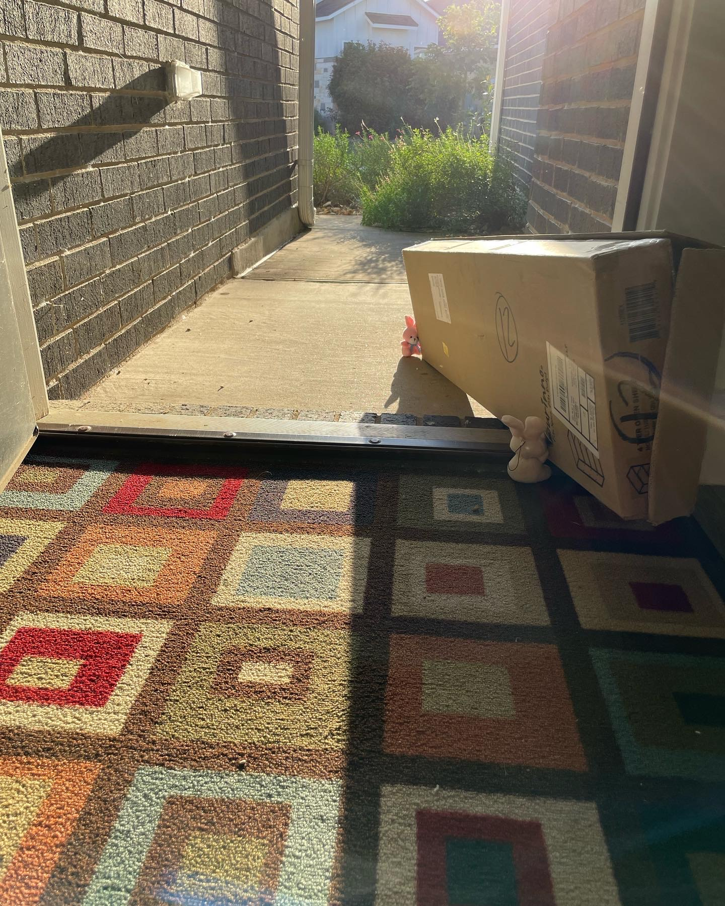
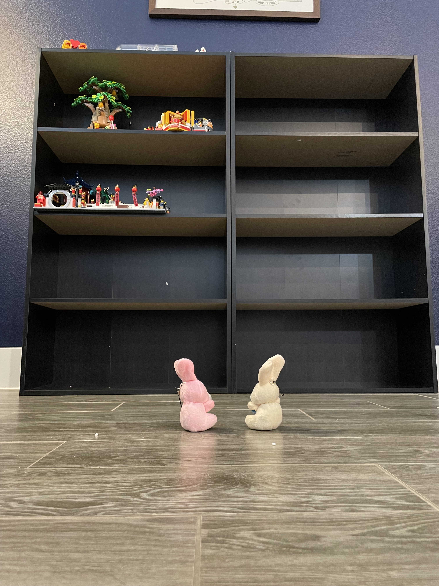

# Room For Lego

As it turns out, the bunnies have been struggling quite a bit with this box. The decided the best course of action was to open the bookshelf and assemble in the foyer.

So they laid the box down.

Grabbed a knife.

And cut open the box.

Opened the box up.

And inspected the parts.

The figured it would be best to pull the parts out and clean them up before construction.

After cleaning, they lines up the parts.

They started with the screws.

Then put the back on.

Nails are next, gotta be careful though. No sore bunny paws today.

TaDa!

Have to pick up after yourself though, so they took the box out.

So much room for lego!

