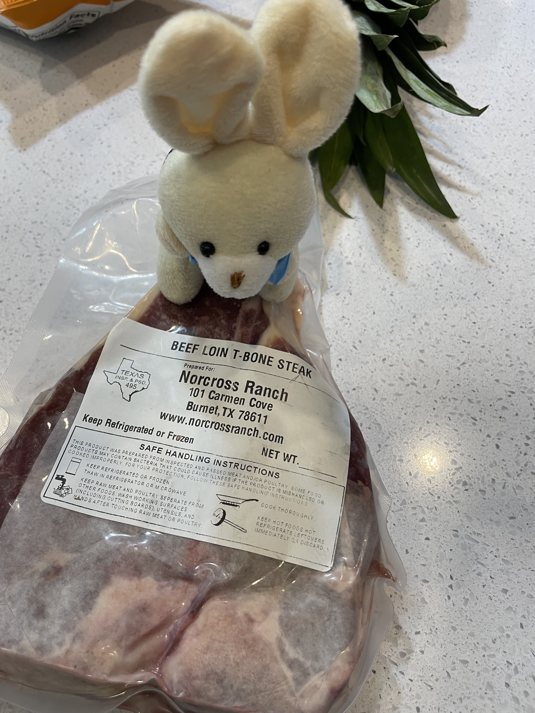

# A Motorcycle Adventure

This morning Shanny and I went on adventures. First up! The farmers market. I was planning on riding while Shanny drove. 
But as I was gearing up I felt a small tug at my pants.
Bubbles, as you may remember wanted to take the bike for the donut adventure, and was drooling over the bike last week when she got the tubs out of the car.
Shanny said she could go for a ride, only if she had a seat belt.

Bubbles hopped on the bike!

And we rigged up a seat belt.

Appears safe.

Jacob got on.

Bubbles got quite excited when the bike started.
Off we went!

Make it to the market safe and sound.

We walked around for a bit.

Got some farm fresh eggs!

Some bunny snacks!

And some human snacks!

Even went on a side quest to pick up a secret box... Think the espresso bunnies will be excited?

