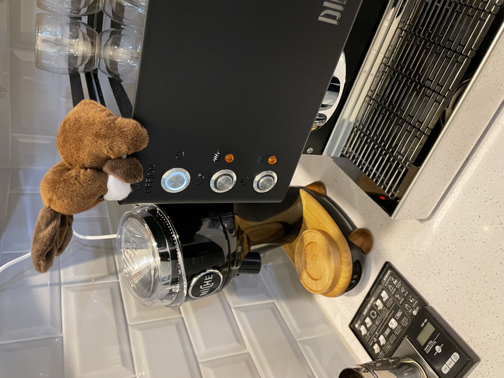
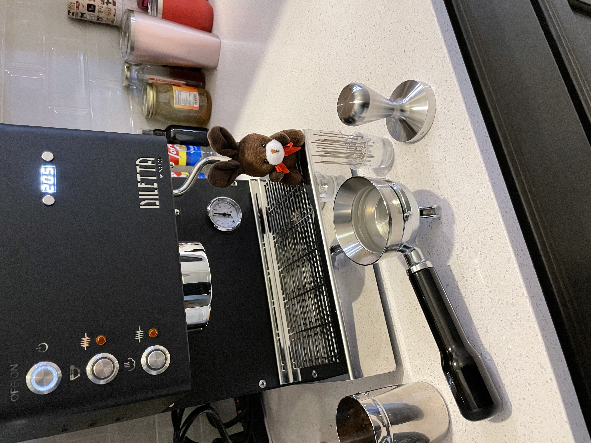
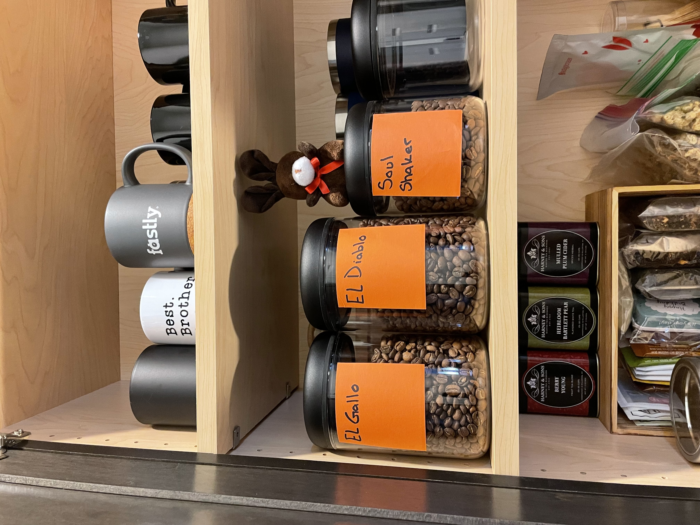
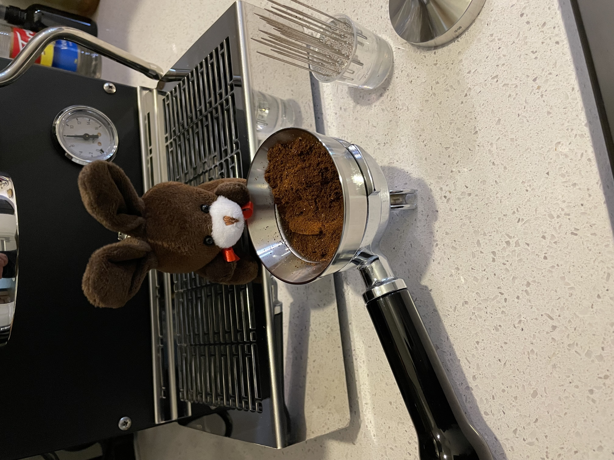
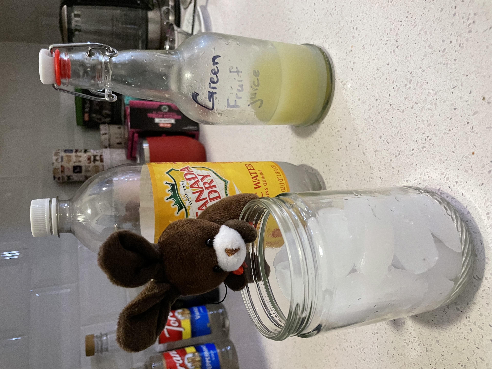
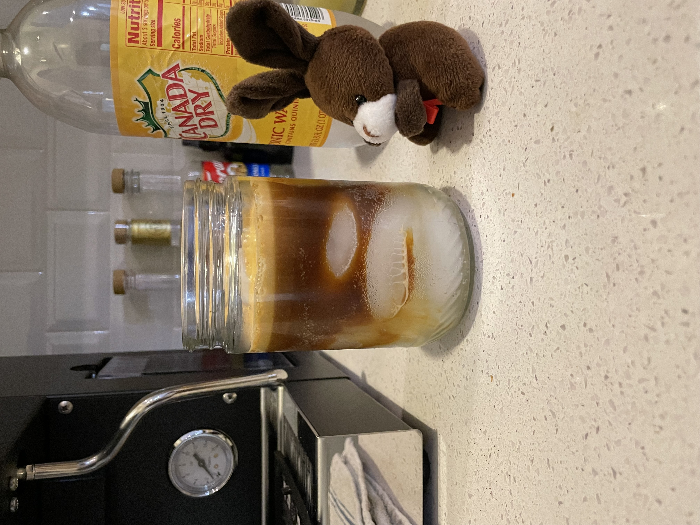

# Upgrades People! Upgrades

There is lots of excitement in the bunny house today. The coffee bunnies got a new machine.

First, we have to pick up. Current station is a little messy.
First we organize the coffee.

Then we organize the tools.

Then we set up the new machine.

Espresso is pretty excited. The new machine sparkles.

Gotta turn on the machine to get it hot.

Then we get set up.

Gotta pick out a coffee.

Then get the shot ready.

Espresso says "Jacob seems stressed this morning, so we gunna make an espresso tonic".

Tada!

