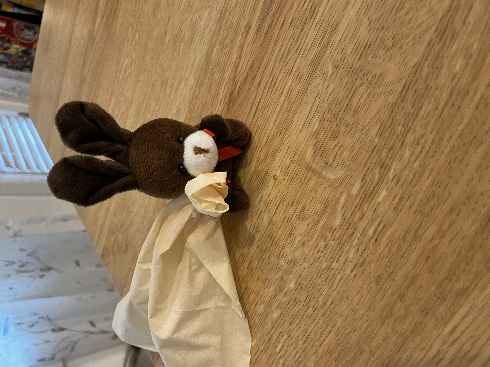
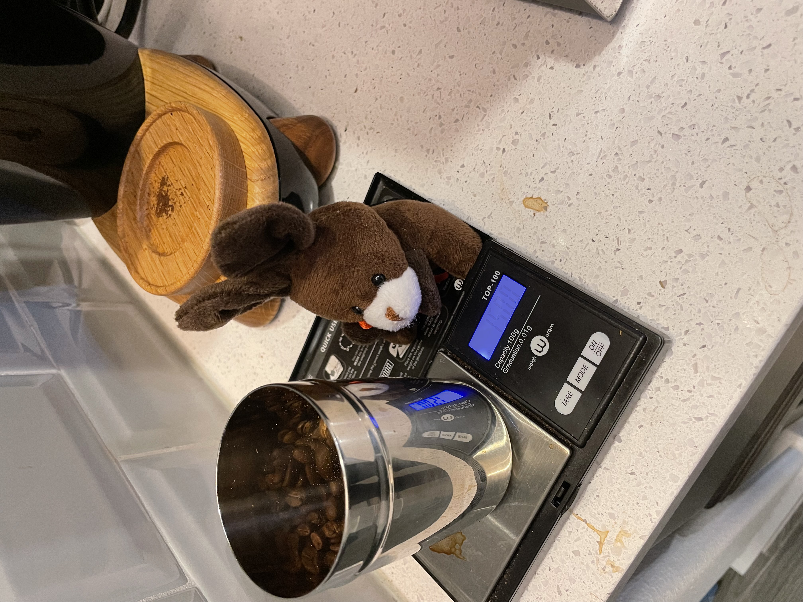
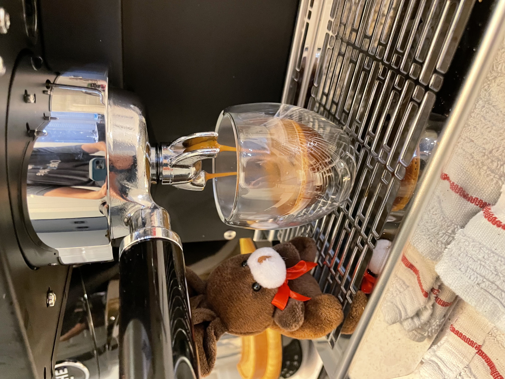

# Downgrades People... Downgrades

Today is a very sad morning. Espresso is pretty upset.

Turns out the new espresso machine has to go back.

It makes delicious espresso.

But it leaks...

When we make coffee, we have to put a towel under it.

Water and electricity don't mix.

So we will be reviewing warranty docs and sending it back.

