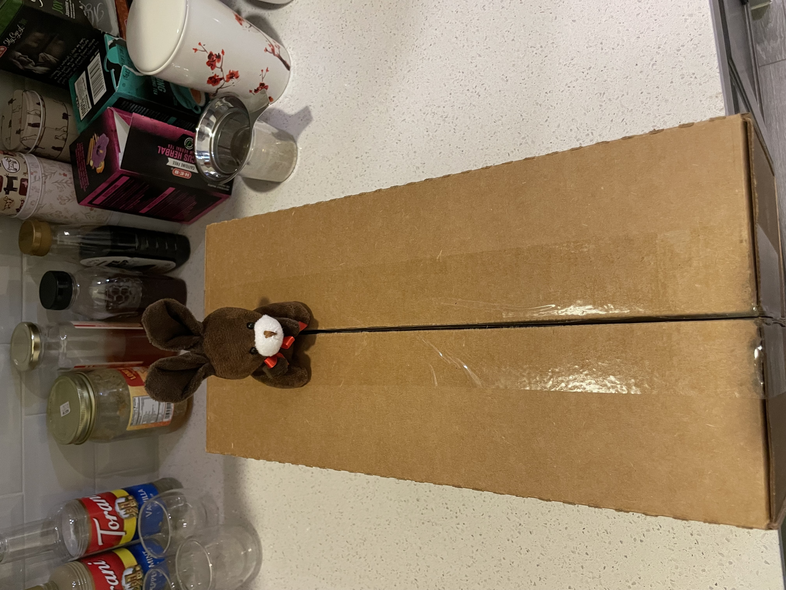
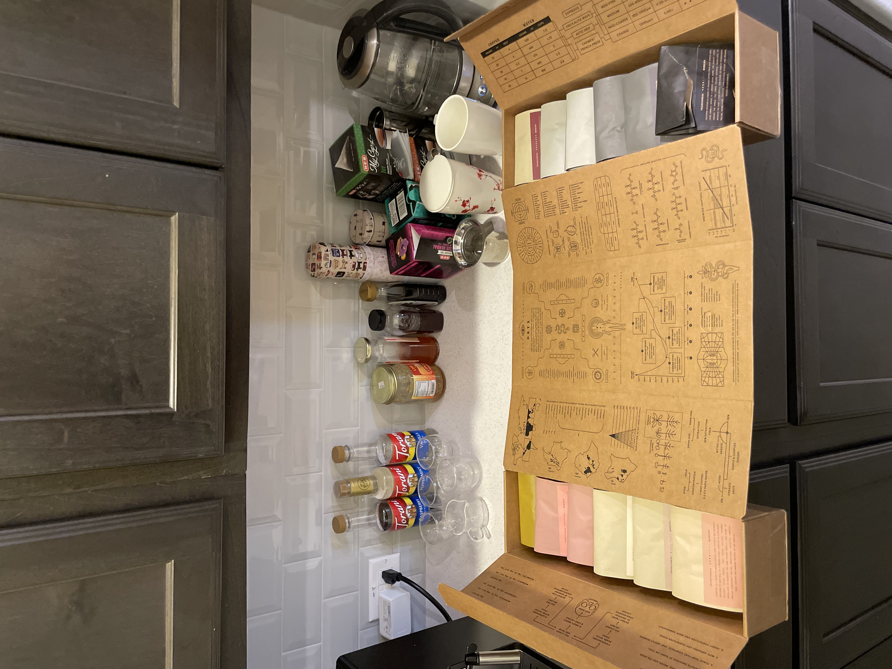
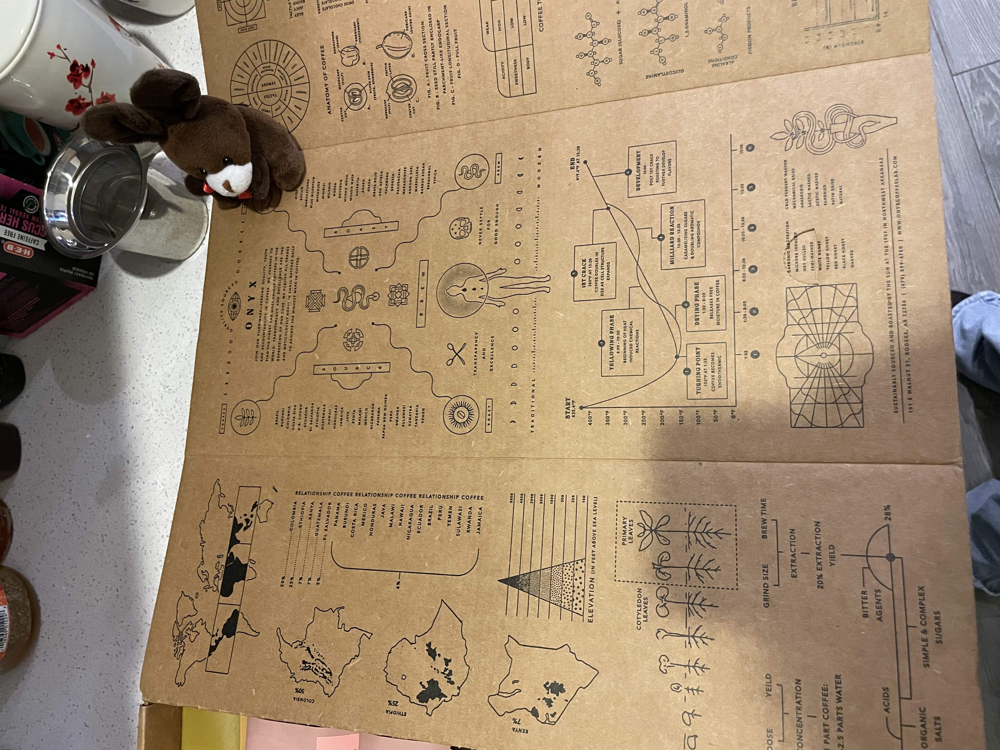
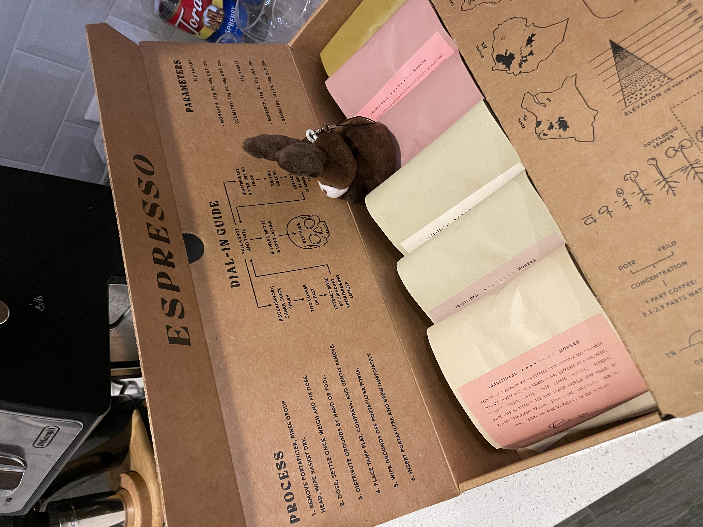
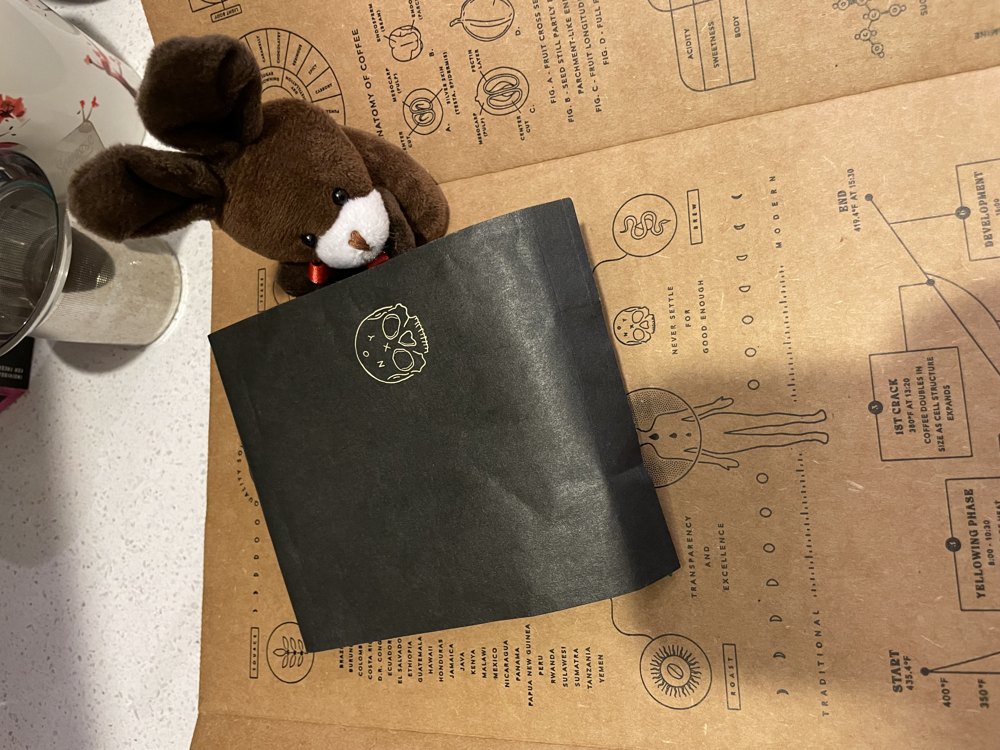
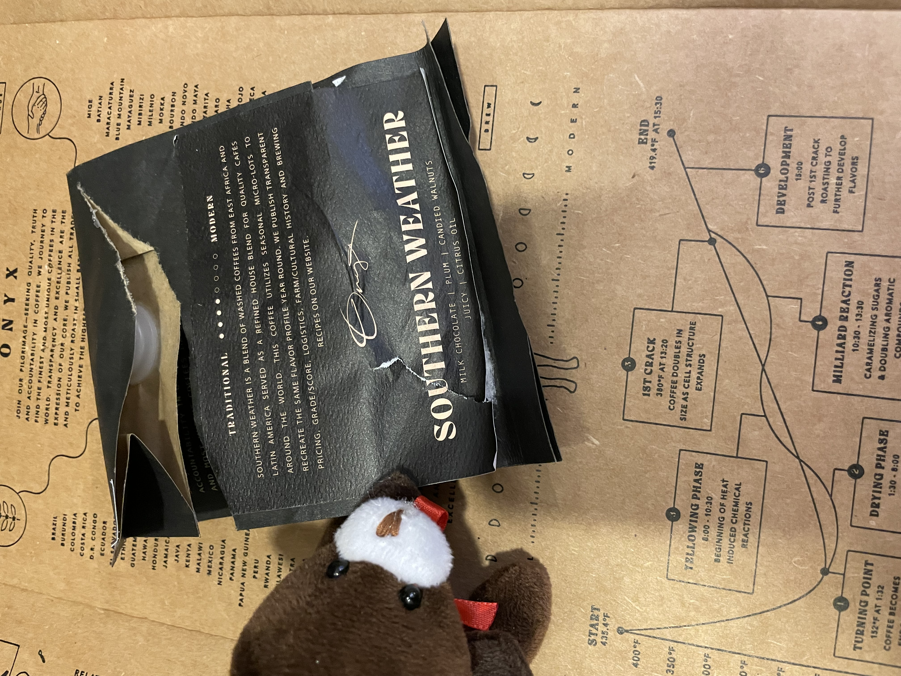
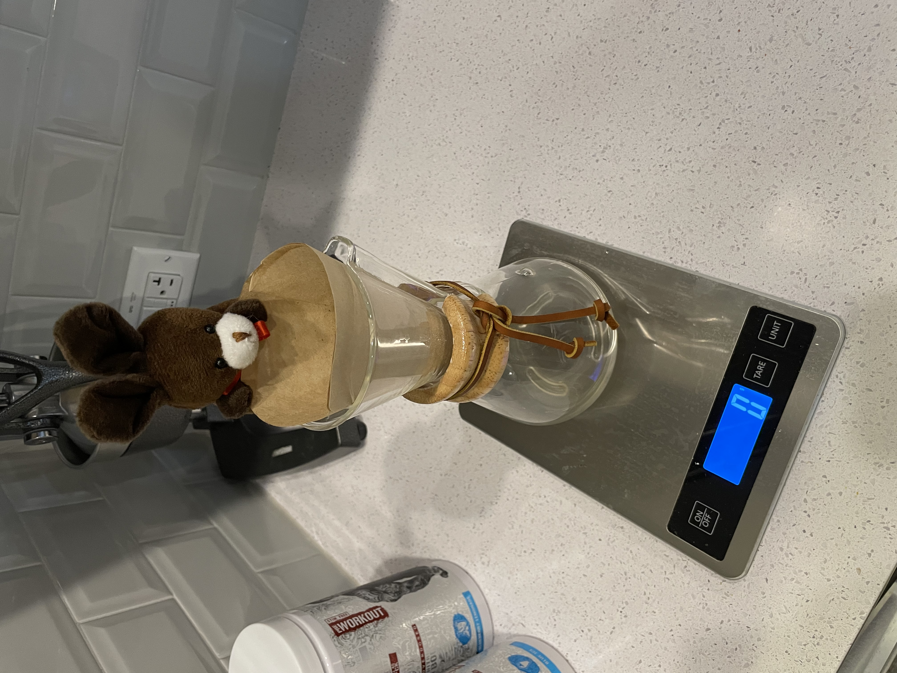
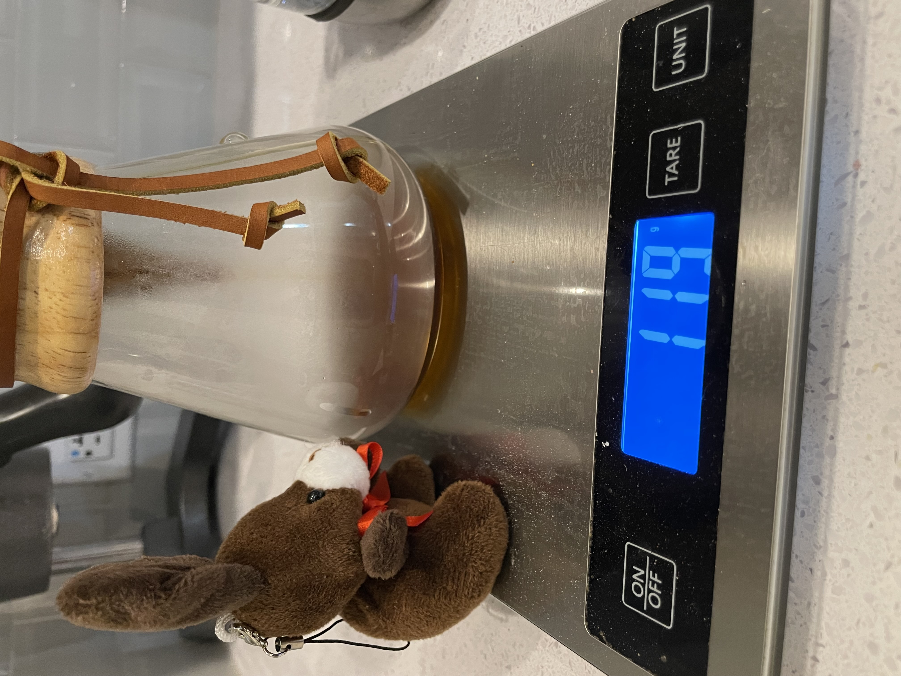
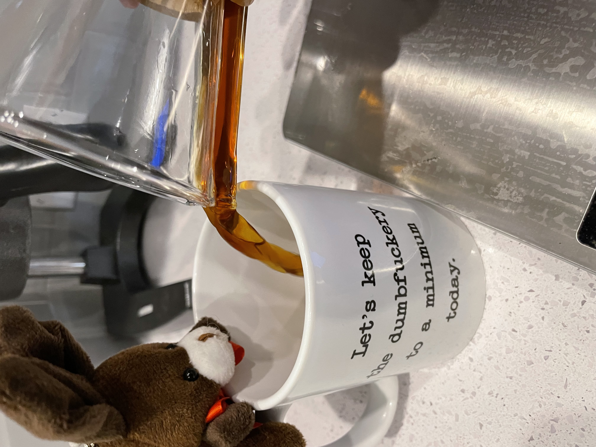
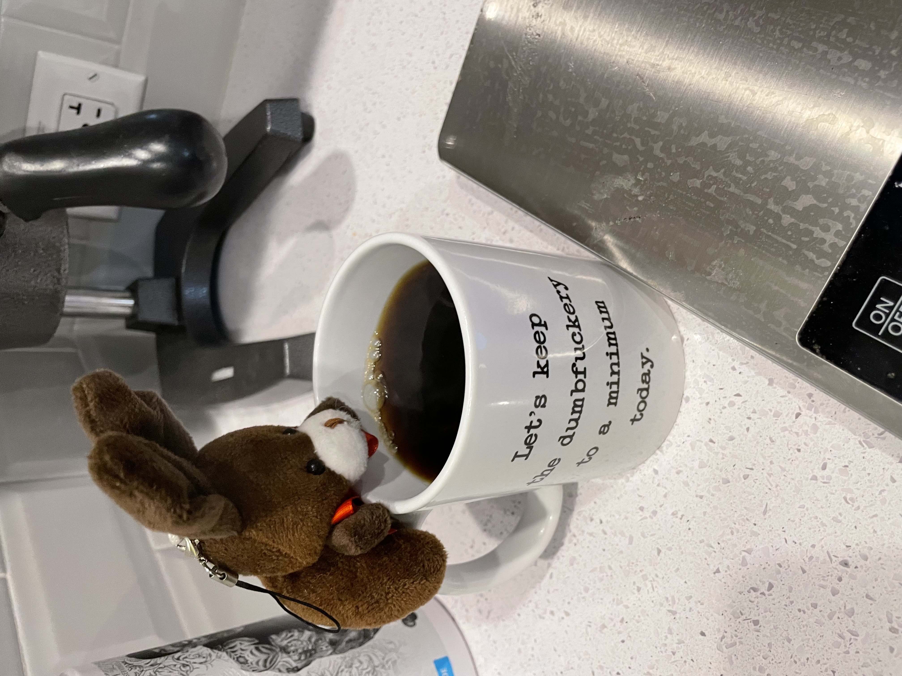

# Retail Therapy For Espresso

Espresso is still pretty upset with the loss of the new machine. So for a little retail therapy I ordered him a coffee sample from Onyx.

We opened it up this morning.

Espresso thought the packaging was pretty cool.

Even has a dial in guide.

As onyx is typically black, Espresso decided we should start with the black bag.

Its called southern weather, smells pretty yummy too.

We decided to go chemex today. Dialing in new beans, especially fresh ones can be fussy.

Waiting for coffee... 

With the week of meetings we have had, Espresso decided this mug was the most appropriate.

Yummy.

