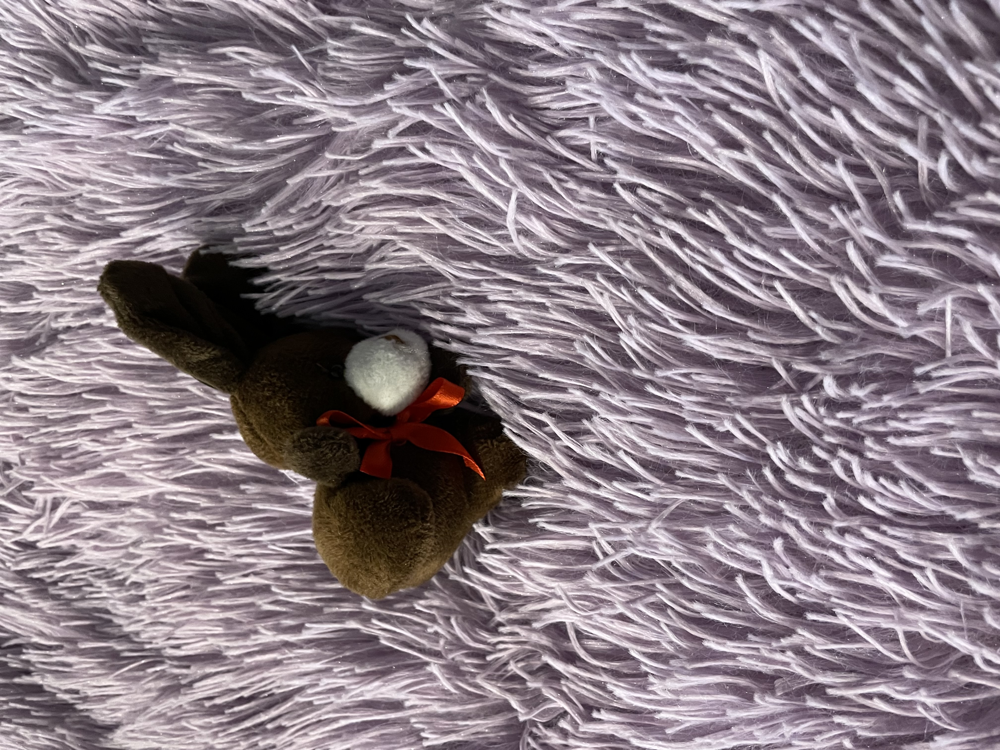
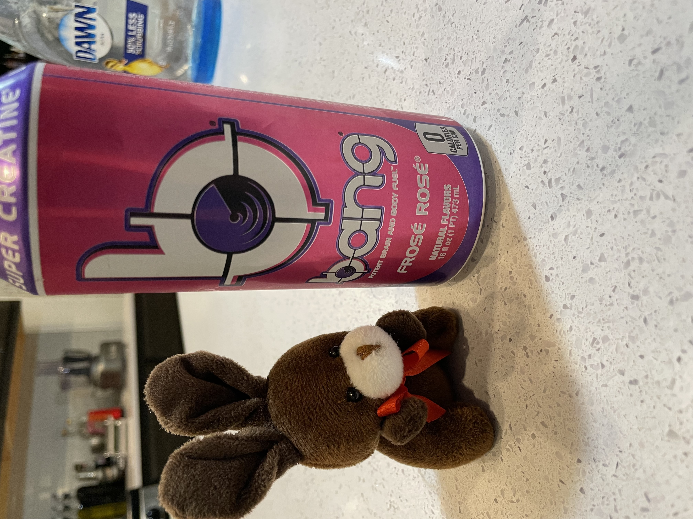
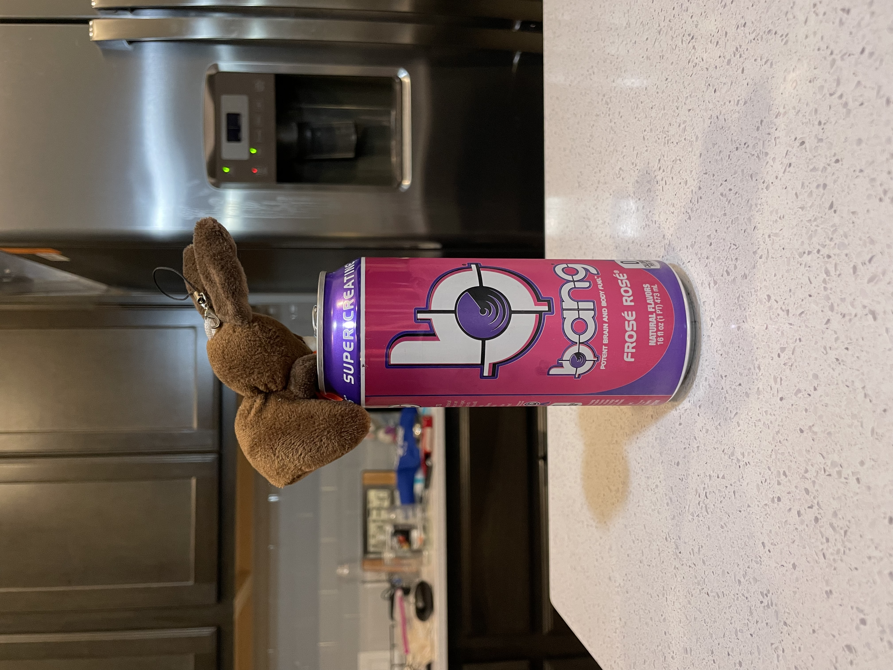
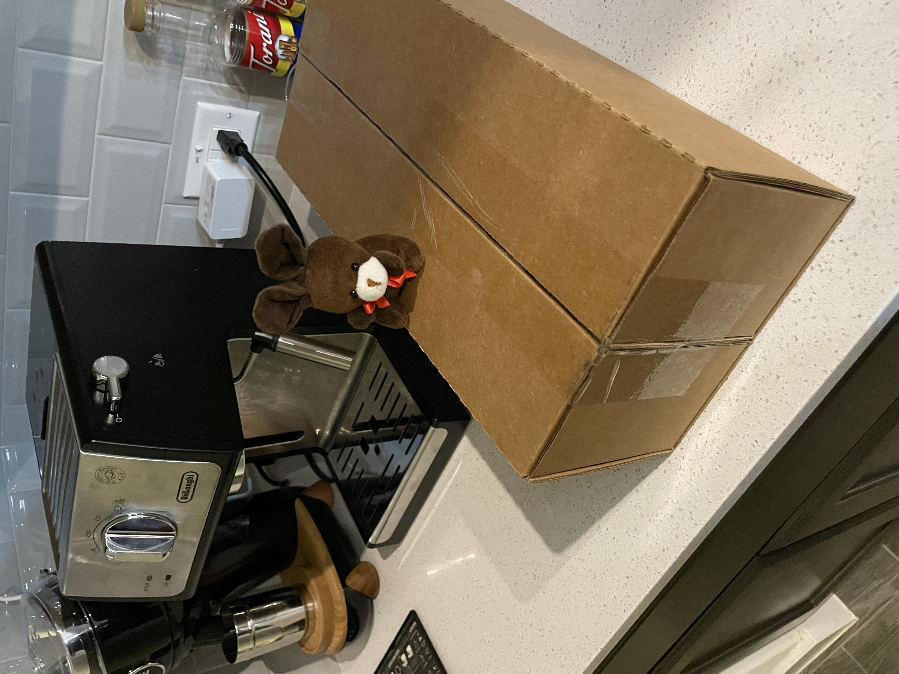
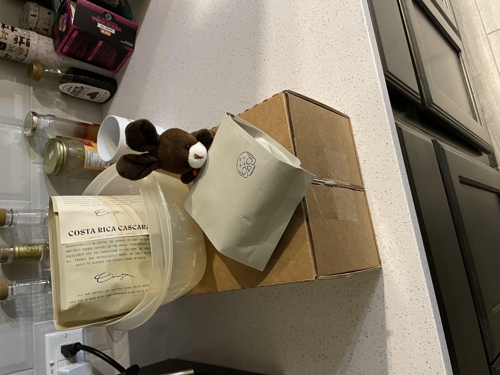
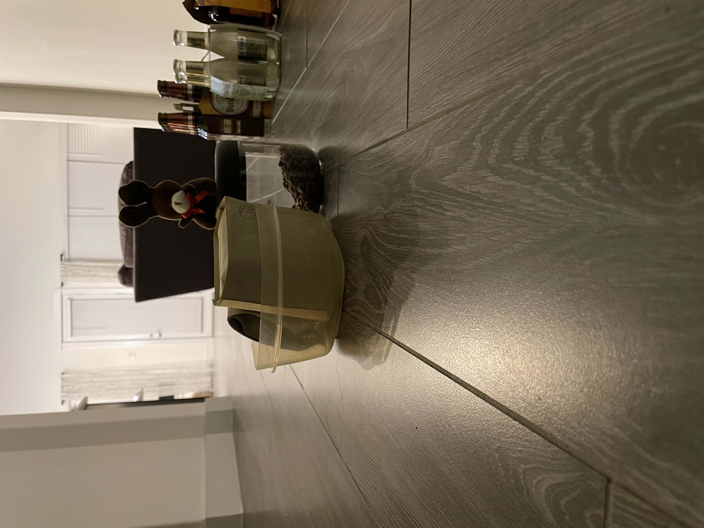
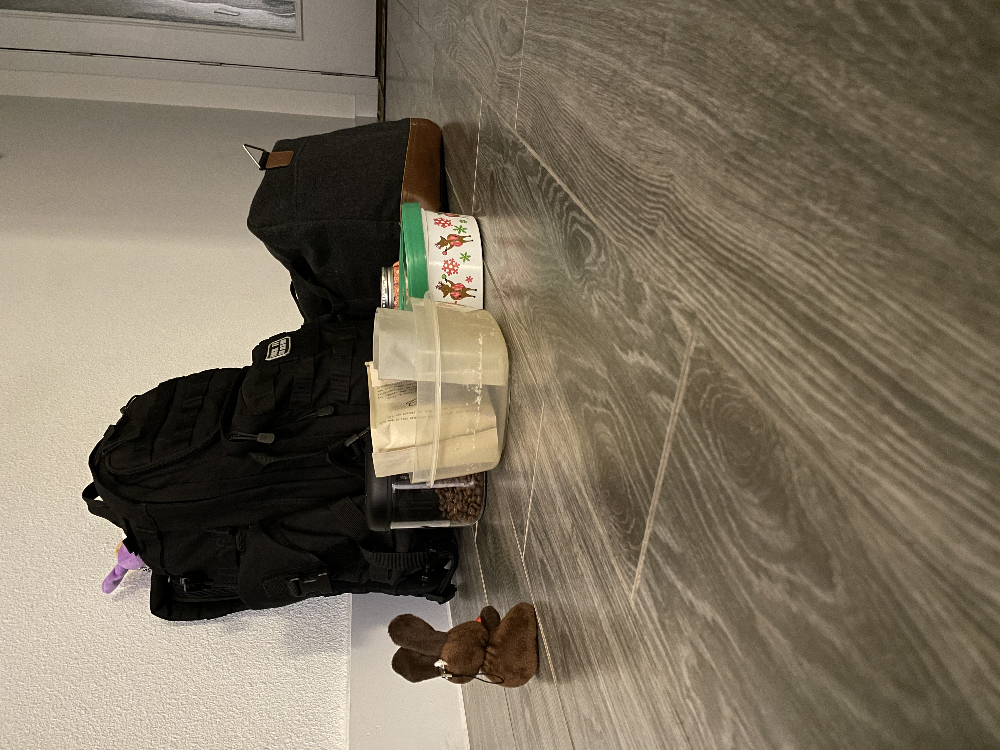
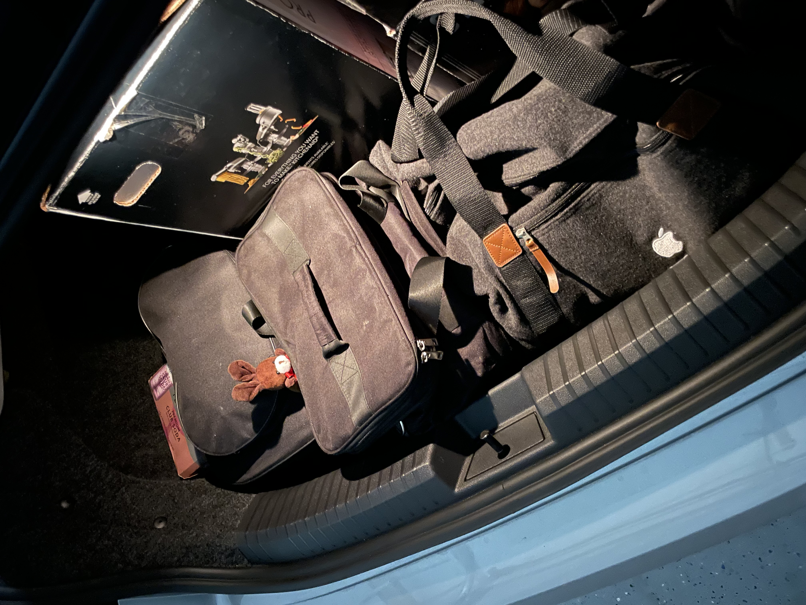

# Always Time For Coffee

It's Friday! And even more exciting, it's an adventure Friday!
Time to go wake up Espresso!

As we are traveling today, we decided a band was in order as that is a little faster than a latte.

After a sample sip, Espresso started to question the human's judgment.
There is always time for lattes said Espresso.

Not only did espresso pull out some coffee.

We went with a white bag this time.

Espresso decided to pack some too.

Travel coffee would be needed.

Better bring some cream too.

All packed!

