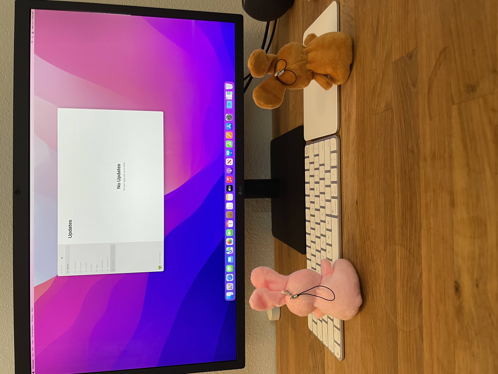

# Office Remodel Part 2

Last night was a long night. Espresso bunnies stayed up waiting for the UPS driver. They were.... way late.
But we finally got a box! Peach and Grape were the first to find it this morning.

The bunnies opened the box. 
The bunnies still haven't learned human, but they decided this looked like an office thing. 

They went and got Radish and Turnip, who have been working on cleaning the office.
They were quite excited, they knew what the box was...

They wasted no time booting the machine, and getting it going.

Now, the bunnies were excited. Jacob however was tired.
As the espresso bunnies were up late, no latte this morning. 
Jack however, came in clutch with a monster.

Jack has a few sips too.

