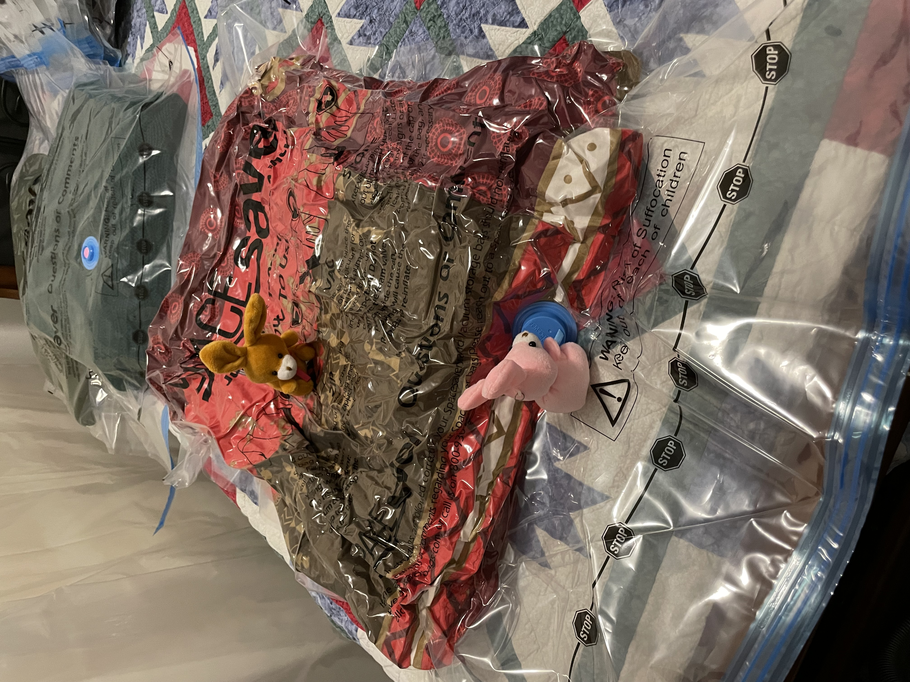

# Guest Room Cleanup

Here recently the bunnies have been working to clean up the guest room.
We have lots of blankets, so the bunnies got some space save bags to squish them all down.

Finishing up the last few this morning. 
Gotta wash and fold first.

Opening bags is hard.

But team work makes the dream work.

Blanket it!

Zip Zip.

Gotta make sure the bags are sealed.

Ready for the vacuum.

And.... Go!

All ready for storage.

Gotta be organized!

