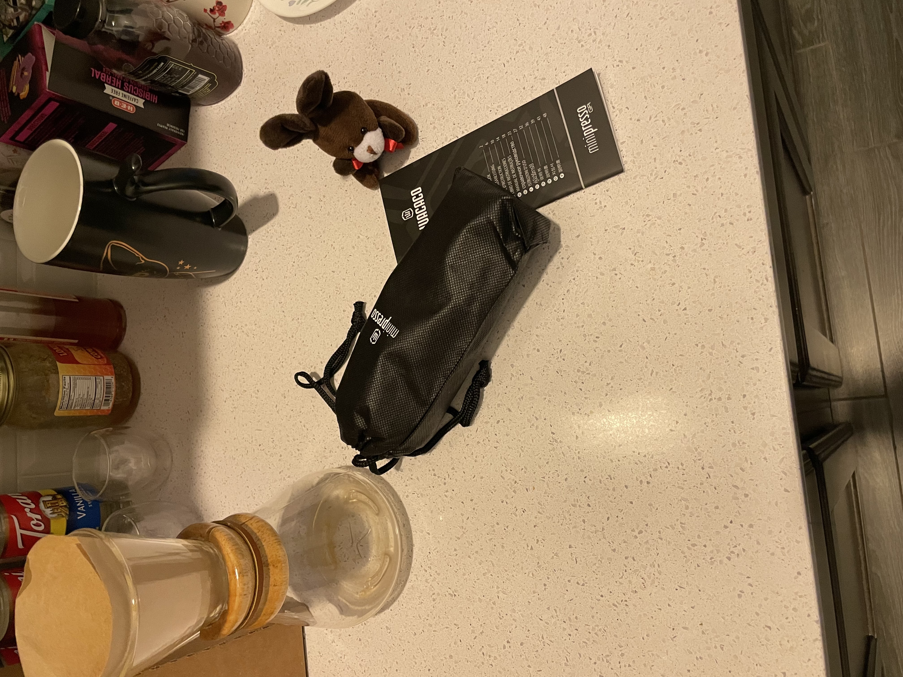
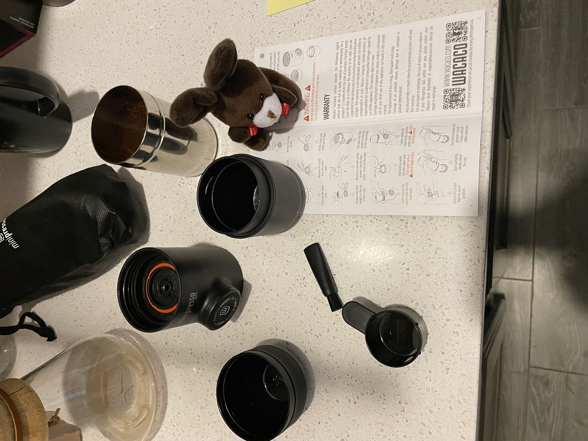
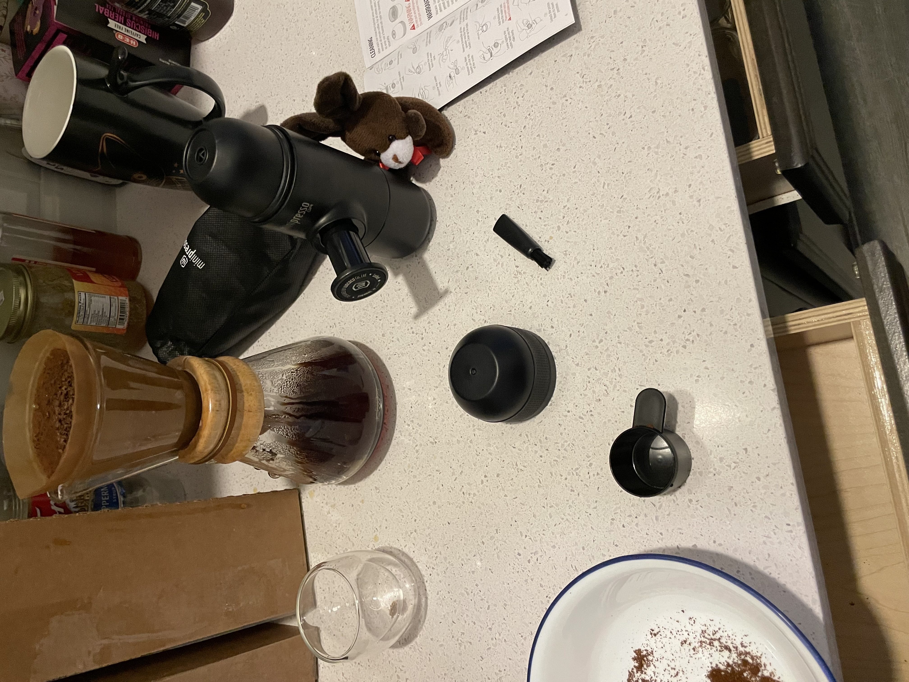
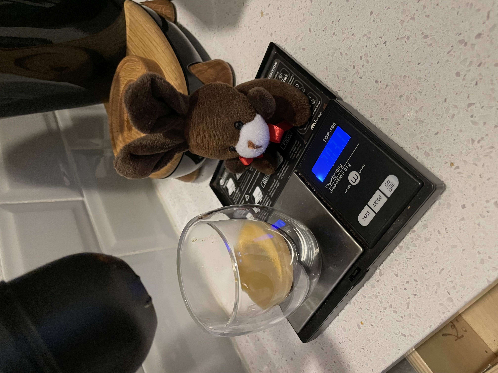
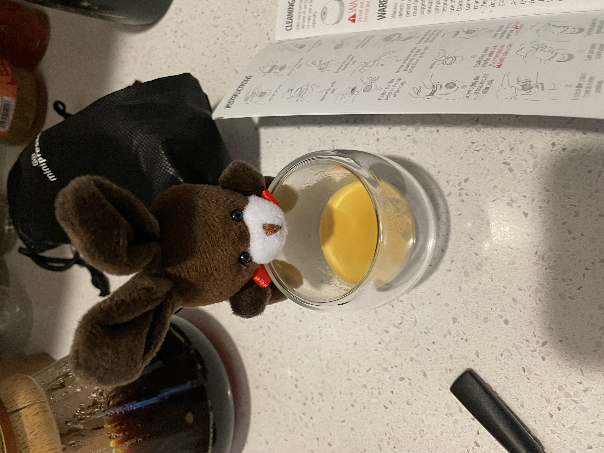

# Mobile Espresso

Espresso heard me comment about how bad the office coffee was….

Espresso is a firm believer life is too short to drink bad coffee, so he explored the curious world of manual portable espresso machines.

Taking things apart and reading instructions.

Getting ready to pull a shot.

Pulling a shot, I suppose we should try to keep something of a 2:1 ratio.

Espresso says, you probably won’t win any barista awards, but it makes a passable espresso all the same!!

