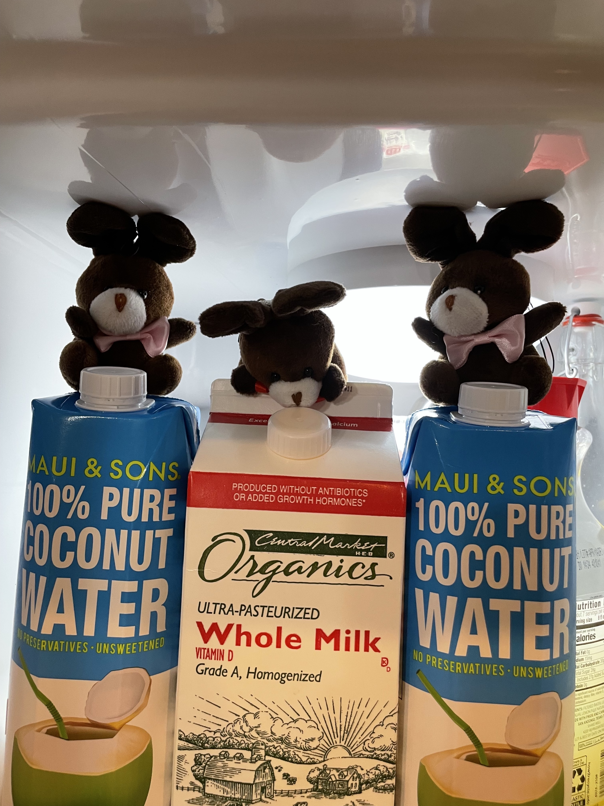
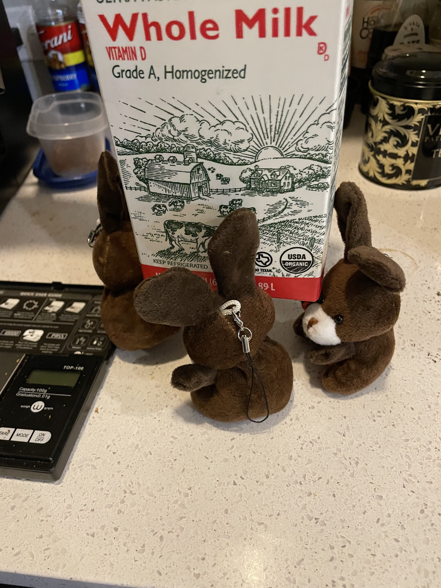
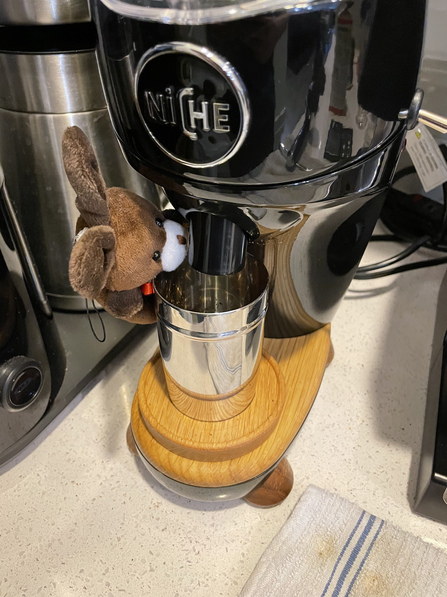
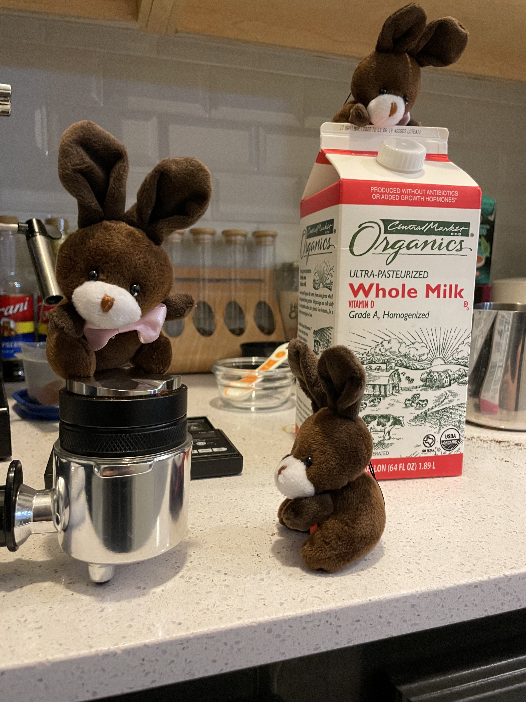
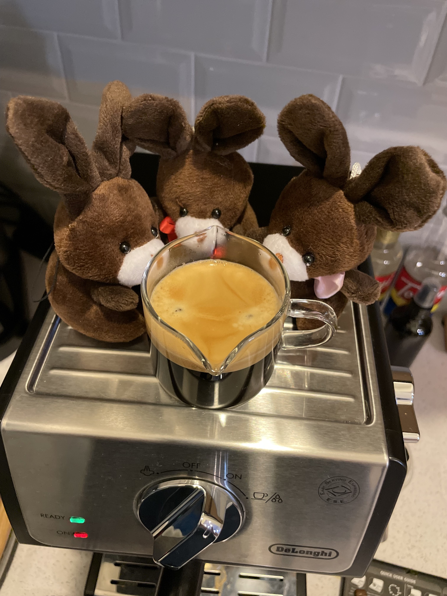

# Latte Lessons

I asked the espresso bunnies for a latte this morning. But milk is heavy, and I’m told that is at least a three bunny job.

So espresso and Mocha found Hershey to help carry the milk.

Mocha is working on opening the milk. Espresso is inspecting the beans. Hershey is doing her best to tamp the beans down.

Gotta work as a team to carry milk.

Checking the grind.

Tamping the coffee.

Inspection time!

