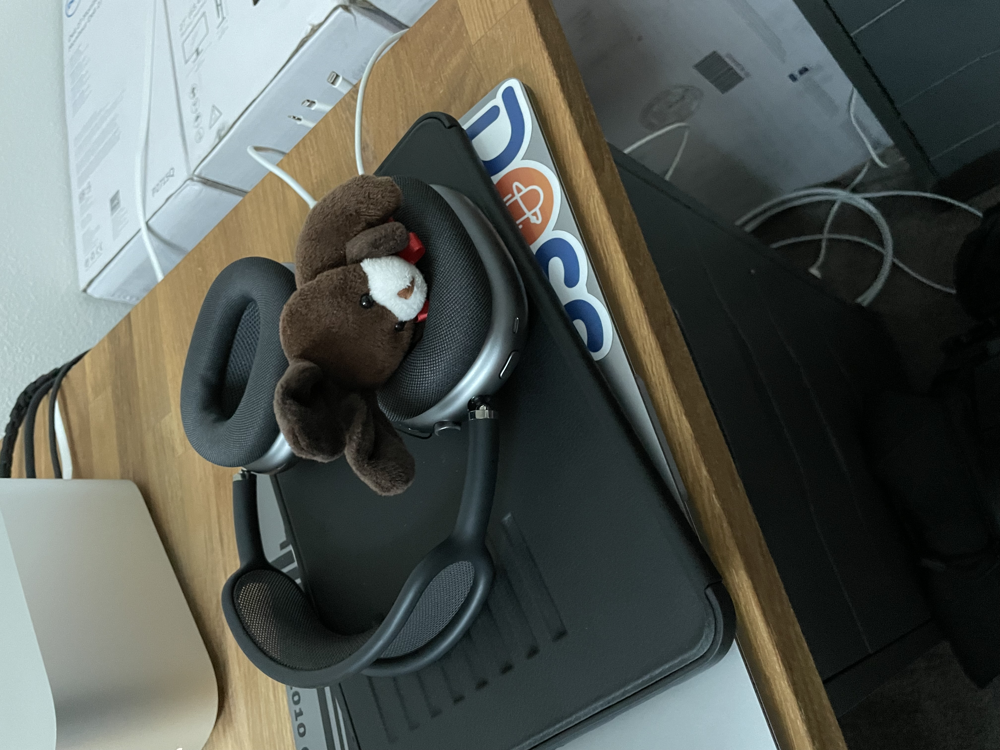
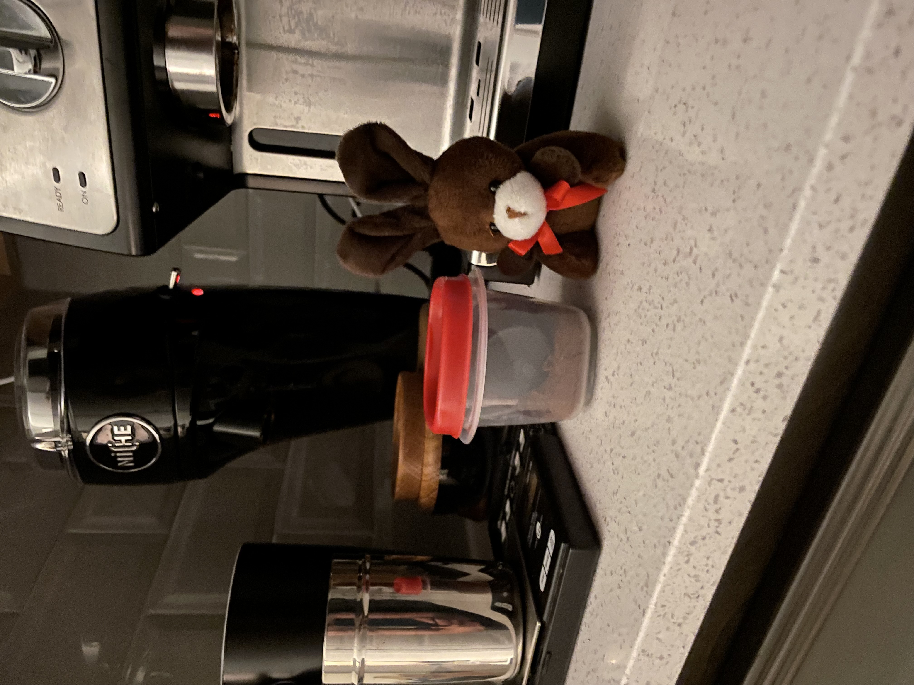
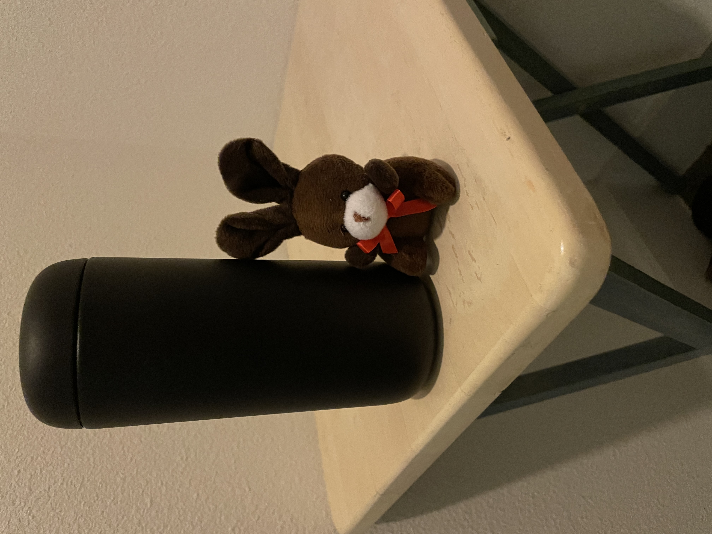
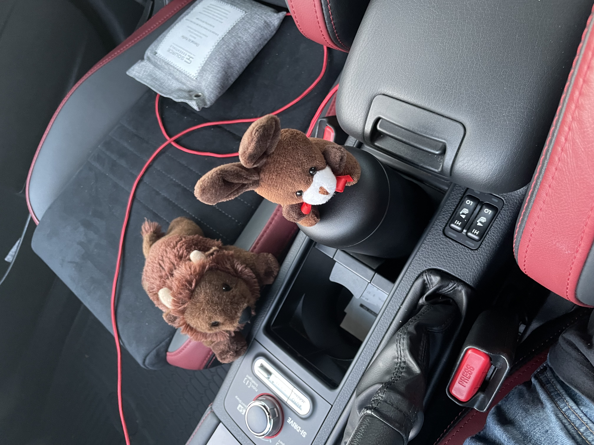
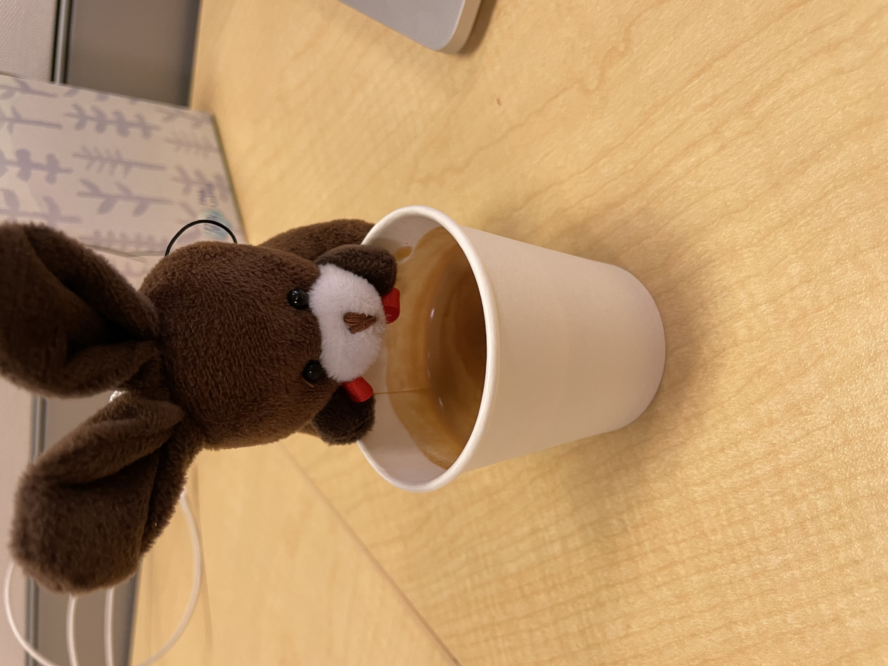
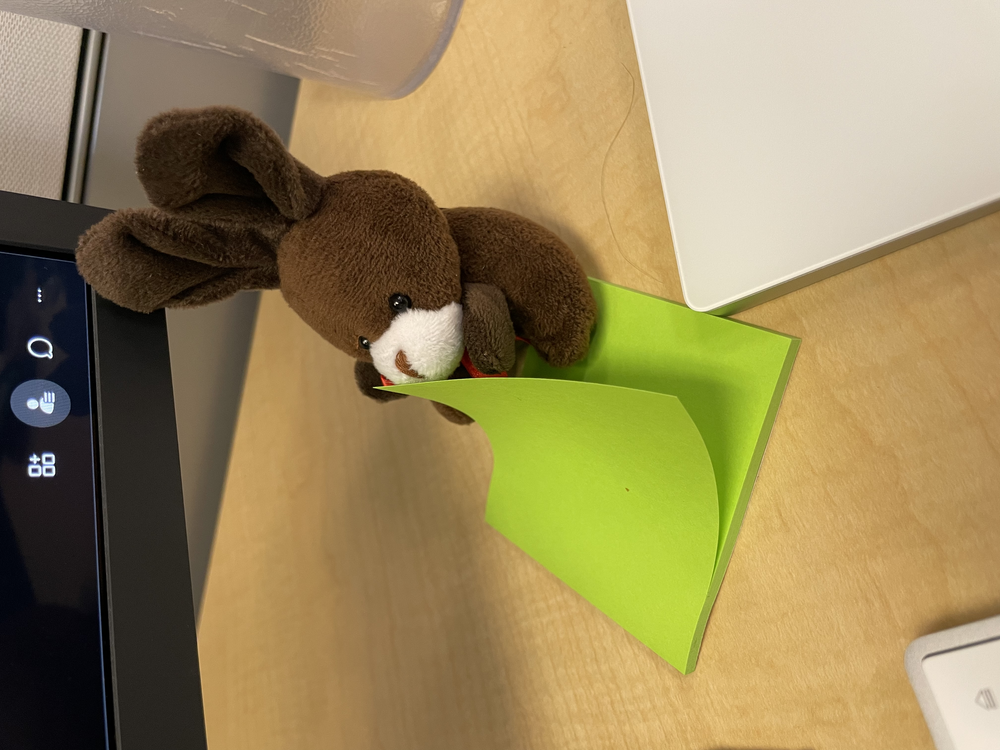
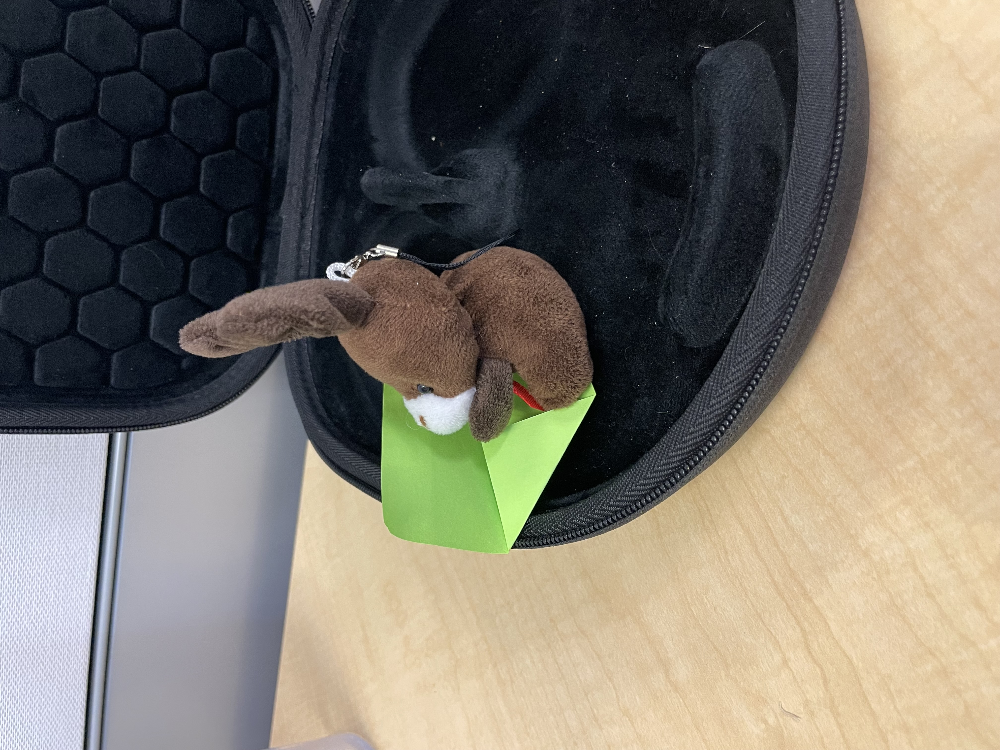
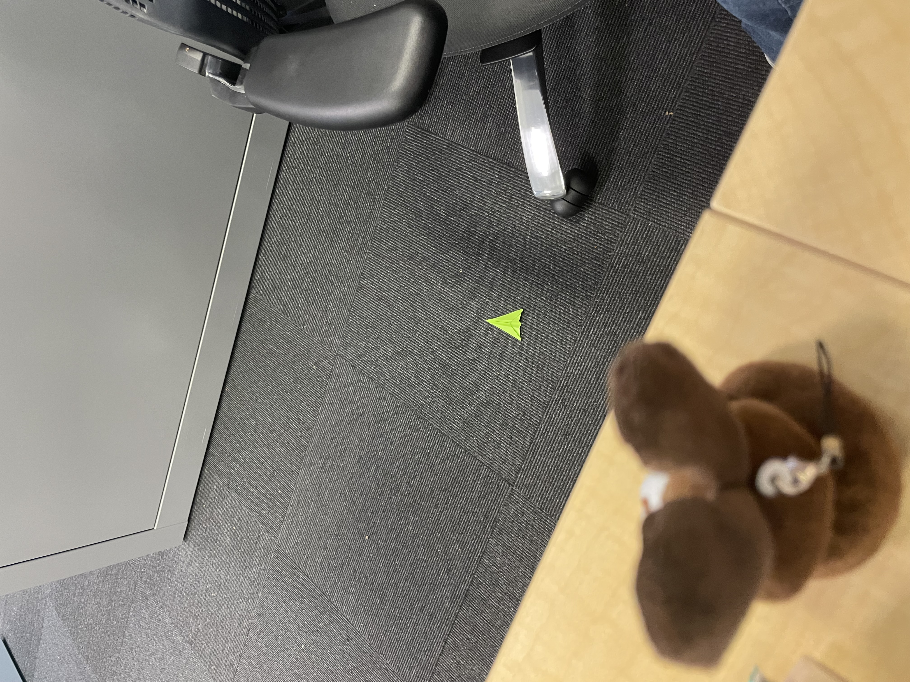

# Espresso's Office Adventure

Yesterday was quite the adventure for espresso. He wanted to come to the office to check out the coffee situation.

He figured if he slept in the headphones, he would wake up when I packed.

Espresso ground up some coffee, so if we needed we could pull an office shot.

Espresso also prepared some drip coffee, just so we have something to drink on the way.

Espresso enjoyed hanging out with Ben while riding to work.

We sampled some office espresso. It's not bad, but we like ours better.

Espresso did his best to be a god bunny all day, but got bored with all the meetings.

Even worse, he couldn’t find a fidget toy, so he had to make his own

Found a stickey...

Foldy foldy.

Air plane!!

Weeee!

