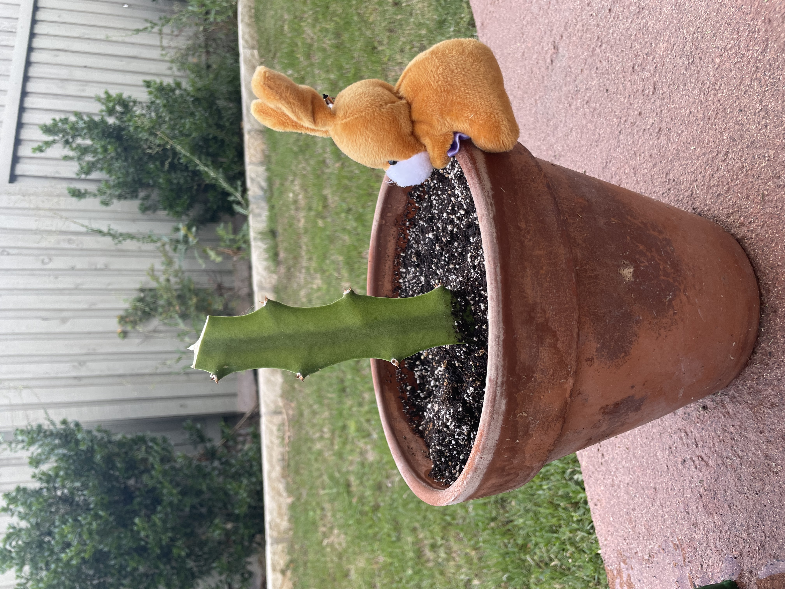
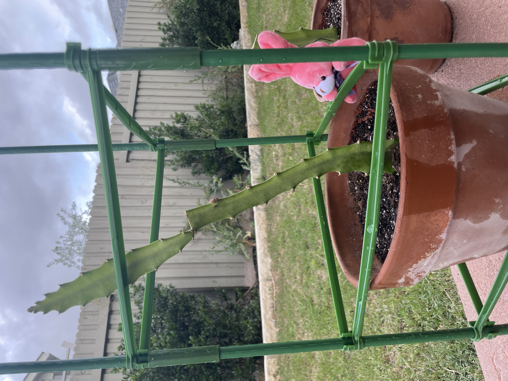

# New Seeds

This morning I figured we check back in on the farming bunnies, Acorn and Grapefruit.
They didn't have much lick growing dragon fruit from seeds, but Shanny did order them two cuttings.
One isn't doing too much just yet.

While the other seems to grow every time you turn around.

We even had to build it a cage to climb.

The bunnies, after feeling encouraged by keeping at least one cutting alive, have decided to try some seeds again.

This time we are trying golden kiwis.

We are going to try a couple different methods.

