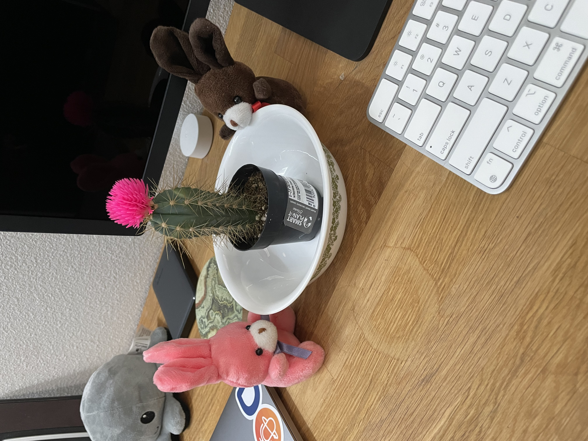
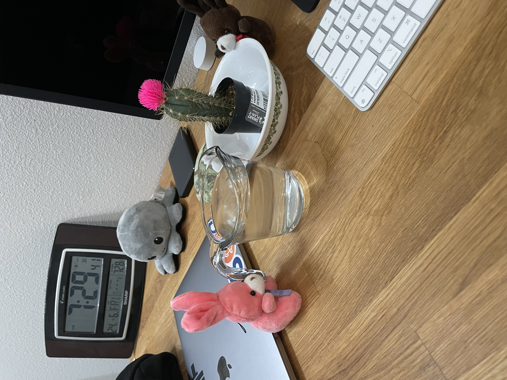
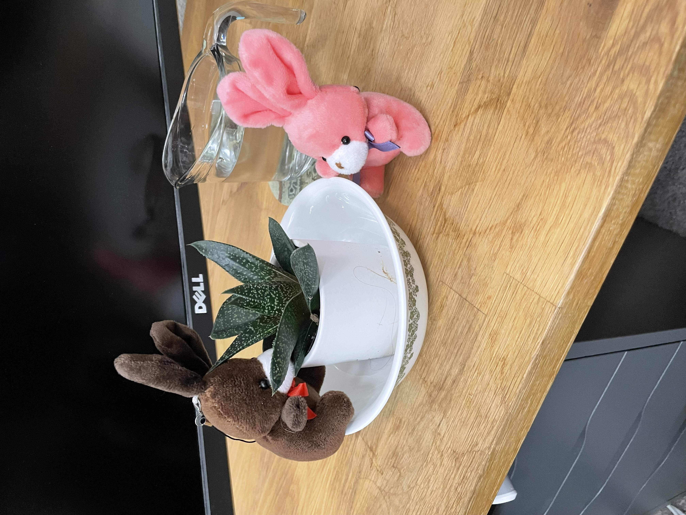
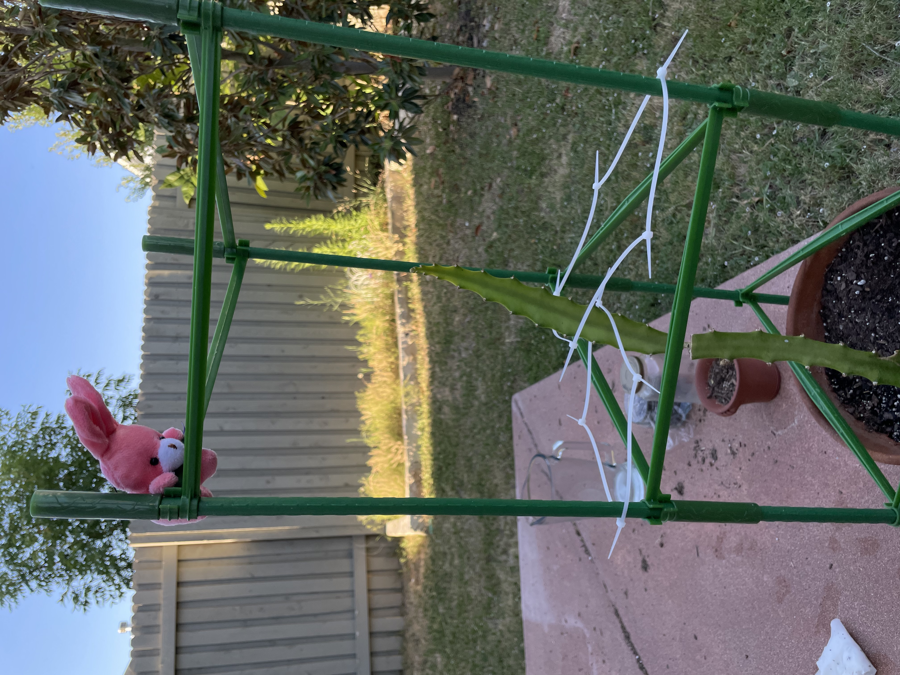
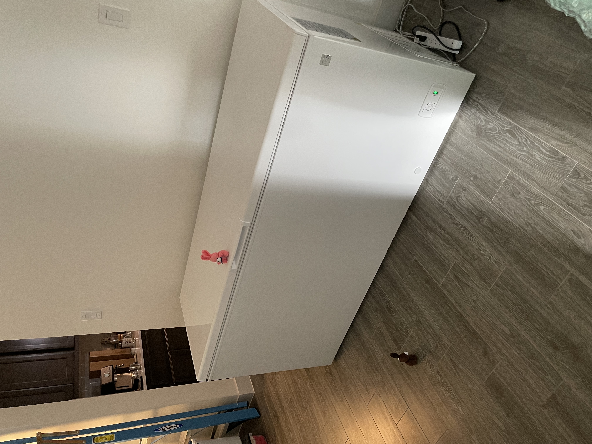

# New Hobbies

So here recently the bunnies have been pretty stressed out.
Between getting some land, full time bunny jobs, helping the humans, and trying to work side gigs to help espresso get his dream machine, it’s been rough.

The bunnies, as you might have noticed took the week off. During there vacation, they explored some new hobbies.

Turns out bunnies like farming, houseplants, and ice?
This is Spike the side project desk plant.

Spike needed a drink... gotta be careful though. He is prickly.

This is Keffery. THe work desk plant. He isn't prickly.

The bunnies also got a few more plant cuttings. Gotta check on em daily to make sure they are happy.

Little cactus may need a new name soon, isn't so little anymore.

And as luck would have it! Sickly cactus is making a comeback!! Even though the humans thought it was dead the bunnies kept watering it.

We have new growth!

In addition to plant farming the bunnies have also been exploring the art of ice farming and carving.
In order to make the ice though the bunnies went out and found a very small freezer.

