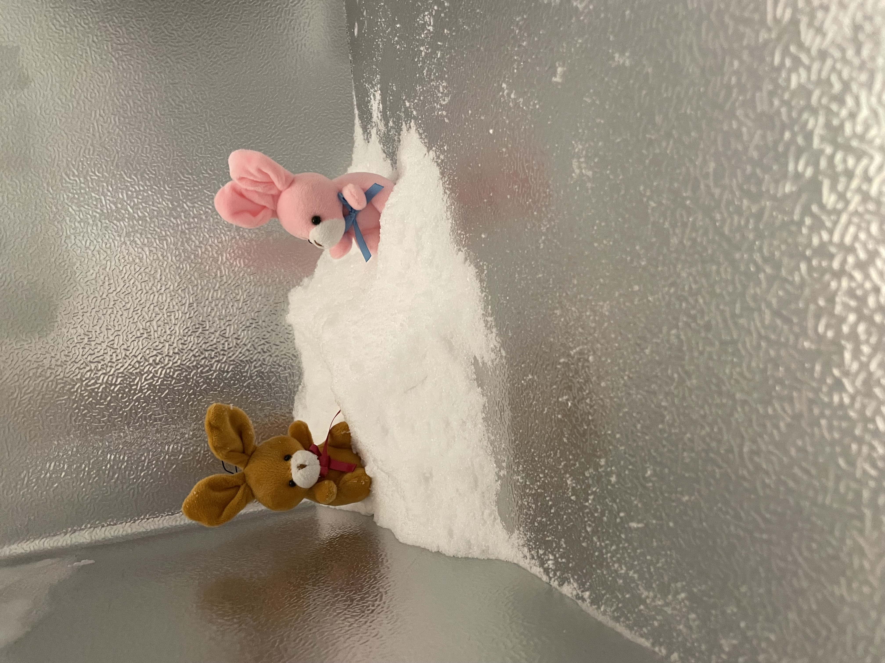

# Ice Bunny

Here recently we discovered a hole in the freezer.

Good news, we can repair it. Bad news, we need to defrost it.

In addition to repairing, we also decided to get some mats. Prevent further damage.

We had to take everything out, so we packed it in ice.

Then started scraping out the ice in the freezer. The bunnies thought the "snow" was great fun.

They even made a snow bunny.

