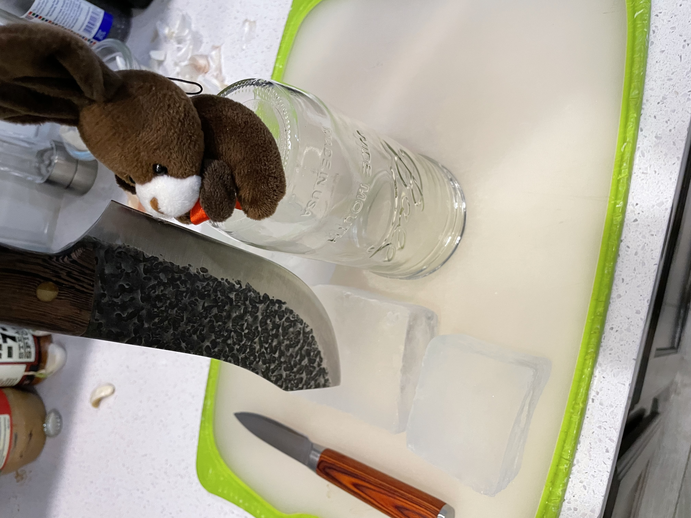
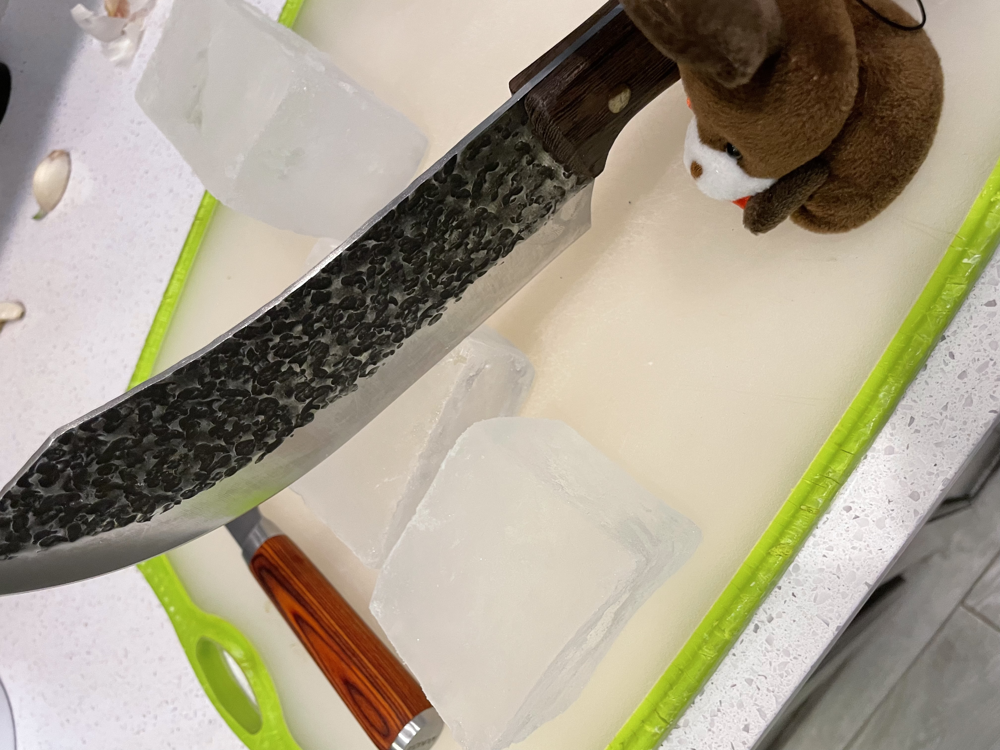
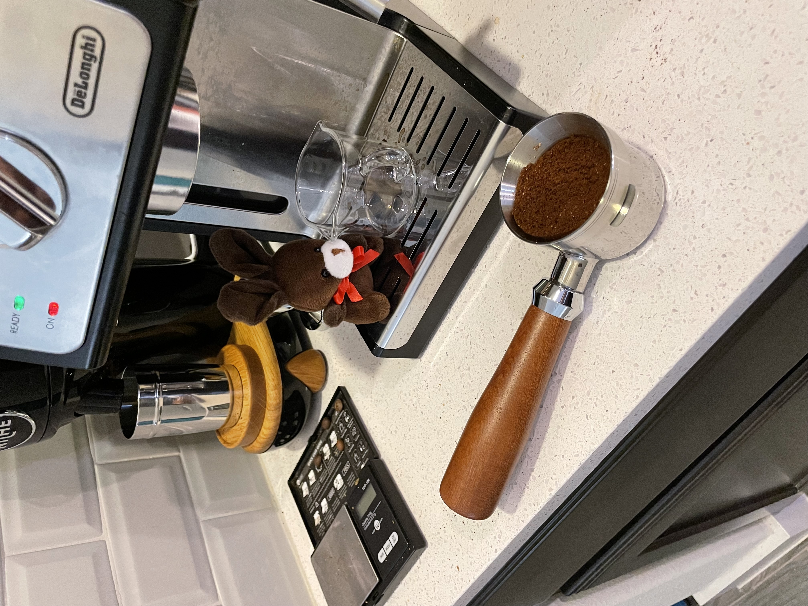
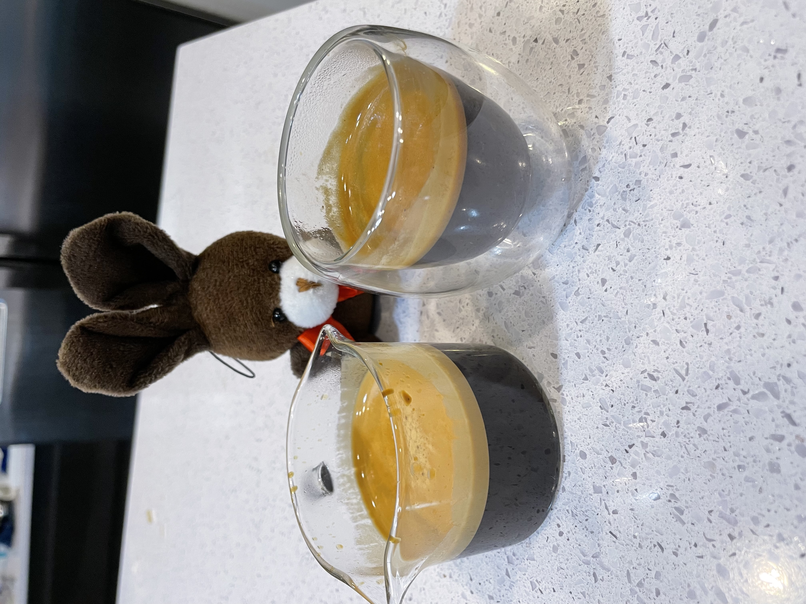
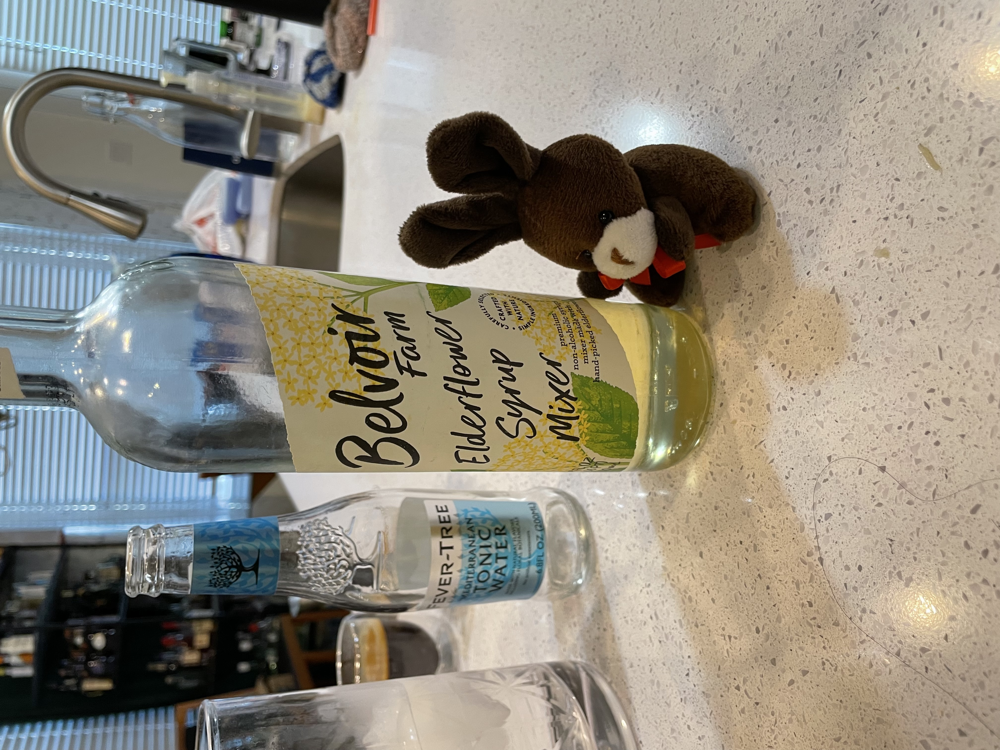
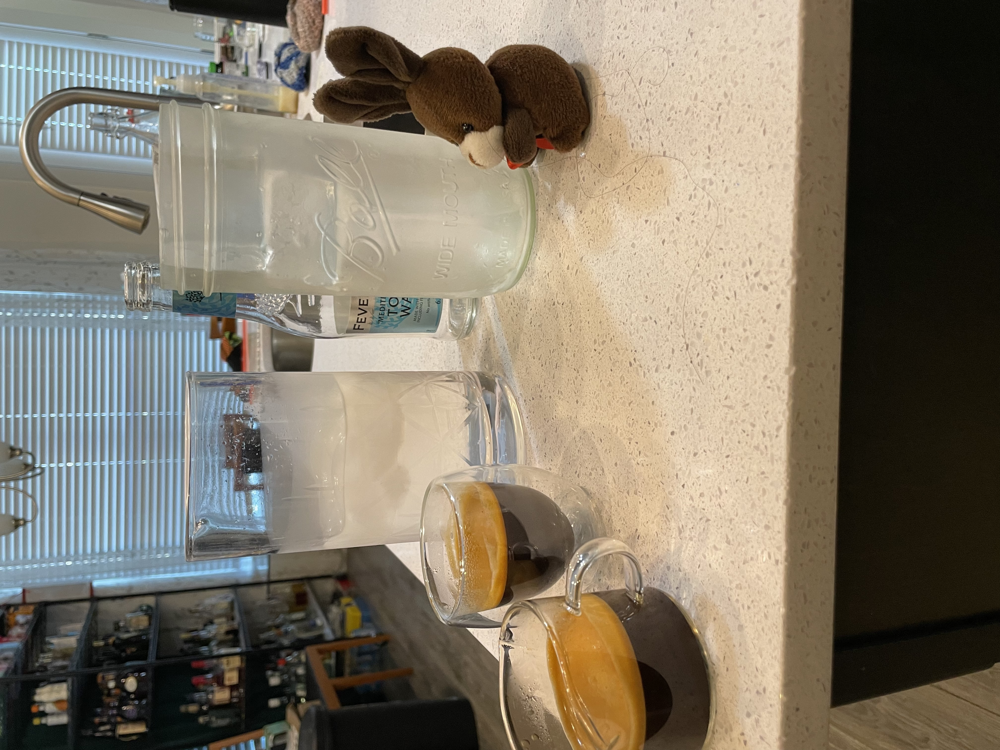
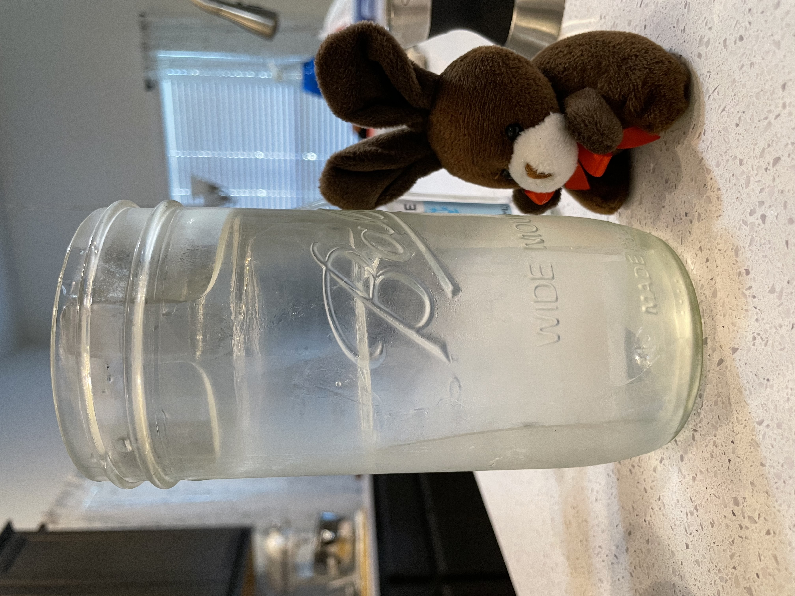
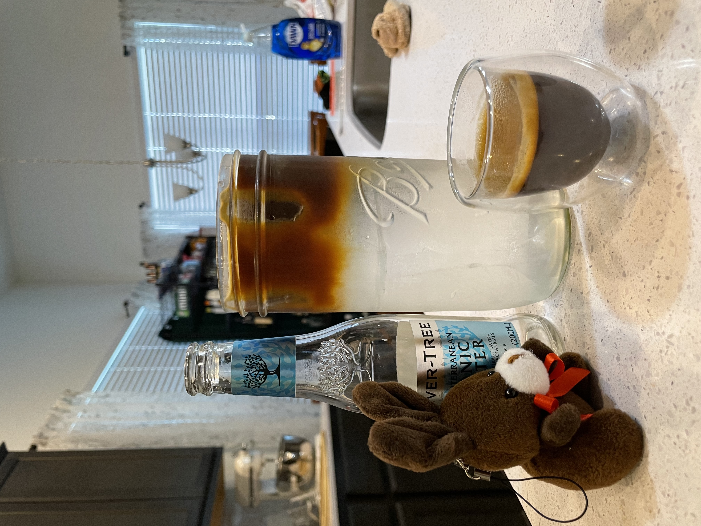
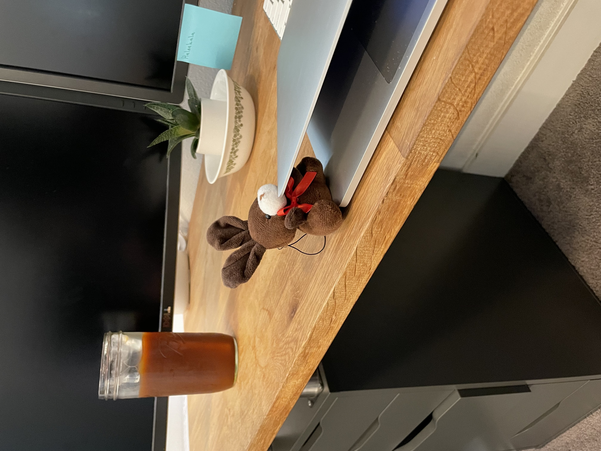

# A Proper Espresso Tonic

Espresso has decided today is a day for espresso tonics.
Today, we are also going to perfect them. To start, we much find an incorrectly sized mason jar.
This one seems too big, so we will use it.

THen, we must hand cut out ice cubes.

Can't have foggy ice as that would ruin the photo for the "only bunnies" account.

Be sure to inspect your ice.

Then we pull some shots.

Two should do.

Then we assemble. Be sure to pre chill your tonic water so you do not crack your clear ice.

If you are feeling fancy, you can add a little elder flower.

Espresso, assemble!

Ice looking good, no cracks.

Espresso in!

Now we get to work!

