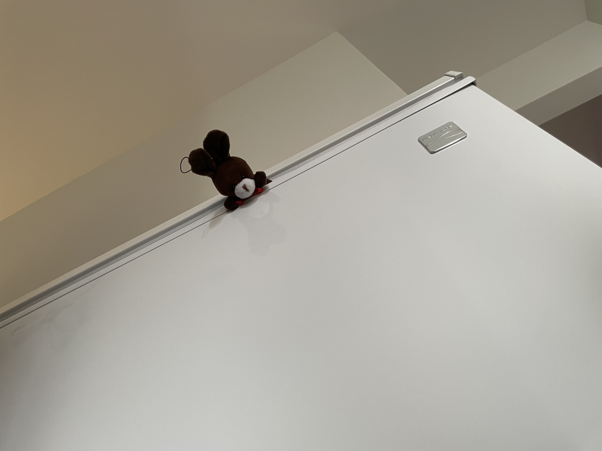
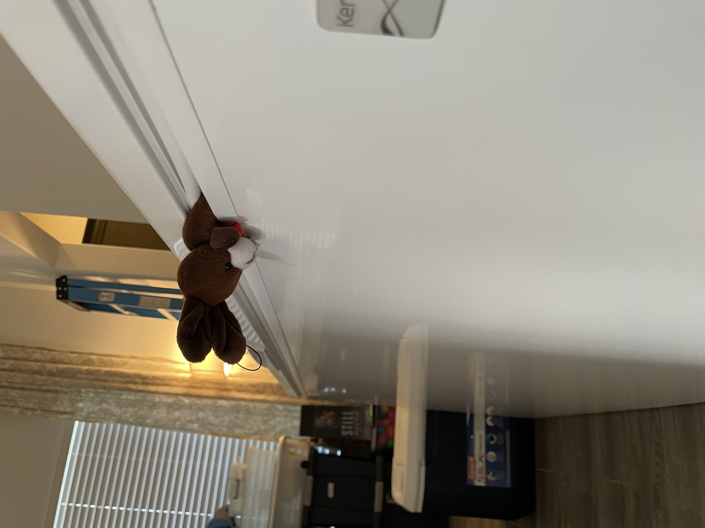
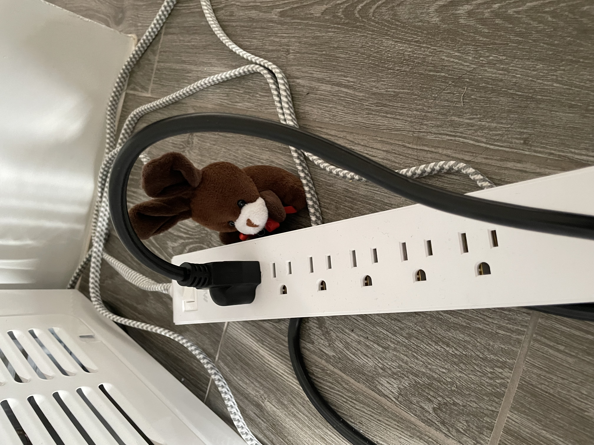
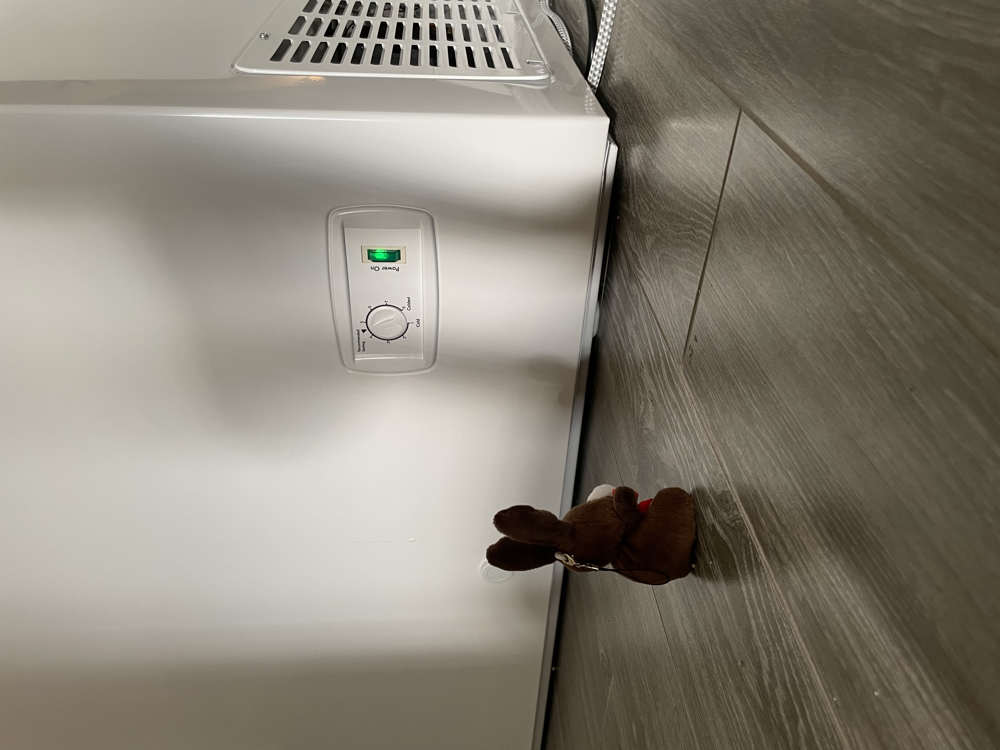

# Fixed Up Freezer

After allowing the silicon to dry in the freezer. It was time to test it out.
First, step close the freezer.

Turns out, this step is dangerous. Espresso almost got stuck.

He did manage to wiggle out, and plug the freezer in.

Freezer turned on! We will have to check back in a bit to see if it gets cold.

