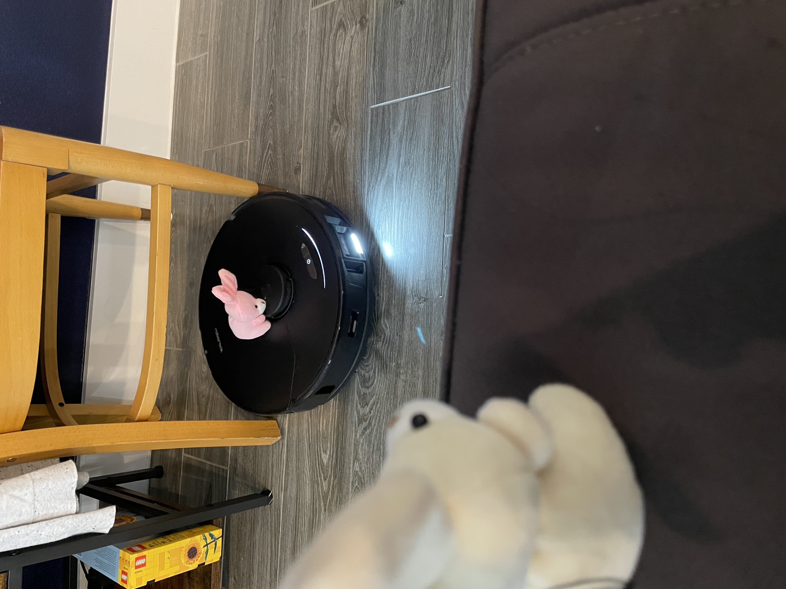

# Welcome Rover!

Bubbles and peppermint are super excited this morning.
A new cleaning toy has arrived.

Even Shanny was excited.

First we had to cut the tape.

Then open the box

Then open the other box?

The bunnies had to get creative pulling this box out. It was a tight fit.

Good packaging is hard to open.

Sometimes you get tape on your ears.

We found a robot!

Bubbles and Peppermint named him Rover.

The bunnies read the care and feeding book. Gotta keep Rover happy.

The bunnies walked Rover around the house. Bubbles was a little unsure of Rover.

But eventually came around!

