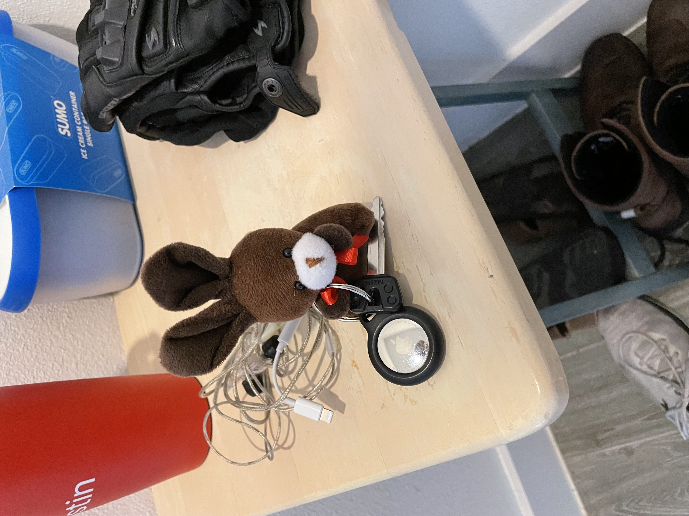
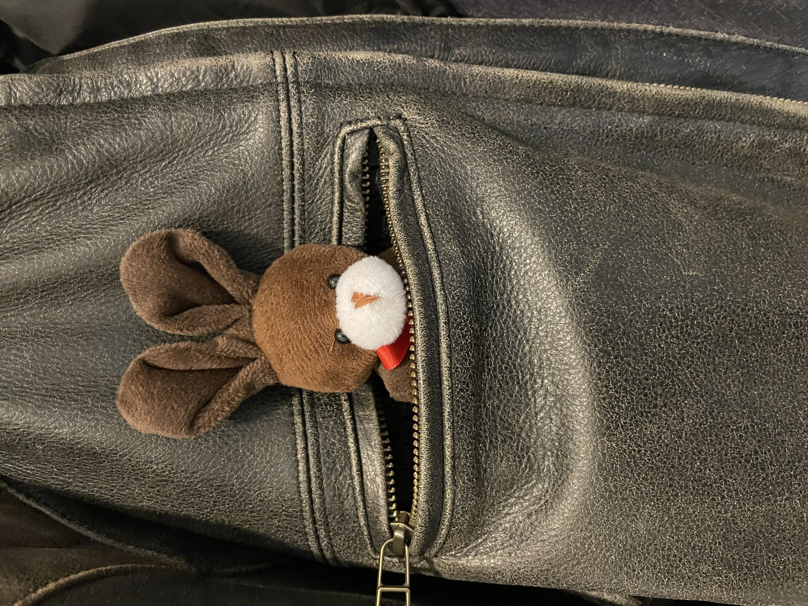
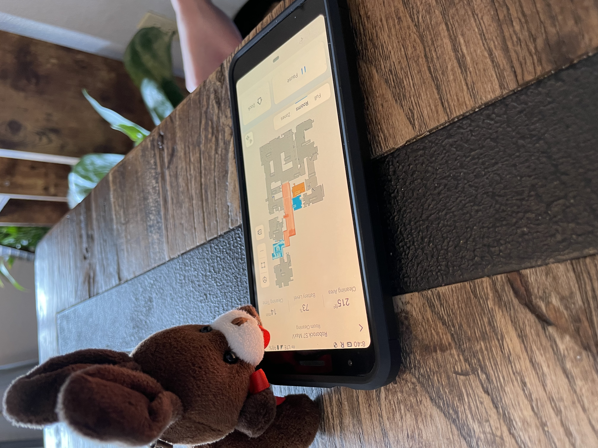
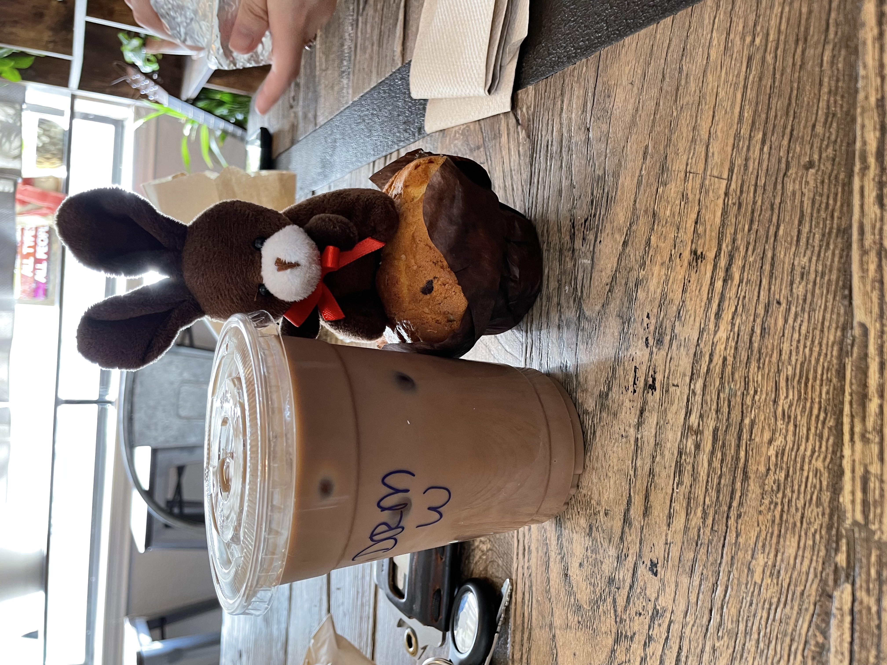
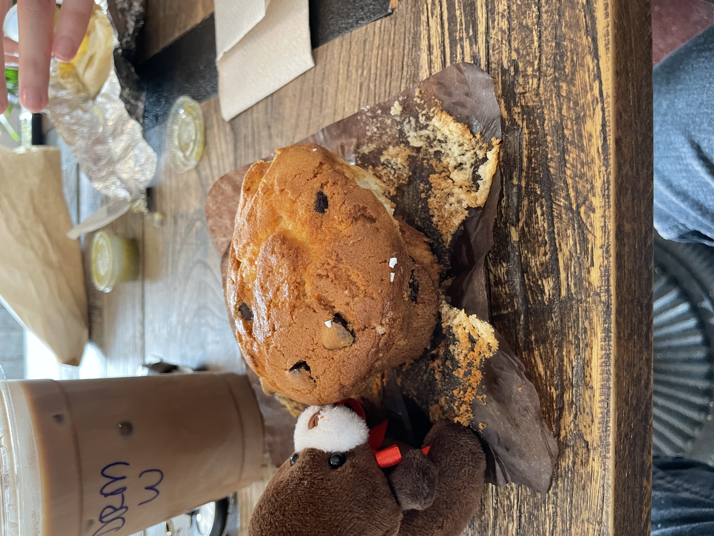
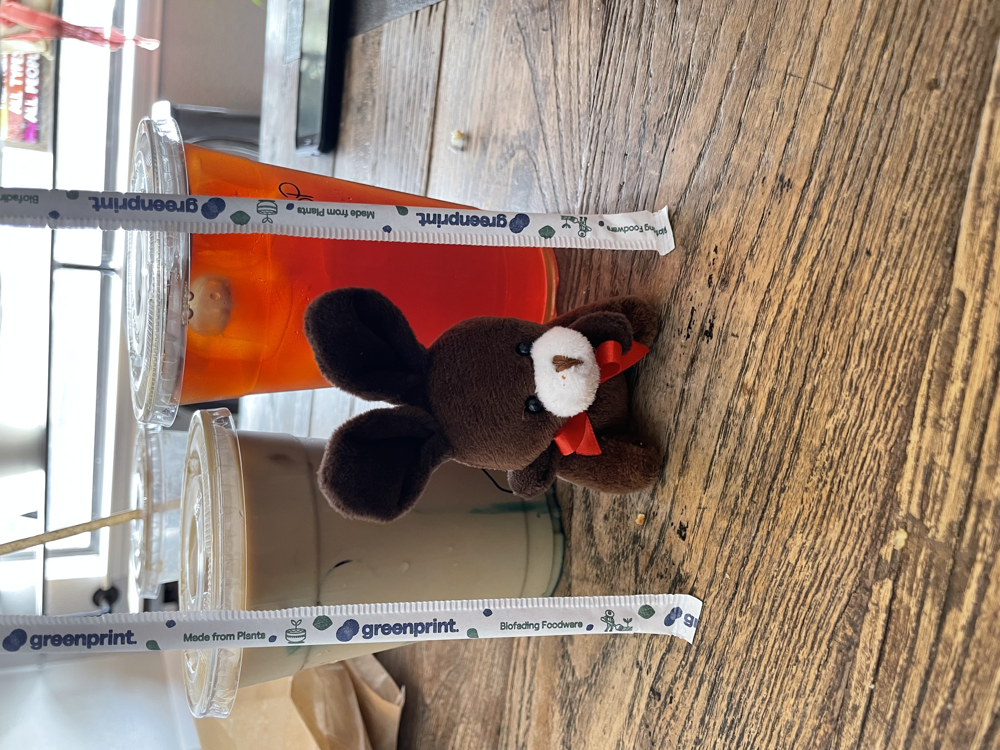

# Espresso's Espresso Adventure

Espresso heard we were going on a coffee date for a latte flight this morning.
He asked if he could come along as long as he was on his best behavior.

He even promised to ride quietly in the jacket.
We said sure! Maybe the barista will teach you some new tricks.

The barista wouldn’t teach espresso any new tricks. And the place does not do flights anymore…
So espresso was a little bummed out.
He offered to grab a table for us though.

While we were waiting, Shanny and Espresso checked on Rover.

Got coffee and a muffin.

Bunny nibble

After enjoying our coffee we remembered to get out punch card stamped.

Then we decided, we came here to drink an unhealthy amount of coffee.
That is exactly what we are going to do!
So we got another latte.

