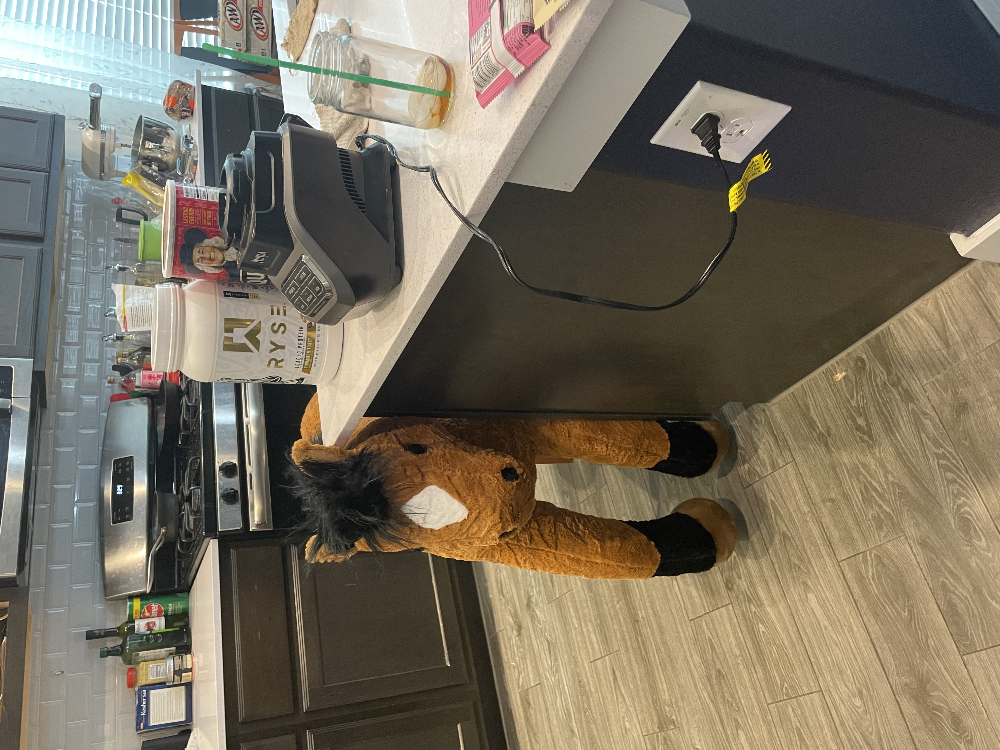
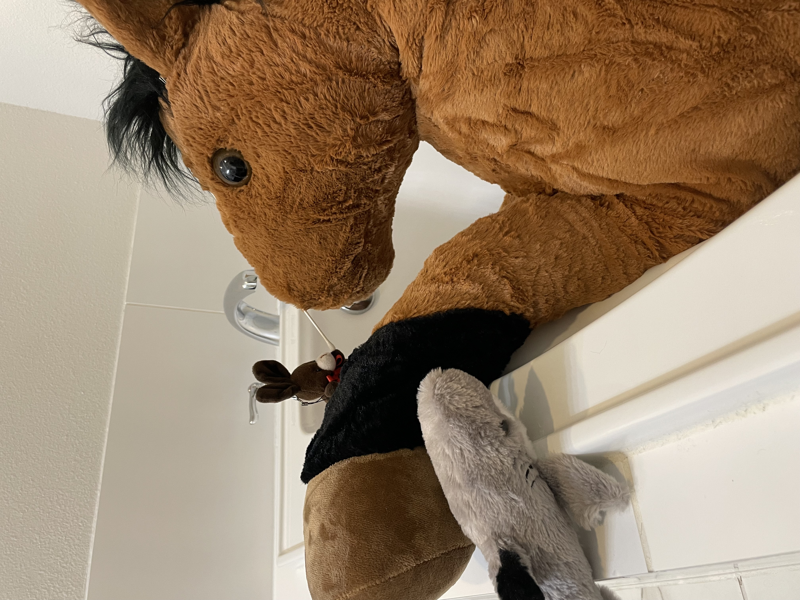
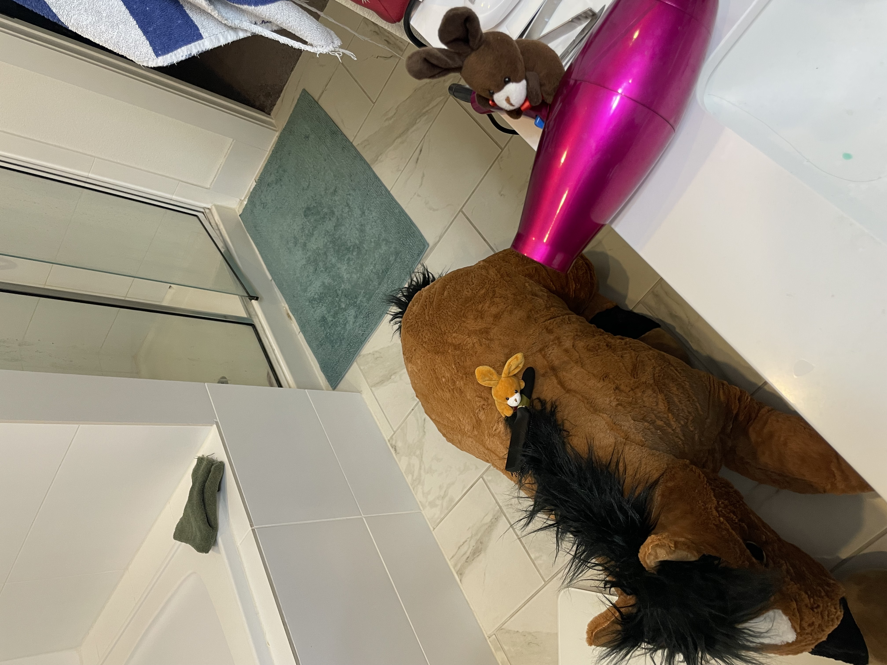

# Cheddar finds a home

Many moons ago, a rather strange adventure took place. Jacob and Shanny went to tractor supply to refill some propane tanks.
However, at the propane store they discovered a horse being sold! 
The horse made puppy eyes and Shanny, and soon enough, the horse was led out to the car....
Shanny had just the forever home in mind....

You see, Cheddar's forever home was a small place in Conroe.
However, no cars were headed that way for a while, so Cheddar had to camp out at the "House of Coffee".
Cheddar was quite shy, but eventually made friends. He got along with the bunnies, but quick became best friends with Bruce the Shark.

Cheddar even warmed up to Shanny. They frequently had evening couch time.
Cheddar would slowly sneak onto the couch and give Shanny puppy eyes...

Until Shanny eventually caved, and gave him scritches.

More often than not, cuddles took place.

It was not all snuggles and couch sits though. Cheddar frequently helped in the kitchen.
When folks were cooking, he would often circle the island.

He was often put in charge of inspecting ingredients.

Weighing them out

And checking for freshness

He would even suggest new ingredients from time to time... He always seemed to want to add parmesan chips to things though...
Shanny is convinced these are his favorite snack. Shanny even ordered him a box as a surprise. 

More often than not though, parmesan chips don't go in things, and we would have to find other ingredients.

From time to time, Cheddar even got to help mix things. 

More often than not this led to a mess

But things always turned out yummy

Eventually though, a car was scheduled to go to conroe and Cheddar had to get ready for his forever home.

The day before Cheddar decided a bath was needed. Cheddar was convinced this was the right thing to do, but was uneasy

Upon getting in the tub, he decided baths were terrible and that he was dying....

It was not until his best friend Bruce joined him, he decided it was ok.

Cheddar had trouble reaching his back and ears though, so Bruce called for the Bunnies.

Espresso cleaned his ears...

Carmel started on his back...

Soon Cheddar was getting a full scrumb down

Wash cloths were used

Cheddar even got his nose cleaned! Though Bruce had to hold his hoof...

After the bath, Cheddar got a brush

And a dry!

Pretty soon Cheddar was all spiffed up

After the bath, Cheddar decided he should get some fresh hay to take with him. 
He got a small hay bale

And made some hay packs.

Right as Cheddar finished his hay packs, there was a knock on the door! The secret package Shanny ordered arrived!

Cheddar could smell the parmesan chips inside the box.

Lots of snacks were had.

Shortly after it got dark, Cheddar water the plants for the bunnies and went to bed. 

Today is the day! Cheddar is off to his forever home! First a latte! Then a car ride!

