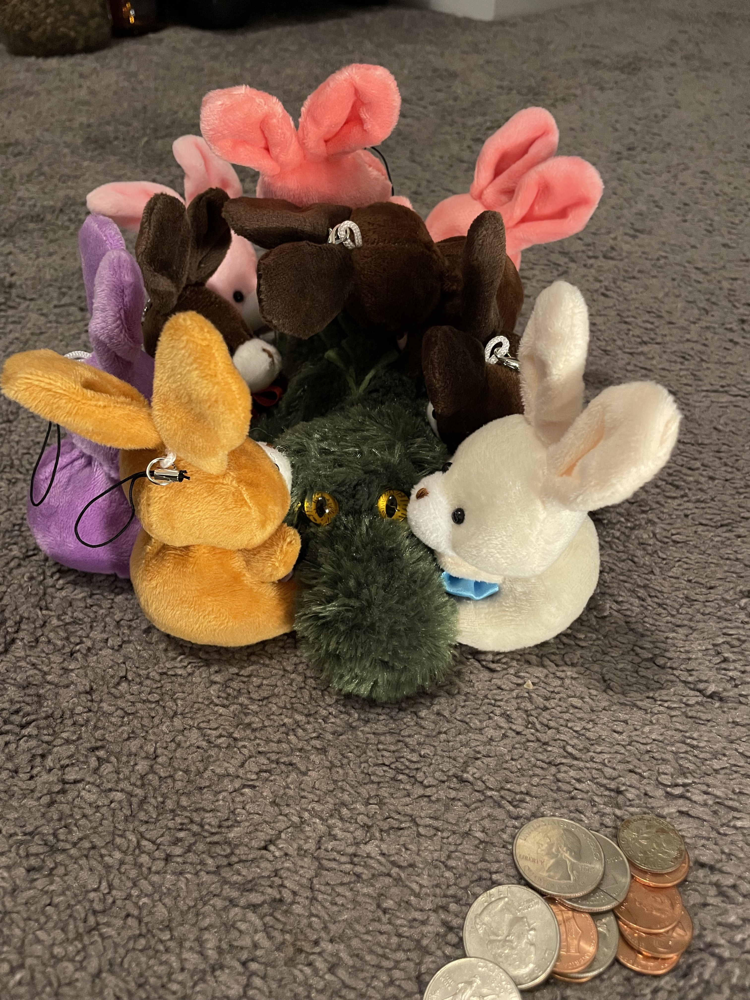

# The Great Donut Adventure

last night was pretty rough. I was working late due to bugs, but there was also a totally bunny breakdown.

You see, the bunnies had a meeting last night.

They heard Jill was going to be in town. The bunnies think very highly of Jill because Jill sent them all to the Bunny Academy, I am told this is like college for bunnies. As such, the bunnies wanted to buy Jill some donuts. All the bunnies pulled their resources but were HORRIFIED to find out they only had $1.52.

They considered trying to do more chores to make more money, but the more they discussed options the more upset they got!

Now, upset bunnies can be quite loud, and Sam the friendly alligator heard this. He went to investigate.

Sam found the upset bunnies and asked them what was going on. After hearing the issue, and understanding the importance of donuts, Sam decided to help.

Sam said that if the bunnies helped him build a pillow castle, he would be happy to help fund donuts.

The bunnies not only thought building pillow castles sounded like great fun, but were also super grateful for the help funding donuts. All the bunnies gave Sam a big group hug.

After the group hug, espresso and bubbles were given the money for a donut mission. Espresso was voted most likely to be awake, and Bubbles was voted the most financially responsible.

Bubbles decided to wear the alarm...

The morning of the donut adventure Espresso and Bubbles decided the fastest way to get donuts was on the bike.... Jacob convinced them the car would be more comfortable.

Turns out.... Jacob was right!

Donuts discovered!

Donuts acquired!

Donuts with Jill!!

