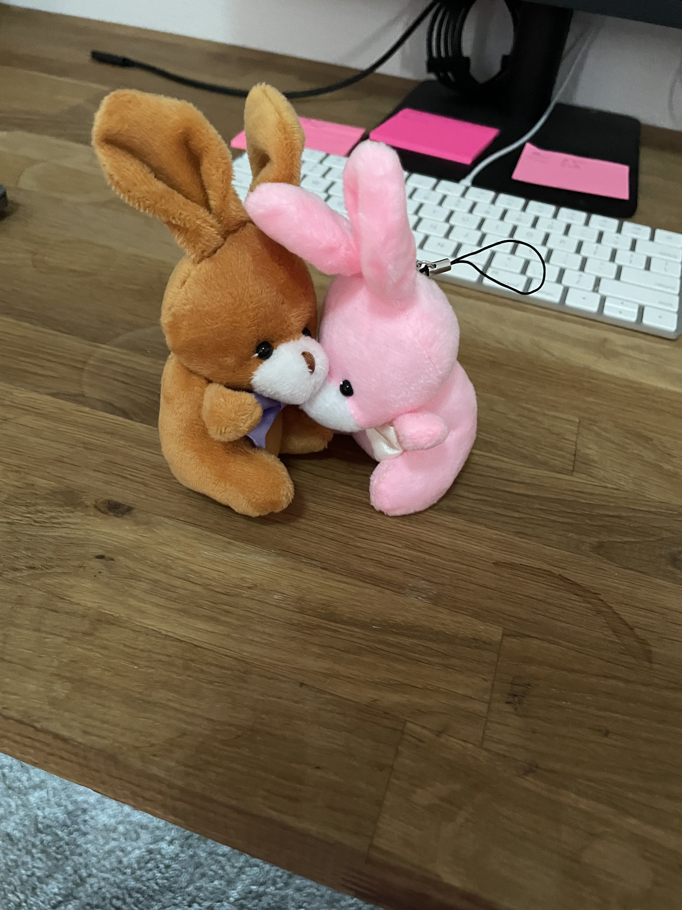
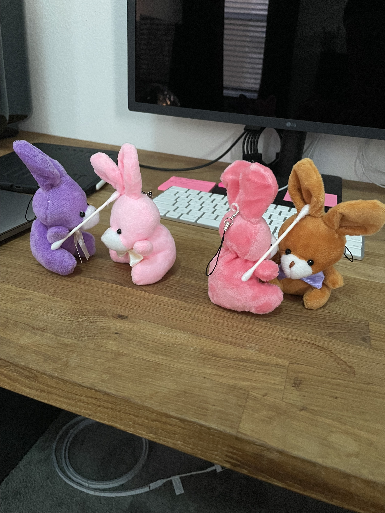
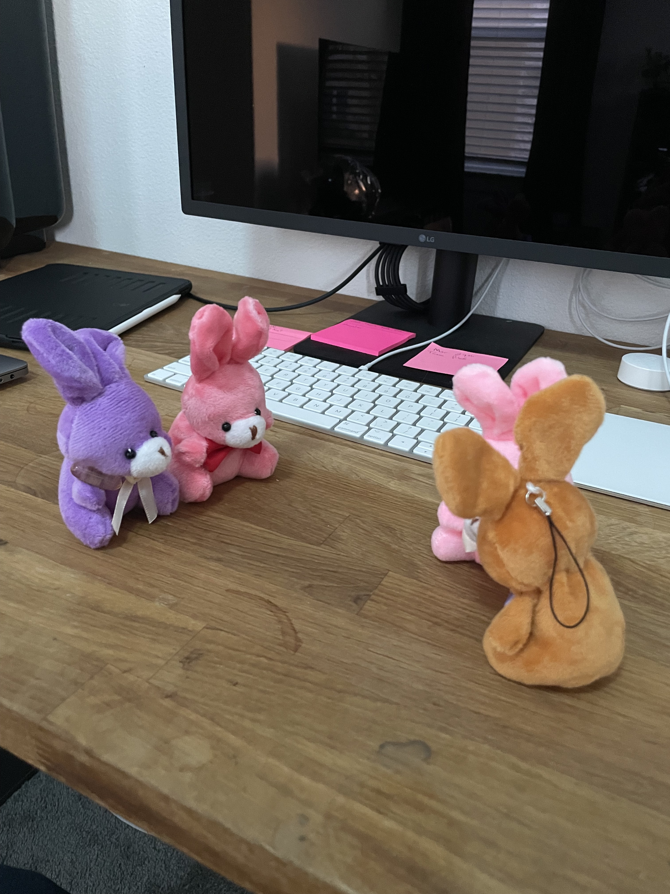
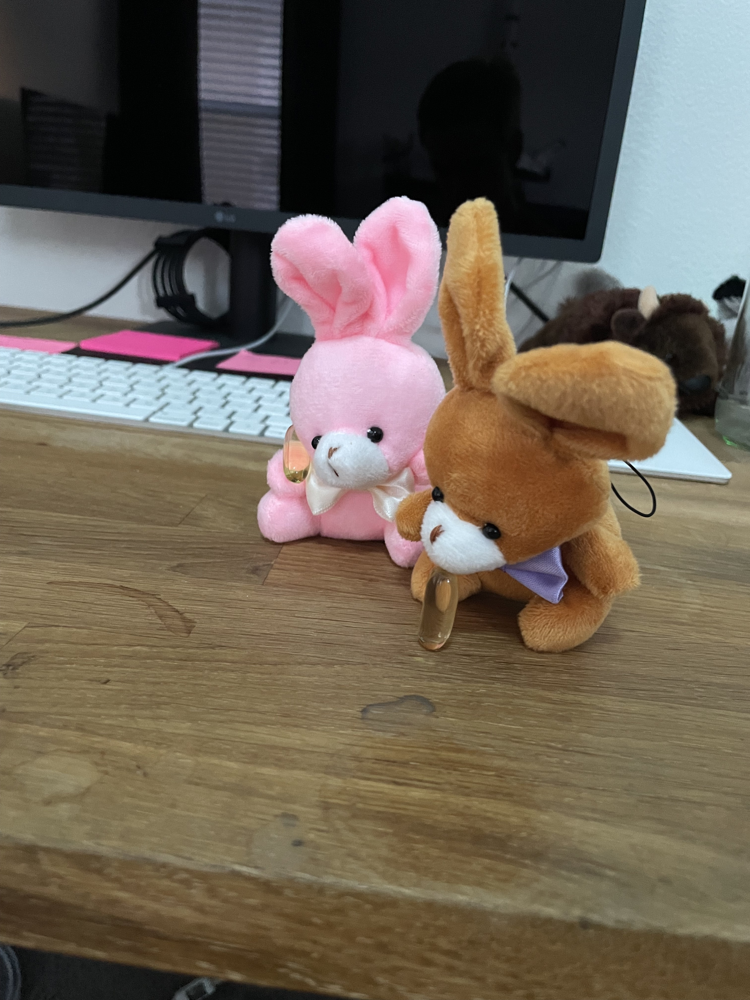
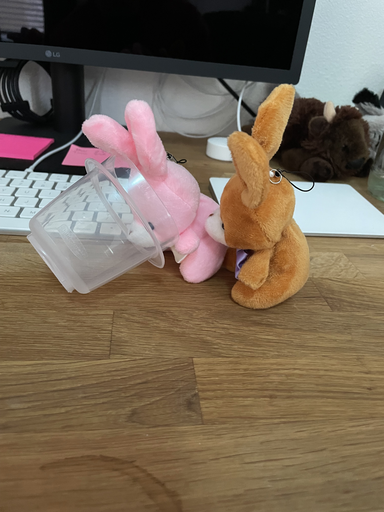
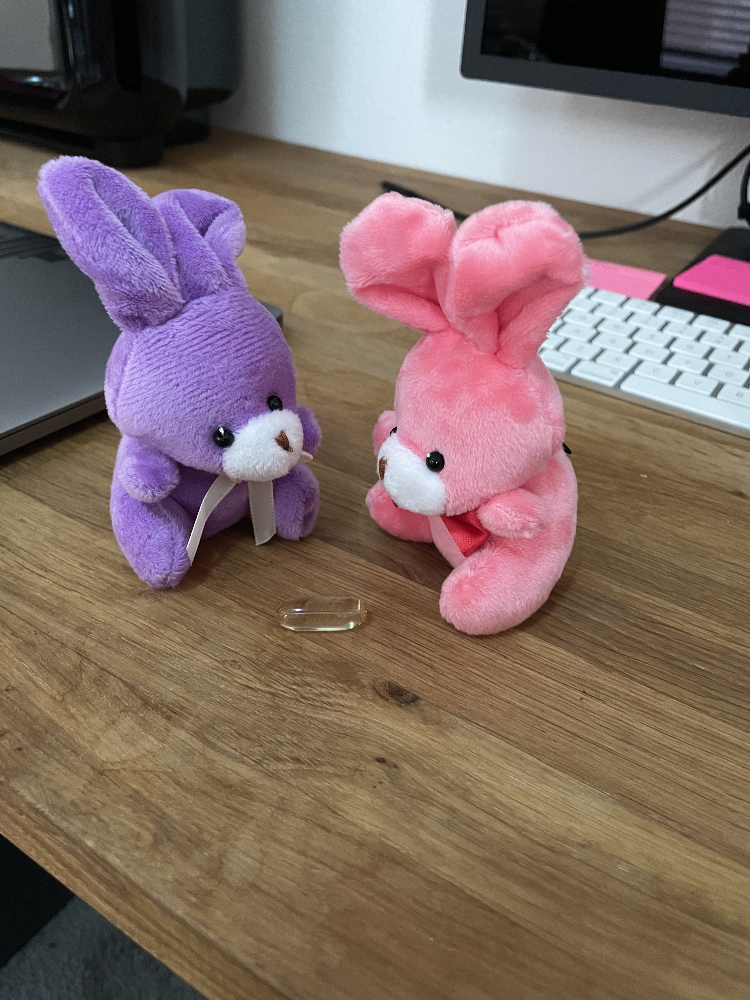
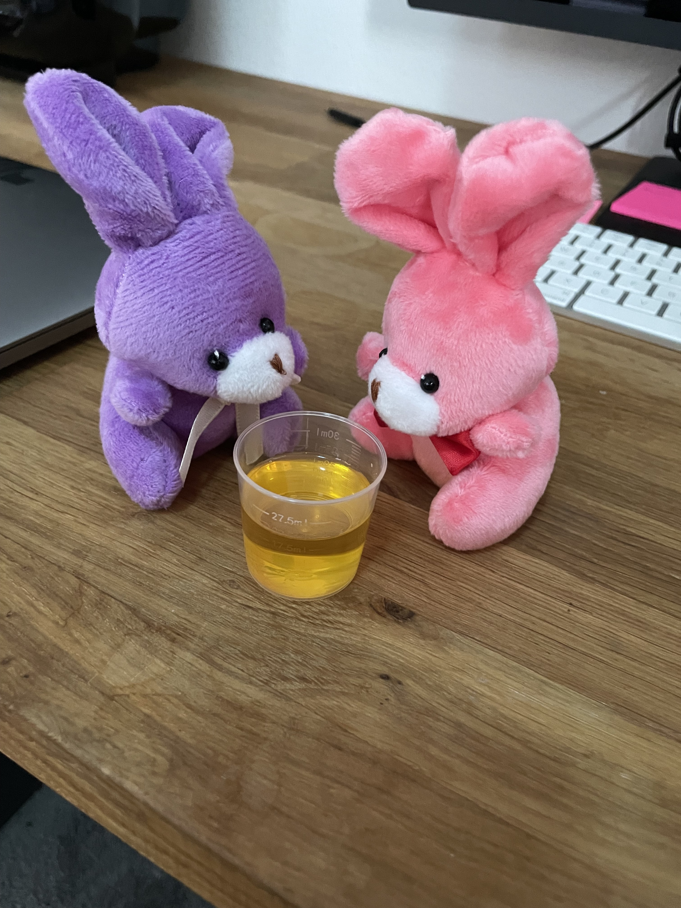
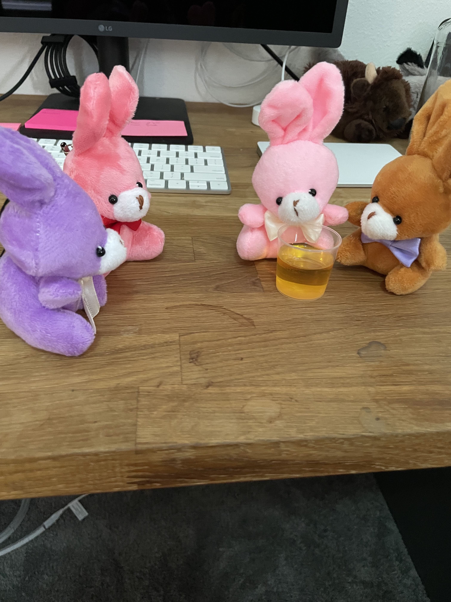
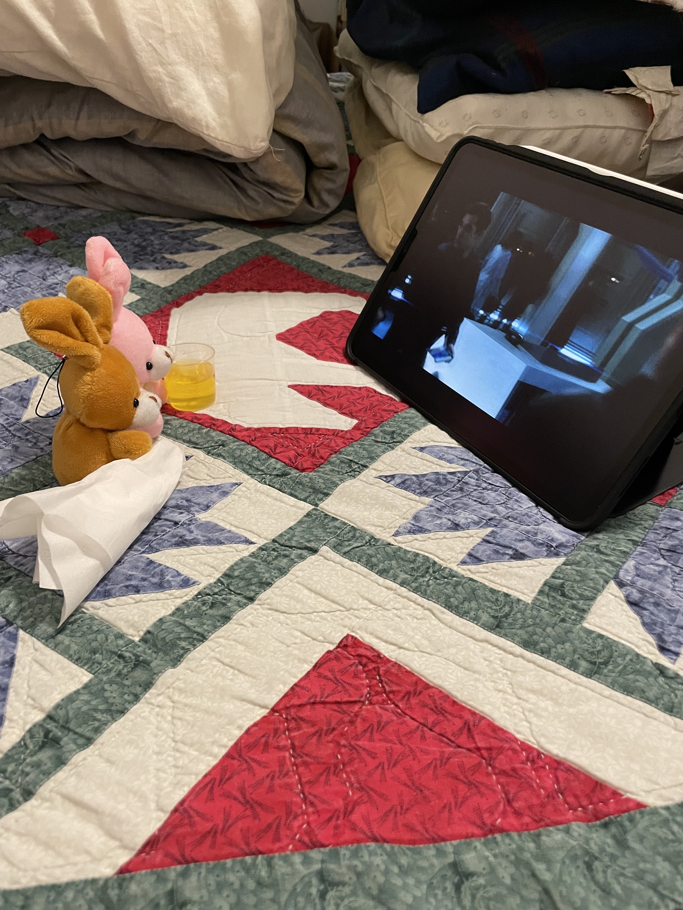

# Bunnyvid

Ok guys.... Got some baaaad news this morning. Turnip and Radish woke up feeling really bad this morning.

So much so, they had to call the doctor.

Doctor Hops and Jumps came over for a house call. 

Concerned it might be bunnyvid, they did some ear swap tests.

Turns out, it’s not bunnyvid, but it is a really bad case of the bunny flu.

Hops and Jumps prescribed some pretty large doses of antibiotics.

Turnip managed to get his pill down, Radish struggled.

Radish's pill came back up.

So the doctors studied the pill...

And came up with a liquid form.

After which, they handed her the liquid and sent them home to shelter in place.

We set up a nice bunny shelter in the guest room, where Radish can drink her meds, and the bunnies can watch Netflix.

